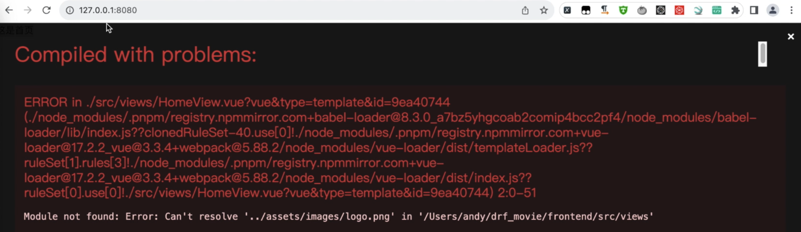
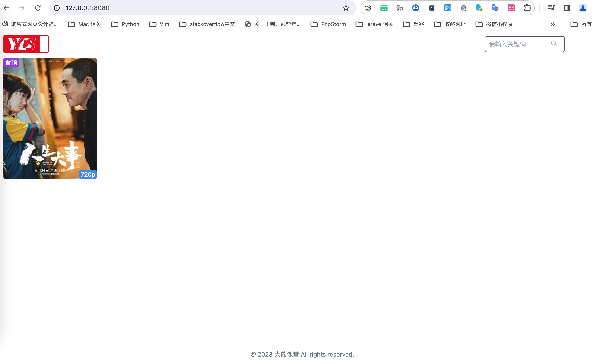
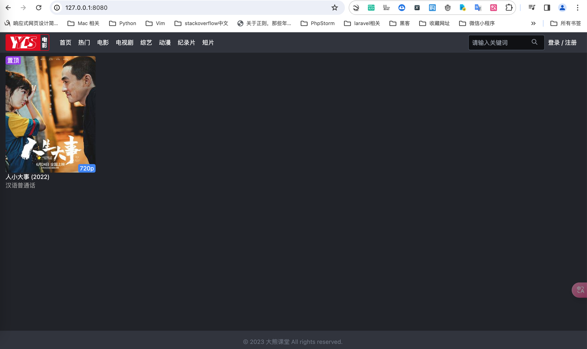

# 创建项目首页

准备工作已经就绪，我们可以开始着手编写项目的页面了。

首先，我们将聚焦于首页的构建。在这一步骤中，原有的首页内容将被全部清除，为编写自定义页面内容腾出空间。首先，需要在路由中定位到首页，其路由地址简单地标记为“/”，名为“home”。这部分可以保持不变。

代码如下:

```js title='fronted/src/router/index.js'
import { createRouter, createWebHistory } from 'vue-router'
import HomeView from '../views/HomeView.vue'

const routes = [
  {
    path: '/',
    name: 'home',
    component: HomeView
  },

export default router
```


## 编写模板页面


接下来，我们将目光转向`HomeView`。此处的内容并不符合我们的需求，因此，我们将其全部删除，并开始编写属于我们的首页。
创建HomeView.vue模板，代码如下：
```html title='frontend/src/views/HomeView.vue'
<template>
  <div id="container" class="text-white text-sm bg-primary-300 min-h-screen pb-4"> 
    <!-- <Header/> -->
    <div id="header" class="h-12 py-1 bg-primary-100 flex items-center justify-center">
      <div class="w-full px-4" style="max-width:1440px;">
        <div class="flex justify-between">
          <div class="flex items-center">
            <a href="/">
              
            </a>
            <div id="nav" class="px-4">
              <ul class="hidden md:flex items-center space-x-4 ml-2">
                <li>
                    <a href="/">首页</a>
                </li>
                <li>热门</li>
                <li>电影</li>
                <li>电视剧</li>
                <li>综艺</li>
                <li>动漫</li>
                <li>纪录片</li>
                <li>短片</li>
              </ul>
            </div>
          </div>
          <div class="flex items-center space-x-2">
            <!-- 搜索 -->
            <div class="relative shrink">
                <form>
                    <input type="text" name="keyword" class="outline-0 h-9 rounded bg-primary-700 border border-gray-600 placeholder-gray-400 w-64 px-2 py-1 max-w-[180px]" placeholder="请输入关键词" value="">
                    <div class="absolute top-0 right-0 flex items-center h-full">
                        <div class="rounded text-xs text-gray-400 px-2 mr-2">
                            <button>
                                <svg xmlns="http://www.w3.org/20 00/svg" class="h-4 w-4" fill="none" viewBox="0 0 24 24" stroke="currentColor" stroke-width="2">
                                    <path stroke-linecap="round" stroke-linejoin="round" d="M21 21l-6-6m2-5a7 7 0 11-14 0 7 7 0 0114 0z"></path>
                                </svg>
                            </button>
                        </div>
                    </div>
                </form>
            </div>
            <!-- 登录和注册 -->
            <div class="text-white flex-shrink-0 pr-2">
                <a href="#">登录</a>
                / <a href="#">注册</a>
            </div>
          </div>
        </div>
      </div>
    </div>

    <!-- 电影信息 -->
    <div class="flex items-center justify-center">
      <div class="w-full px-2" style="max-width:1440px;">
          <div id="movie-list" class="p-2 grid grid-cols-2 md:grid-cols-4 lg:grid-cols-6 gap-4">
            <div class="movie">
                <a href="http://127.0.0.1:8080/movie/2">
                    <div class="relative">
                        <div style="min-height:259px;max-height:300px;height:274px">
                                         
                        </div>
                        <div class="rounded absolute top-0 bg-purple-600 px-1 text-sm">置顶</div>
                        <div class="rounded absolute bottom-0 right-0 bg-blue-500 px-1 text-sm">720p</div>
                    </div>
                    <p>人小大事 (2022)
                    </p><p class="text-sm text-primary-200">汉语普通话</p>
                </a>
            </div>
          </div>  
      </div>
    </div>

    <!-- <Footer/> -->
    <footer class="fixed bottom-0 w-full flex justify-center items-center bg-primary-100 py-4">
      <p class="text-gray-500">© 2023 大熊课堂 All rights reserved.</p>
    </footer>
  </div>
</template>

<script>

export default {
  name: 'HomeView'
}
</script>

```

我们发现提示了一个错误信息，指出`assets image logo.png`文件缺失。为了解决这个问题，我们在`assets`下创建了一个名为`images`的文件夹，并将所有图片置于此。目录结构如下：
```
├── src
│   ├── App.vue
│   ├── assets
│   │   ├── css
│   │   │   └── tailwind.css
│   │   ├── images
│   │   │   ├── logo.png
```

再次刷新页面后，我们终于看到了带有样式的页面。



这是因为缺少图片资源，所以我们需要来导入。
在src/assets目录下新建一个名为“images”文件夹，用于存放图片资源。
此时再刷新就会有页面效果，如下图所示。


然而，页面的背景是白色的，这并不是我们想要的效果。于是，我们在`tailwind.css`中设置了默认背景，并在`tailwind.config.js`中进行了详细的配置，包括primary和secondary颜色的配置。
tailwind.config.js 配置如下：
```js title=''
/** @type {import('tailwindcss').Config} */
module.exports = {
  content: ["./src/**/*.{html,js,vue}"],
  theme: {
    extend: {
      colors: {
        primary: {
          100: '#31343d',
          200: '#9e9e9e',
          300: '#212329',
          700: '#101114'
        },
        secondary: {
          100: '#E2E2D5',
          200: '#888883'
        }
      }
    },
  },
  plugins: [],
}

```
这样，在使用时，我们可以直接通过这些预设选项来选择相应的颜色。再次刷新页面，我们看到默认颜色已经被应用。运行效果如下图所示。


## 创建组件

至此，我们有了一个具有基本样式的首页，包括logo、菜单、输入框、登录注册选项以及底部信息。这些内容的配置都在`HomeView`中完成，与编写普通的html文件无异。接下来，我们采用了组件化的方式来优化项目结构。这与在Django中创建模板非常相似，我们创建了一个父模板，并在其他页面中调用这个父模板。这在Vue中被称为组件化。

我们接下来在`components`文件夹下存放了这些组件，包括头部和尾部的组件。接着，我们创建了`header.vue`和`footer.vue`文件，并将相关内容提取至相应的组件中。目录结构如下 :
```
├── src
│   ├── components
│   │   ├── Footer.vue
│   │   ├── Header.vue

```

接下来，我们在`home.vue`中引入了这些组件，并使用了import语句从`components`引入`header`和`footer`组件。

Header.vue代码如下:
```js 
<template>
    <div id="header" class="h-12 py-1 bg-primary-100 flex items-center justify-center">
      <div class="w-full px-4" style="max-width:1440px;">
        <div class="flex justify-between">
          <div class="flex items-center">
            <a href="/">
              
            </a>
            <div id="nav" class="px-4">
              <ul class="hidden md:flex items-center space-x-4 ml-2">
                <li>
                    <a href="/">首页</a>
                </li>
                <li>热门</li>
                <li>电影</li>
                <li>电视剧</li>
                <li>综艺</li>
                <li>动漫</li>
                <li>纪录片</li>
                <li>短片</li>
              </ul>
            </div>
          </div>
          <div class="flex items-center space-x-2">
            <!-- 搜索 -->
            <div class="relative shrink">
                <form>
                    <input type="text" name="keyword" class="outline-0 h-9 rounded bg-primary-700 border border-gray-600 placeholder-gray-400 w-64 px-2 py-1 max-w-[180px]" placeholder="请输入关键词" value="">
                    <div class="absolute top-0 right-0 flex items-center h-full">
                        <div class="rounded text-xs text-gray-400 px-2 mr-2">
                            <button>
                                <svg xmlns="http://www.w3.org/20 00/svg" class="h-4 w-4" fill="none" viewBox="0 0 24 24" stroke="currentColor" stroke-width="2">
                                    <path stroke-linecap="round" stroke-linejoin="round" d="M21 21l-6-6m2-5a7 7 0 11-14 0 7 7 0 0114 0z"></path>
                                </svg>
                            </button>
                        </div>
                    </div>
                </form>
            </div>
            <!-- 登录和注册 -->
            <div class="text-white flex-shrink-0 pr-2">
                <a href="#">登录</a>
                / <a href="#">注册</a>
            </div>
          </div>
        </div>
      </div>
    </div>
</template>

<script>
export default {
    name: 'Header',
}
</script>

```

Footer.vue组件代码如下：
```js
<template>
  <footer class="fixed bottom-0 w-full flex justify-center items-center bg-primary-100 py-4">
    <p class="text-gray-500">© 2023 大熊课堂 All rights reserved.</p>
  </footer>
</template>

<script>
export default {
    name: 'Footer'
}
</script>
```

此时HomeView.vue组件可以直接引入上面的2个组件，代码如下:
```js
<template>
  <div id="container" class="text-white text-sm bg-primary-300 min-h-screen pb-4"> 
    <Header/>
    <!-- 电影信息 -->
    <div class="flex items-center justify-center">
      <div class="w-full px-2" style="max-width:1440px;">
          <div id="movie-list" class="p-2 grid grid-cols-2 md:grid-cols-4 lg:grid-cols-6 gap-4">
            <div class="movie">
                <a href="http://127.0.0.1:8080/movie/2">
                    <div class="relative">
                        <div style="min-height:259px;max-height:300px;height:274px">
                                         
                        </div>
                        <div class="rounded absolute top-0 bg-purple-600 px-1 text-sm">置顶</div>
                        <div class="rounded absolute bottom-0 right-0 bg-blue-500 px-1 text-sm">720p</div>
                    </div>
                    <p>人小大事 (2022)
                    </p><p class="text-sm text-primary-200">汉语普通话</p>
                </a>
            </div>
          </div>  
      </div>
    </div>

    <Footer/>
  </div>
</template>

<script>
// 添加代码
import Footer from '@/components/Footer.vue'
import Header from '@/components/Header.vue'
 

export default {
  name: 'HomeView',
  components: {
    Header, Footer, MovieList
  }
}
</script>

```

这些组件被添加到了components属性中，并在页面中引入`<Header/>` 和 `<Footer/>` 进行了相应的替换。页面刷新后，效果与之前一致，表明组件化成功。


接下来，进一步抽象了电影信息，将其作为一个单独的组件——`MovieList`。目录结构如下:
```
├── src
│   ├── components
│   │   ├── Footer.vue
│   │   ├── Header.vue
│   │   ├── MovieList.vue
```


HomeView代码如下：
```
<template>
  <div id="container" class="text-white text-sm bg-primary-300 min-h-screen pb-4"> 
    <Header/>
    <!-- 电影信息 -->
    <MovieList/>

    <Footer/>
  </div>
</template>

<script>
// 添加代码
import Footer from '@/components/Footer.vue'
import Header from '@/components/Header.vue'
import MovieList from '@/components/MovieList.vue'

export default {
  name: 'HomeView',
  components: {
    Header, Footer, MovieList
  }
}
</script>
 
```

至此，我们的`HomeView`变得非常简洁，它包含了引入的导航栏、电影信息和底部信息组件。这样的组件化不仅优化了项目的结构，而且提高了代码的复用性。


我们再次看下项目的结构和工作流程，从`main.js`入口文件到`app.view`的路由跳转，以及如何构建一个包含头部、电影信息、尾部的完整页面。

最后，我们将在后续的教程中继续介绍如何从接口文件中获取电影信息，并展示在页面上。


