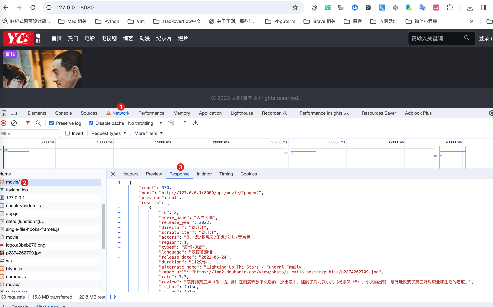

# 发送axios请求


接下来，我们就可以发送请求了。很多小伙伴写过python爬虫，可以使用requests发送请求，但是我们现在使用的vue发送请求，那么我们可以选择一个前端`axios`模块来发送请求。

<!-- trancate -->

## 安装axios

使用下面的命令安装axios,命令如下:
```bash 
cnpm install axios
```

## axios发送请求

在我们的首页中，当用户通过浏览器访问的时候，我们就使用axios向后端接口发送一个get请求，请求电影信息，也即是我们前面定义的/api/movie这个接口。

MovieList.vue 代码如下：

```js title='frontend/src/components/MovieList.vue'
<template>
    <div class="flex items-center justify-center">
      <div class="w-full px-2" style="max-width:1440px;">
          <div id="movie-list" class="p-2 grid grid-cols-2 md:grid-cols-4 lg:grid-cols-6 gap-4">
            <div class="movie">
                <a href="http://127.0.0.1:8080/movie/2">
                    <div class="relative">
                        <div style="min-height:259px;max-height:300px;height:274px">
                                         
                        </div>
                        <div class="rounded absolute top-0 bg-purple-600 px-1 text-sm">置顶</div>
                        <div class="rounded absolute bottom-0 right-0 bg-blue-500 px-1 text-sm">720p</div>
                    </div>
                    <p>人小大事 (2022)
                    </p><p class="text-sm text-primary-200">汉语普通话</p>
                </a>
            </div>
          </div>  
      </div>
    </div>
</template>

<script>
import axios from 'axios'

export default {
    name: 'MovieList',
    data: function() {
        return {
            info: ''
        }
    },
    mounted() {
        // axios发送get请求
        axios
            .get('/api/movie')
            .then( response => (this.info = response.data))  
            .catch(error => {
                console.log(error)
            })
    },
}

</script>

```


:::tip[代码解析]

这段Vue.js代码定义了一个Vue组件，名为`MovieList`。它主要使用了`axios`库来发送HTTP请求，并在组件挂载后从一个API获取电影数据。下面是具体的解释：

1. **`import axios from 'axios'`**: 这行代码导入了`axios`库。`axios`是一个基于Promise的HTTP客户端，用于浏览器和node.js，主要用于发送HTTP请求。

2. **`export default { ... }`**: 这是ES6的模块导出语法，导出了一个Vue组件的配置对象。

3. **`name: 'MovieList'`**: 给Vue组件命名为`MovieList`。

4. **`data: function() { ... }`**: 定义组件的数据对象。这里定义了一个`info`属性，初始值为空字符串。这个属性将用于存储从API获取的电影数据。

5. **`mounted()`**: 是Vue组件的生命周期钩子之一，会在组件被挂载到DOM后立即执行。在这个函数中，你可以执行一些初始化任务，比如发送API请求。

6. **`axios.get('/api/movie')`**: 使用`axios`发送GET请求到`/api/movie`。这通常意味着你的后端有一个路由来处理`/api/movie`的GET请求，并返回电影数据。

7. **`.then(response => (this.info = response.data))`**: 当请求成功时，将响应的数据（`response.data`）赋值给组件的`info`属性。这样，你就可以在组件的模板或其他地方使用`info`来显示电影数据。

8. **`.catch(error => { console.log(error) })`**: 如果请求失败（比如网络问题或者服务器错误），`.catch`方法将捕获错误，并通过`console.log`打印出错误信息。

综合来看，这个`MovieList`组件在被加载时，会通过`axios`发送一个GET请求到`/api/movie`，然后将获取的电影数据存储在`info`属性中，如果请求失败，则在控制台打印错误信息。

:::

在浏览器中访问网址:http://127.0.0.1:8080/ , 查看network, 如下图所示。
