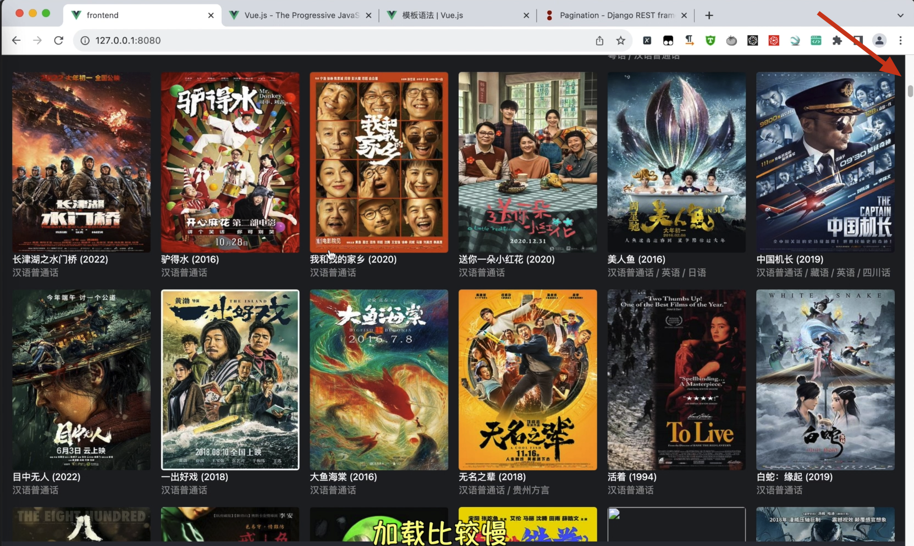
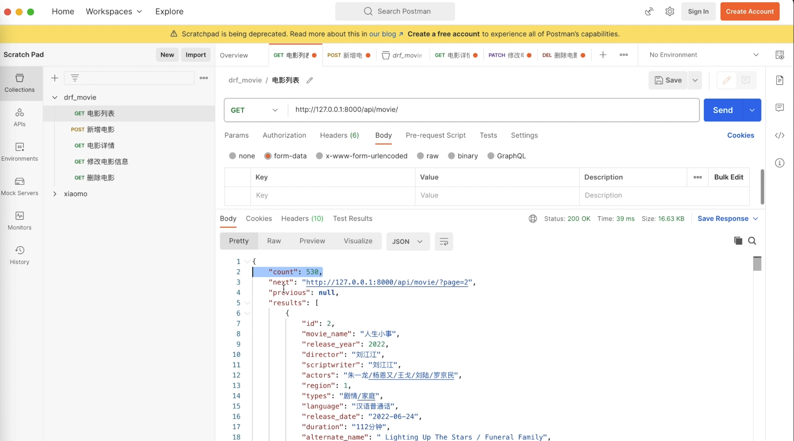
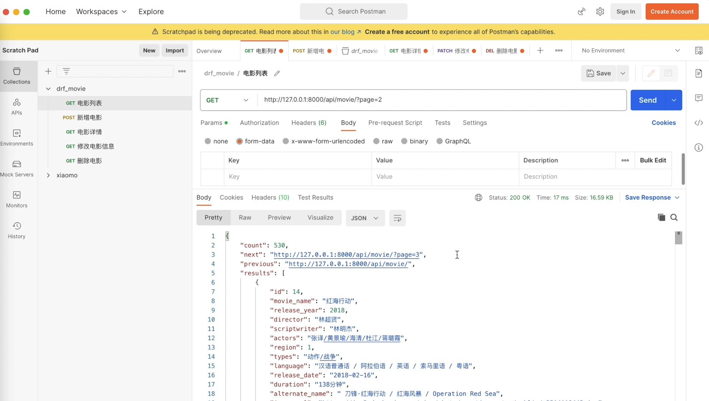

#  实现分页请求数据功能

目前，我们已经成功构建了项目首页，但在实际操作中，我们发现了一个问题：电影列表的所有条目都在同一页面中显示。这样的设计带来了两个明显的问题：首先，每次请求都会加载所有数据，由于图片加载时间较长，导致页面加载缓慢；其次，这种设计并不利于提升用户体验。 

 


为了解决这些问题，我们需要实现分页功能，即将电影列表分成多个页面展示。

假设我们有500条数据，每页展示50条，那么总共就会分成10页。接下来，让我们探讨如何在Django中实现这一分页功能。


## 实现分页接口

在Django REST Framework（以下简称DRF）中，已经内置了分页类。我们不需要编写代码，只通过配置就能实现对特定页面数据的请求。例如，通过在请求接口中添加一个`page`参数（如`page=1`表示请求第一页的数据），并在全局设置中定义每页显示的数据量，我们可以方便地实现数据的分页显示。如果我们设置每页显示5条数据，那么当`page=1`时，接口将返回前5条数据；当`page=2`时，将返回第6至第10条数据，依此类推。

那么要如何配置分页呢？

非常简单，我们只需在全局配置文件`settings.py`中设置`DRF`相关参数即可。

```python title='drf_movie/settings.py'
# DRF设置
REST_FRAMEWORK = {
    'DEFAULT_PAGINATION_CLASS': 'rest_framework.pagination.PageNumberPagination',
    'PAGE_SIZE': 12,
}

```

:::info[代码解析]
这段配置信息是Django REST framework的设置，用于定义API的分页行为。具体来说：

1. `'DEFAULT_PAGINATION_CLASS': 'rest_framework.pagination.PageNumberPagination'`
  
   这行配置指定了Django REST framework应该使用哪种分页类。这里使用的是`PageNumberPagination`，这是一种基于页码的分页方式。客户端可以通过请求参数来指定想要获取的页码（通常是`page`），服务器基于这个页码返回相应的数据页。

2. `'PAGE_SIZE': 12`
  
   这行配置指定了每页包含的数据条目数。在这个例子中，每页将包含12条数据。这意味着如果API返回的数据有24条，那么会被分为两页，每页12条。

总的来说，这段配置设置了Django REST framework的分页方式为基于页码的分页，且每页显示12条数据。这样做的好处是可以有效管理大量数据的展示，提高API的性能和用户体验，避免一次性加载和传输过多的数据。
:::


完成配置后，我们可以发送请求来查看效果。如果不添加任何参数直接发送请求，你会发现数据结构已经从列表变为字典，其中包括总数（`count`）、下一分页的链接（`next`）、当前分页的链接（`previous`）以及当前分页的数据列表（`results`）。



如果想要查看第二页的数据，只需在URL中添加`?page=2`即可。



然而，随着分页功能的实现，原有的前端页面无法直接读取数据结构，因为数据结构已经发生了变化。在实现分页之前，数据结构是列表形式，列表中每个元素是一个字典；而现在，数据结构变为包含`results`的字典，真实的数据被嵌套在`results`键下。因此，我们需要调整前端的数据处理逻辑，确保可以正确读取和显示分页数据。


在Vue.js中，我们可以在`MovieList.vue`组件中调整数据接收逻辑，使用`info.results`来获取实际的数据列表。`MovieList.vue`修改后代码如下：
```js title='frontend/src/components/MovieList.vue'
<template>
    <div class="flex items-center justify-center">
      <div class="w-full px-2" style="max-width:1440px;">
        <div id="movie-list" class="p-2 grid grid-cols-2 md:grid-cols-4 lg:grid-cols-6 gap-4">
            <div class="movie" v-for="movie in info.results" :key="movie.id">
                <a :href="'/movie/' + movie.id"> 
                    <div class="relative">
                        <div class="" style="min-height: 259px; max-height: 300px;height: 274px;" >
                        
                        </div>
                        <div v-if="movie.is_top" class="rounded absolute top-0 bg-purple-600 px-1 text-sm">置顶</div>
                        <div v-if="movie.quality==1" class="rounded absolute bottom-0 right-0 bg-blue-500 px-1 text-sm ">720p</div>
                        <div v-else-if="movie.quality==2" class="rounded absolute bottom-0 right-0 bg-blue-500 px-1 text-sm ">1080p</div>
                        <div v-else-if="movie.quality==3" class="rounded absolute bottom-0 right-0 bg-blue-500 px-1 text-sm ">4K</div>
                    </div>
                    <p> {{ movie.movie_name }} ({{ movie.release_year }})</p>
                    <p class="text-sm text-primary-200"> {{ movie.language}}</p>
                </a>
            </div>
        </div>  
      </div>
    </div>
</template>

```

此外，我们也需要调整API请求的URL，使其能够随着页面参数的变化而变化，而不是固定不变。代码如下：

```js title='frontend/src/components/MovieList.vue'
    mounted() {
        // axios发送get请求
        axios
            .get('/api/movie')
            .then( response => (this.info = response.data))  
            .catch(error => {
                console.log(error)
            })
    },
```


为此，我们可以定义一个函数，根据当前的页面参数动态构建请求URL，然后发送请求以获取相应页面的数据。我们可以这样修改, 我们可以创建一个方法叫做`get_movie_data`的方法，用于实现这个功能。然后在mounted中调用它，代码如下：
```js title='frontend/src/components/MovieList.vue'
export default {
    name: 'MovieList',
    data: function() {
        return {
            info: ''
        }
    },
    mounted() {
        this.get_movie_data()
    },
    methods: {
        get_movie_data: function() {
            let url = '/api/movie'  // /api/movie/?page=3&movie_name=我
            // 获取page参数值
            const page = Number(this.$route.query.page);
            if (!isNaN(page) && (page !== 0)) {
                url = url + '/?page=' + page;
            }

            axios
                .get(url)
                .then( response => (this.info = response.data))
                .catch(error => {
                    console.log(error)
                })
        }
    },
}
```


:::tip[代码解析]

这段Vue代码定义了一个名为`MovieList`的组件，主要用于从一个API获取电影数据并将其存储在组件的`data`属性中。下面逐个解释代码的各个部分：

1. **组件定义**:
   - `name: 'MovieList'`: 组件的名称是`MovieList`。
   - `data: function() { return { info: '' } }`: 组件的`data`是一个函数，返回一个对象，该对象包含一个属性`info`，初始值为空字符串。在Vue组件中，`data`必须是一个函数，以确保每个组件实例都可以维护一份被返回对象的独立的拷贝。

2. **生命周期钩子**:
   - `mounted() { this.get_movie_data() }`: 这是Vue的一个生命周期钩子。组件被挂载到DOM后，`mounted`钩子被调用，并执行`get_movie_data`方法。这意味着一旦组件显示在页面上，它就会立即向API请求电影数据。

3. **方法**:
   - `methods: { get_movie_data: function() { ... } }`: 定义了一个名为`get_movie_data`的方法。这个方法负责从API获取电影数据，并处理分页逻辑。
     - `let url = '/api/movie'`: 定义了API的基础URL。
     - 获取`page`参数值：从当前路由（`this.$route.query.page`）中获取`page`参数的值，如果`page`参数存在且不为0，则将其添加到API的URL中，用于获取指定页码的数据。
     - 使用`axios.get(url)`发送一个GET请求到API。
     - 在请求成功时，使用`.then( response => (this.info = response.data))`将响应数据赋值给`info`属性。这意味着获取的电影数据将存储在`info`中，可以在组件的模板或其他方法中使用。
     - 在请求失败时，使用`.catch(error => { console.log(error) })`捕获任何错误，并在控制台中记录错误信息。

总结来说，`MovieList`组件在被加载到页面上后，会立即向`/api/movie`发送GET请求获取电影数据。如果URL中有`page`参数，会请求特定页码的电影数据。获取到的数据存储在组件的`info`属性中，可用于显示或其他处理。如果请求失败，错误信息会被记录到控制台。

:::

例如，查看第3页电影信息，则需要访问"127.0.0.1:8080?page=3", 运行效果如下：


而如果直接访问"127.0.0.1:8080", 则等价与"127.0.0.1:8080?page=1",  访问第1页。


总结来说，通过DRF的内置分页功能，我们可以简单而有效地实现数据分页功能。同时，我们也需要在前端做出相应的调整，以确保页面可以正确显示分页后的数据。下一节课，我们将进一步探讨如何在页面中显示分页页码，敬请期待。