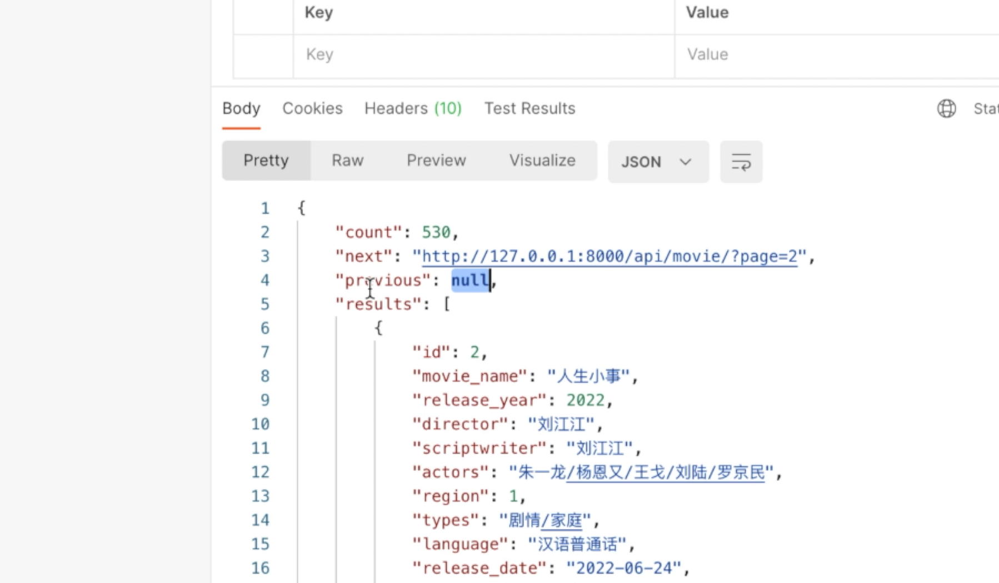
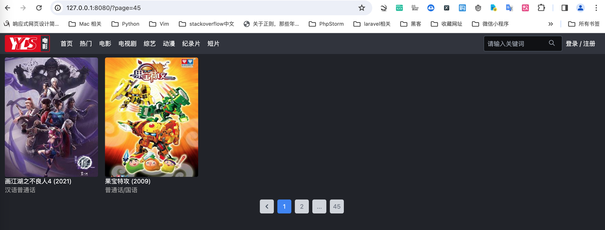

# 页面中添加分页按钮和页码


在上一节课中，我们成功实现了分页接口的请求。本节课的目标是在页面上添加分页按钮，实现通过点击按钮跳转到指定页面的功能。

<!-- trancate -->

## 分页样式

首先，我们需要将分页样式整合到首页中。在MovieList.vue文件中，电影信息下添加如下代码：

```js title="frontend/src/components/MovieList.vue"
    <div class="flex items-center justify-center text-gray-500 pb-4 mb-12">
        <span  class="page-link">
            <button class="w-8 h-8 rounded mx-1 my-1 text-gray-600 bg-gray-300">
                <svg xmlns="http://www.w3.org/2000/svg" class="h-5 w-5 mx-auto" viewBox="0 0 20 20" fill="currentColor">
                    <path fill-rule="evenodd" d="M12.707 5.293a1 1 0 010 1.414L9.414 10l3.293 3.293a1 1 0 01-1.414 1.414l-4-4a1 1 0 010-1.414l4-4a1 1 0 011.414 0z" clip-rule="evenodd" />
                </svg>
            </button>
        </span>
        <a class="page-link">
            <button class="w-8 h-8 rounded mx-1 my-1 bg-blue-500 text-white">1</button>
        </a>
        <a class="page-link">
            <button class="w-8 h-8 rounded mx-1 my-1 bg-gray-300">2</button>
        </a>
        <a class="page-link">
            <button class="w-8 h-8 rounded mx-1 my-1 bg-gray-300">...</button>
        </a>
        <a class="page-link">
            <button class="w-8 h-8 rounded mx-1 my-1 bg-gray-300">45</button>
        </a>
        <a class="page-link" href="javascript:void(0)">
            <button class="w-8 h-8 rounded mx-1 my-1 bg-gray-300">
                <svg xmlns="http://www.w3.org/2000/svg" class="h-5 w-5 mx-auto" viewBox="0 0 20 20" fill="currentColor">
                    <path fill-rule="evenodd" d="M7.293 14.707a1 1 0 010-1.414L10.586 10 7.293 6.707a1 1 0 011.414-1.414l4 4a1 1 0 010 1.414l-4 4a1 1 0 01-1.414 0z" clip-rule="evenodd"></path>
                </svg>
            </button>
        </a>
    </div>

```

运行效果如下图所示。


## 创建分页组件

然而，这只是样式的初步实现，我们接下来需要在View组件中实现具体的跳转逻辑，确保每次点击都能跳转到相应的页面，并正确显示分页数据，同时应该包含上一页和下一页的选项。 

考虑到分页功能在多个页面中均可能用到，例如在展示电影分类时，我们需要将其设计为一个可重用的组件。因此，我们不再将分页逻辑直接写入当前页面，而是创建一个新的分页组件，并通过组件的方式进行调用。

具体操作如下：在`Components`目录下，我们新建一个名为`PageView`的组件，并将之前的分页代码迁移到该组件中。目录结构如下：
```
├── src
│   ├── App.vue
│   ├── assets
│   │   ├── css
│   │   │   └── tailwind.css
│   │   ├── images
│   │   │   ├── logo.png
│   ├── components
│   │   ├── Footer.vue
│   │   ├── Header.vue
│   │   ├── HelloWorld.vue
│   │   ├── MovieList.vue
│   │   ├── Page.vue
```


接下来，在`MovieList`组件中导入`Page`组件，并在模板中引用它。

```js title="frontend/src/components/MovieList.vue"
<template>
  <!-- 分页 -->
  <Page />
</template>

<script>
import axios from "axios";
import Page from "@/components/Page.vue";

export default {
  name: "MovieList",
  data: function () {
    return {
      info: "",
    };
  },
  components: { Page },
  mounted() {
    this.get_movie_data();
  },

```

这样做后，刷新页面，你会看到分页组件已经成功集成到页面中。

## 显示`上一页`和`下一页`逻辑

下一步，我们需要实现基本的分页逻辑，即实现`上一页`和`下一页`的功能。在实现这一功能时，我们需要注意一些条件判断，例如，如果当前页面是第1页，则不应显示`上一页`按钮；如果当前页面是最后一页，则不应显示`下一页`按钮。我们可以通过检查数据结构中的`previous`和`next`属性来判断当前页面的位置。如下图所示。


当然我们可以在Page.vue中使用axios再次发一个请求，获取数据信息，判断是否有上一页和下一页。但是这里有一个效率问题。在`MovieList`页面中，我们已经使用axios请求获取了数据，如果我们再次发起请求，就会导致不必要的重复请求。

为了解决这个问题，我们可以将`MovieList`页面中请求得到的数据通过属性传递给分页组件。这里我们可以把`MovieList`当做父组件，而把`Page.vue`当做子组件。
在Vue.js中，我们可以使用属性绑定（prop binding）来实现父组件向子组件传值。

MovieList.vue代码如下：

```js title="frontend/src/components/MovieList.vue"
<template>
	<Page  :info="info">
</template>
```

Page.vue代码如下：
```js title="frontend/src/components/Page.vue"
<script>
export default {
  props: ["info"],
};
</script>
```

具体而言，我们在`MovieList`组件中将请求到的数据通过`props`传递给`PageView`组件。然后在`PageView`组件中，我们通过`props`接收这些数据，并使用它们来实现分页逻辑。

接下来，我们使用Vue的`v-if`指令来通过判断`previous`和`next`属性的值，来控制是否显示`上一页`和`下一页`的按钮。Page.vue代码如下:
```js title="frontend/src/components/Page.vue"
<template>
  <div class="flex items-center justify-center text-gray-500 pb-4 mb-12">
    <span v-if="info.previous" class="page-link">
      <button class="w-8 h-8 rounded mx-1 my-1 text-gray-600 bg-gray-300">
        <svg
          xmlns="http://www.w3.org/2000/svg"
          class="h-5 w-5 mx-auto"
          viewBox="0 0 20 20"
          fill="currentColor"
        >
          <path
            fill-rule="evenodd"
            d="M12.707 5.293a1 1 0 010 1.414L9.414 10l3.293 3.293a1 1 0 01-1.414 1.414l-4-4a1 1 0 010-1.414l4-4a1 1 0 011.414 0z"
            clip-rule="evenodd"
          />
        </svg>
      </button>
    </span>
    <a class="page-link">
      <button class="w-8 h-8 rounded mx-1 my-1 bg-blue-500 text-white">1</button>
    </a>
    <a class="page-link">
      <button class="w-8 h-8 rounded mx-1 my-1 bg-gray-300">2</button>
    </a>
    <a class="page-link">
      <button class="w-8 h-8 rounded mx-1 my-1 bg-gray-300">...</button>
    </a>
    <a class="page-link">
      <button class="w-8 h-8 rounded mx-1 my-1 bg-gray-300">45</button>
    </a>
    <a v-if="info.next" class="page-link" href="javascript:void(0)">
      <button class="w-8 h-8 rounded mx-1 my-1 bg-gray-300">
        <svg
          xmlns="http://www.w3.org/2000/svg"
          class="h-5 w-5 mx-auto"
          viewBox="0 0 20 20"
          fill="currentColor"
        >
          <path
            fill-rule="evenodd"
            d="M7.293 14.707a1 1 0 010-1.414L10.586 10 7.293 6.707a1 1 0 011.414-1.414l4 4a1 1 0 010 1.414l-4 4a1 1 0 01-1.414 0z"
            clip-rule="evenodd"
          ></path>
        </svg>
      </button>
    </a>
  </div>
</template>

<script>
export default {
  props: ["info"],
};
</script>

```


当我们访问第1页时，info.previous为null, `v-if`标签条件不成立，所以不显示`上一页`按钮，运行效果如下图所示。


当我们访问最后一页时，info.next为null, `v-if`标签条件不成立，所以不显示`下一页`按钮，运行效果如下图所示。



总结来说，通过创建一个可重用的分页组件，并通过组件属性传递数据，我们实现了一个高效且用户友好的分页功能。下一节课，我们将进一步探讨如何优化和扩展这一功能。

感谢您的收看，我们下节课再见。
