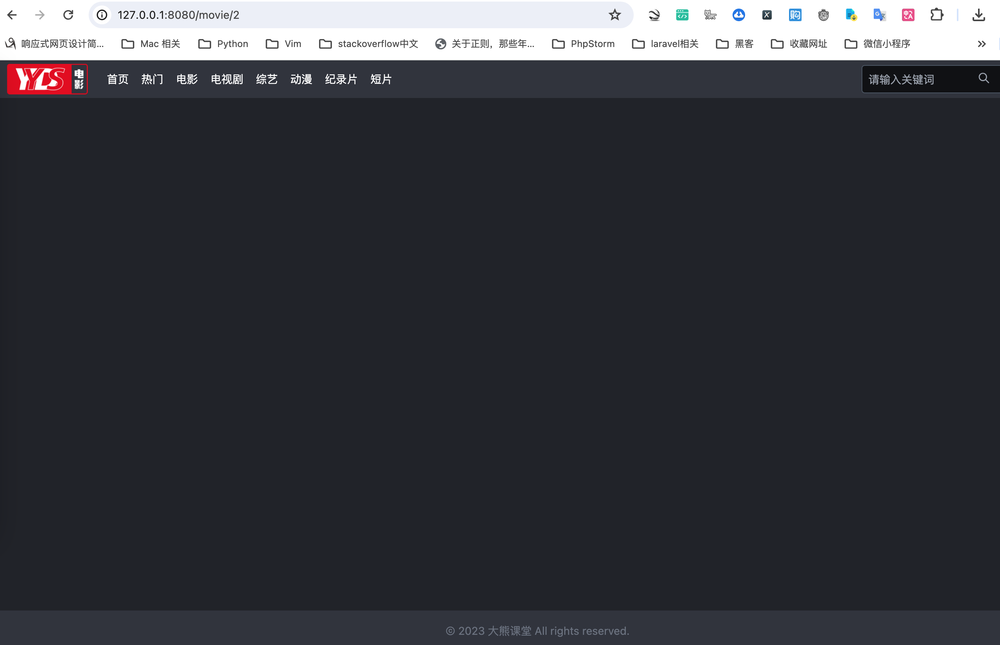
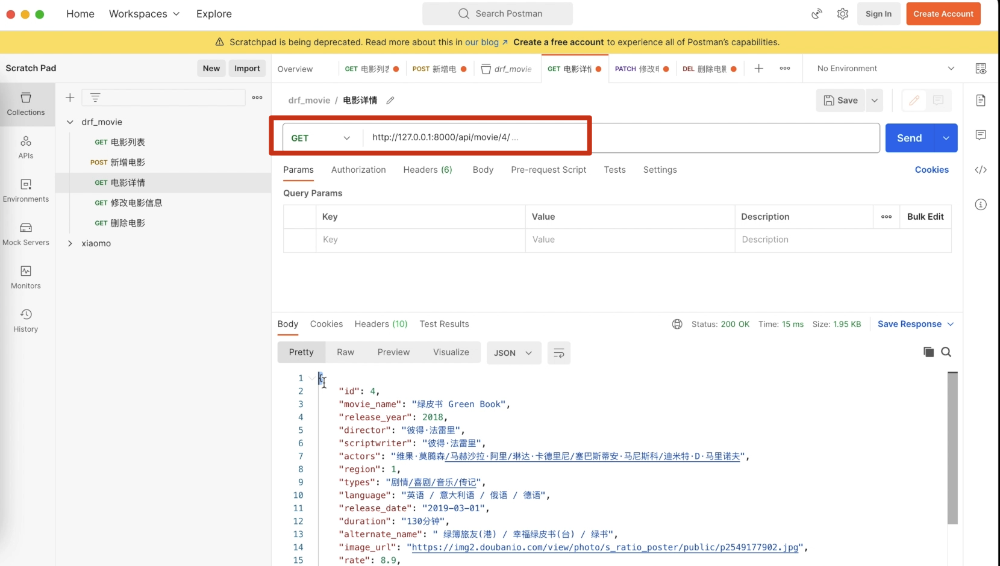
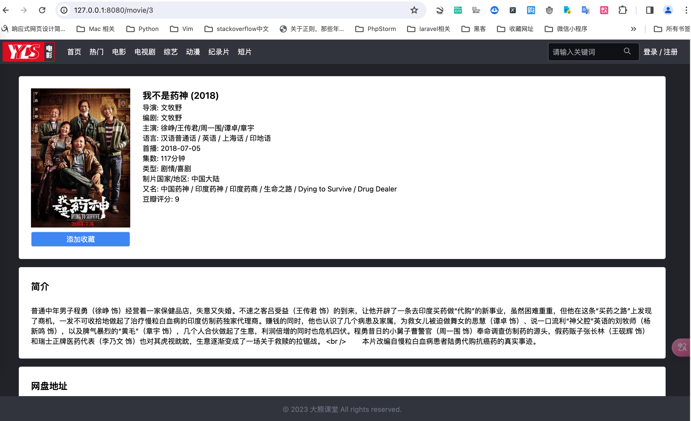

# 电影详情页实现

实现了电影首页后，点击首页某一个电影，应该跳转到电影详情页。本节我们就来介绍如何实现电影详情页。


## 创建路由

在index.js中新增详情页路由，代码如下：

```js title='frontend/src/router/index.js'
import { createRouter, createWebHistory } from 'vue-router'
import HomeView from '../views/HomeView.vue'
import MovieDetail from '../views/MovieDetail.vue'


const routes = [
  {
    path: '/',
    name: 'home',
    component: HomeView
  },
  {
    path: "/movie/:id",
    name: "MovieDetail",
    component: MovieDetail
  },
```

:::info[代码解析]
这段代码是在使用Vue.js框架进行前端开发时，定义路由的一部分。Vue.js通过vue-router插件来管理路由，从而控制页面的显示和跳转。具体来说，这段代码定义了一个路由规则：

- `path: "/movie/:id"`: 表示匹配的URL路径。这里的`:id`是一个动态参数，意味着它可以匹配如`/movie/1`、`/movie/123`等多种形式的URL。访问这样的URL时，`:id`部分会被解析为参数，你可以在组件中通过`this.$route.params.id`来获取这个参数的值。

- `name: "MovieDetail"`: 为这条路由规则定义一个名称，即`MovieDetail`。在编程时，可以通过这个名字引用这条路由，比如使用`<router-link :to="{ name: 'MovieDetail', params: { id: 123 } }">`来生成链接。

- `component: MovieDetail`: 指定当URL匹配这条路由规则时，哪个组件（Component）会被渲染到页面上。这里指定的`MovieDetail`是一个Vue组件，当访问如`/movie/1`的URL时，`MovieDetail`组件将被渲染，并且组件内部可以通过`this.$route.params.id`来获取实际的电影ID。

简而言之，这段代码的意思是：当用户访问像`/movie/123`这样的URL时，应用会渲染`MovieDetail`组件，并且在该组件中可以通过动态路由的方式获取到电影的ID。
:::

## 创建视图

在views路径下，新建一个名为“MovieDetail.vue”的文件，在这个视图中，我们先编写一个基础布局，代码如下：

```js title="frontend/src/views/MovieDetail.vue"
<template>
  <div id="container" class="text-white text-sm bg-primary-300 min-h-screen pb-4">
    <Header />

    <Footer />
  </div>
</template>

<script>
import Header from "@/components/Header.vue";
import Footer from "@/components/Footer.vue";

export default {
  name: "MovieDetail",
  components: { Header, Footer },
};
</script>

```

运行效果如下图所示。


## 请求接口

接下来获取具体的电影信息。那么我们需要向后台接口发送请求。接口信息如下:



代码如下:

```js title="frontend/src/views/MovieDetail.vue"
<template>
  <div id="container" class="text-white text-sm bg-primary-300 min-h-screen pb-4">
    <Header />
    <div class="flex items-center justify-center">
      <div class="w-full px-2" style="max-width: 1440px">
        <div id="main" class="bg-primary-300 p-6 text-black">
          <div class="flex rounded bg-white mx-4 py-6">
            <div class="mx-6">
              <div class="" style="min-height: 259px; max-height: 300px; height: 274px">
                
              </div>
              <button
                id="collect"
                class="copy text-white w-full px-4 py-1 mt-2 text-sm rounded border bg-blue-500"
              >
                添加收藏
              </button>
            </div>
            <div id="info" data-movie-id="443">
              <ul>
                <li class="text-lg font-semibold">
                  {{ movie.movie_name }} ({{ movie.release_year }})
                </li>
                <li>导演: {{ movie.director }}</li>
                <li>编剧: {{ movie.scriptwriter }}</li>
                <li>主演: {{ movie.actors }}</li>
                <li>语言: {{ movie.language }}</li>

                <li>首播: {{ movie.release_date }}</li>
                <li>集数: {{ movie.duration }}</li>

                <li>类型: {{ movie.types }}</li>
                <li>
                  制片国家/地区:
                  <span v-if="movie.region === 1">中国大陆</span>
                  <span v-else-if="movie.region === 2">中国香港</span>
                  <span v-else-if="movie.region === 3">中国台湾</span>
                  <span v-else-if="movie.region === 4">美国</span>
                  <span v-else-if="movie.region === 5">韩国</span>
                  <span v-else-if="movie.region === 6">日本</span>
                  <span v-else>其他</span>
                </li>
                <li>又名: {{ movie.alternate_name }}</li>
                <li>豆瓣评分: {{ movie.rate }}</li>
              </ul>
            </div>
          </div>
          <div class="rounded bg-white mx-4 my-4 py-6">
            <div class="px-6">
              <h1 class="text-lg mb-6 font-semibold">简介</h1>
              <p>
                {{ movie.review }}
              </p>
            </div>
          </div>
          <div id="download_info" class="rounded bg-white mx-4 mt-4 py-6">
            <h1 class="text-lg mb-6 font-semibold px-6">网盘地址</h1>

            <div v-if="movie.download_info" class="px-6">
              <div v-if="downloadInfo">
                {{ movie.download_info }}
              </div>
              <div
                v-else
                class="flex justify-center items-center mx-6 rounded h-28 bg-gradient-to-r from-gray-600 to-gray-900"
              >
                <button
                  id="check_member"
                  class="rounded text-center bg-blue-500 text-white h-10 w-48"
                >
                  查看网盘地址
                </button>
              </div>
            </div>
            <div v-else class="px-6">暂无网盘信息</div>
          </div>
        </div>
      </div>
    </div>
    <Footer />
  </div>
</template>

<script>
import axios from "axios";
import Header from "@/components/Header.vue";
import Footer from "@/components/Footer.vue";

export default {
  name: "MovieDetail",
  data() {
    return {
      movie: {},
    };
  },
  components: { Header, Footer },
  mounted() {
    this.get_movie_info();
  },
  methods: {
    get_movie_info: function () {
      axios
        .get("/api/movie/" + this.$route.params.id)
        .then((response) => (this.movie = response.data));
    },
  },
};
</script>
```

:::info[代码解析]
这段代码是一个使用Vue.js框架开发的单页面应用程序的一部分，具体来说，是一个显示电影详细信息的组件。以下是对其主要Vue相关部分的解释：

### 1. `<template>` 部分
这是组件的HTML模板。它定义了组件的结构和布局。

- **指令 (Directives)**: Vue指令提供了声明式的方法来将数据渲染进DOM系统。
    - `v-if` / `v-else-if` / `v-else`: 条件渲染指令。例如，`<span v-if="movie.region === 1">中国大陆</span>` 表示仅当 `movie.region` 的值为1时，才显示“中国大陆”。
    - `:src`: 是 `v-bind:src` 的简写，用于动态绑定属性。这里用于将图片的 `src` 属性绑定到 `movie.image_url` 数据属性上。
- **数据绑定**:
    - `{{ movie.movie_name }}`: 文本插值。在DOM中显示 `movie` 对象的 `movie_name` 属性。

### 2. `<script>` 部分
这部分包含了Vue组件的逻辑。

- **导入依赖**:
    - `axios` 用于发起HTTP请求。
    - `Header`, `Footer`, `MovieBox` 是子组件，被导入并在这个组件中使用。

- **组件定义**:
    - `name`: 定义了组件的名称。
    - `data`: 组件的数据对象。这里定义了 `movie` 对象，用于存储电影详情。
    - `components`: 注册子组件，使其在这个组件的模板中可用。
    - `mounted`: 生命周期钩子，当组件被挂载到DOM上后执行。这里使用它来调用 `get_movie_info` 方法，获取电影详情。

- **方法 (methods)**:
    - `get_movie_info`: 定义了一个方法，用axios向服务器请求电影信息，并将响应赋值给 `movie` 数据属性。

### 3. 响应式数据
Vue的核心特性之一是其响应式系统。当 `movie` 对象的属性被 `get_movie_info` 方法更新时，所有绑定到这个对象的DOM也会自动更新。这意味着电影的详细信息会自动填充到模板中相应的位置。

### 4. 组件化
`Header` 和 `Footer` 组件被导入并注册到当前组件，这展示了Vue组件化开发的特点。组件化可以帮助你构建可复用和可维护的代码。

总的来说，这段代码展示了一个Vue组件的结构，包括模板、响应式数据、生命周期钩子和方法，以及如何通过组件化构建应用程序的方式。
:::


页面效果如下图所示。




此外，还需要在首页添加电影的点击信息链接，点击`<a>`标签，跳转到对应的电影详情页，代码如下:
```js title="frontend/src/components/MovieList.vue"
<div class="movie" v-for="movie in info.results" :key="movie.id">
	<a :href="'/movie/' + movie.id">
	   省略代码
	</a>
</div>
```


