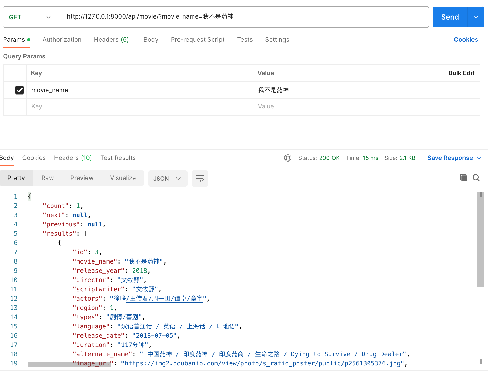
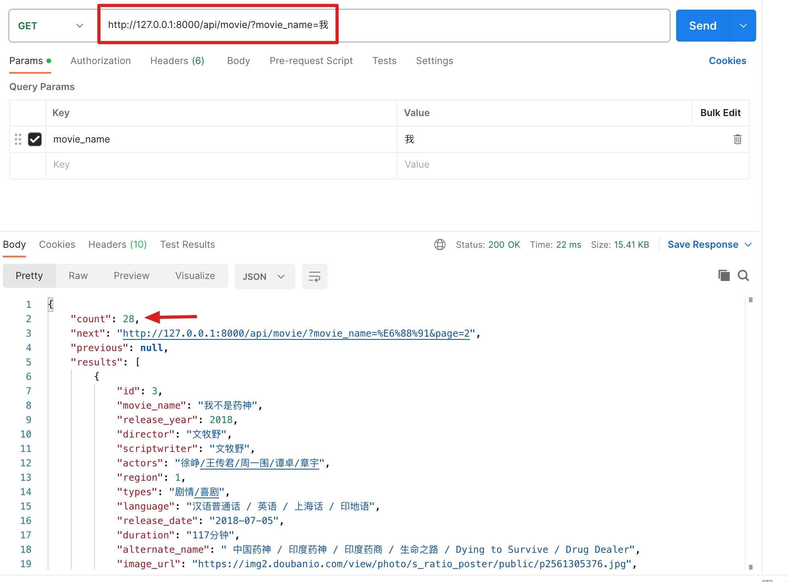

# 搜索功能接口实现

本节开始我们来实现搜索功能。我们先来实现搜索的后台接口。

搜索是非常常见的功能，django中有很多包，可以拿来即用。在本项目中，我们使用的是[django-filter](https://django-filter.readthedocs.io/en/stable/index.html)。


## 安装和配置django-filter

在虚拟环境下使用pip安装django-filter, 命令如下：

```bash
pip install django-filter
```

在drf中配置django-filter， 首先在MovieViewSet()中，配置django-filter的相关属性。代码如下：
```python title='dx_movie/movie/views.py'
from django_filters.rest_framework import DjangoFilterBackend

class MovieViewSet(viewsets.ModelViewSet):
    queryset = Movie.objects.all()
    serializer_class = MovieSerializer
    filter_backends = (filters.DjangoFilterBackend,)
    filterset_fields = ('movie_name',)
```
:::danger[注意]
filterset_fields = ('movie_name',) 括号里有个逗号，表示()这是个元组。可以填写多个查询字段。
:::


接下来配置settings.py全局文件。
INSTALLED_APPS 中添加“django_filters”， REST_FRAMEWORK中配置
代码如下：
```python 'dx_movie/dx_movie/settings.py'
INSTALLED_APPS = [
    'django_filters',
]


# DRF设置
REST_FRAMEWORK = {
    'DEFAULT_PAGINATION_CLASS': 'rest_framework.pagination.PageNumberPagination',
    'PAGE_SIZE': 12,
    'DEFAULT_AUTHENTICATION_CLASSES': (
        'rest_framework_simplejwt.authentication.JWTAuthentication',
    ),
}
```

配置完成后，我们就可以直接请求接口了，请求的url示例如下：
```
http://127.0.0.1:8000/api/movie/?movie_name=我不是药神
```

:::info[参数说明]
?后面是查询的参数。因为在MovieViewSet配置中，设置了filterset_fields字段是movie_name， 所以根据它进行查询。
注意：这里只能进行精准匹配。
:::
运行效果如下图所示。



## 模糊查询

在MovieViewSet配置中，设置了filterset_fields， 它只能精确查询，比如查询“我不是药神”可以查到一条结果，但是如果查询“药神”，返回结果就是空。
接下来我们就来介绍如何实现模糊查询。

在MovieViewSet中，我们配置一个filterset_class， 自己定义一个类，命名“MovieFilter”, 具体代码如下：
```python title='dx_movie/movie/views.py'
from django_filters.rest_framework import DjangoFilterBackend

class MovieFilter(filters.FilterSet):
    movie_name = filters.CharFilter(lookup_expr='icontains')
    class Meta:
        model = Movie
        fields = ['movie_name']

class MovieViewSet(viewsets.ModelViewSet):
    queryset = Movie.objects.all()
    serializer_class = MovieSerializer
    filter_backends = (filters.DjangoFilterBackend,)
    # filterset_fields = ('movie_name',)
    filterset_class = MovieFilter

```

:::info[代码解析]
这段代码是用Django REST framework (DRF) 和 django-filter 库来创建一个电影列表的API，并提供了过滤电影列表的功能。下面是对代码的详细解释：

1. `MovieFilter` 类
这是一个使用 django-filter 库定义的过滤器类，它继承自 `filters.FilterSet`。这个类定义了如何根据不同的字段过滤 `Movie` 模型的查询结果。

- `movie_name = filters.CharFilter(lookup_expr='icontains')`: 定义了一个字符过滤器，用于对 `movie_name` 字段进行过滤。`icontains` 表示不区分大小写的包含，即模糊查询。


在 `Meta` 子类中，指定了以下内容：
- `model = Movie`: 指明这个过滤器是用于 `Movie` 模型的。
- `fields = ['movie_name']`: 指定可以用于过滤的字段。

2. `MovieViewSet` 类
这是一个使用 Django REST framework 的视图集类，继承自 `viewsets.ModelViewSet`。这个类定义了一个视图集，用于处理对 `Movie` 模型的 CRUD 操作。

- `queryset = Movie.objects.all()`: 指定了基础查询集，即开始时获取所有电影记录。
- `serializer_class = MovieSerializer`: 指定了用于序列化和反序列化数据的类。`MovieSerializer` 是处理 `Movie` 实例的序列化器。
- `filter_backends = (filters.DjangoFilterBackend,)`: 指定了过滤后端。这里使用的是 `DjangoFilterBackend`，这意味着它将使用上面定义的 `MovieFilter` 来过滤数据。
- `filterset_class = MovieFilter`: 指定了过滤器类。这告诉视图集使用 `MovieFilter` 类来过滤查询集。

注释掉的行 `# filterset_fields = ('movie_name',)` 是另一种指定过滤字段的方法。但在这个代码中，它被注释掉了，因为使用了更灵活的 `MovieFilter` 类。

总体来说，这段代码定义了一个DRF视图集，它允许客户端对电影数据进行CRUD操作，并且可以通过电影名称来过滤返回的电影列表。
:::


页面效果如下图所示。



