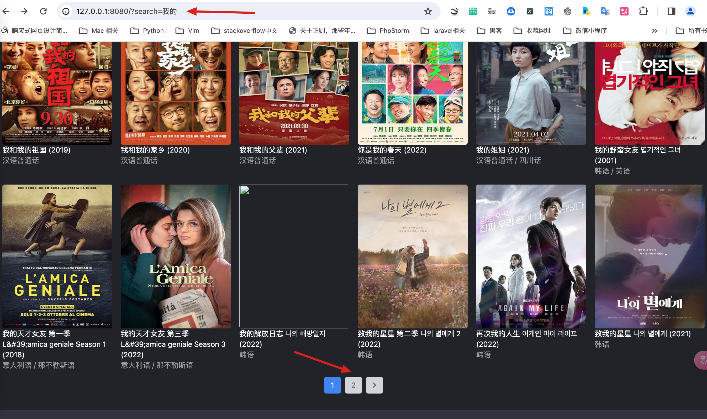
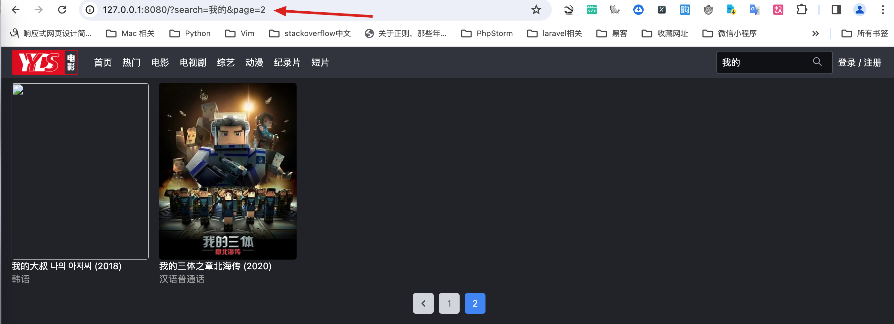

# 实现搜索页面

上一节课，我们实现了请求的API接口。本节课，我们将开始在输入框中输入关键字，然后点击搜索进行电影搜索。


首先，我们观察输入框的位置，它位于页面的header部分。因此，我们先定位到header，并在其中找到form表单。当点击提交按钮时，我们会看到有一个button元素，我们的数据将提交到一个特定的方法中。在这里，我们添加了一个v-on click事件，用以在点击提交时阻止默认事件的提交，并使用prevent指令。

```js title='frontend/src/components/Header.vue'
<form>
  <input
    v-model="keyword"
    type="text"
    name="keyword"
    class="outline-0 h-9 rounded bg-primary-700 border border-gray-600 placeholder-gray-400 w-64 px-2 py-1 max-w-[180px]"
    placeholder="请输入关键词"
  />
  
  <div class="absolute top-0 right-0 flex items-center h-full">
    <div class="rounded text-xs text-gray-400 px-2 mr-2">
      <button v-on:click.prevent="searchMovies">
        <svg
          xmlns="http://www.w3.org/20 00/svg"
          class="h-4 w-4"
          fill="none"
          viewBox="0 0 24 24"
          stroke="currentColor"
          stroke-width="2"
        >
          <path
            stroke-linecap="round"
            stroke-linejoin="round"
            d="M21 21l-6-6m2-5a7 7 0 11-14 0 7 7 0 0114 0z"
          ></path>
        </svg>
      </button>
    </div>
  </div>
</form>
```

:::info[代码解析]
这段Vue代码是一个表单，主要用于输入关键词并通过点击搜索图标来搜索电影。以下是对其Vue和HTML相关部分的详细解释：

1. `<form>` 元素
包含了整个搜索表单。在Vue中，通常会在 `<form>` 标签上使用 `.prevent` 修饰符来阻止表单的默认提交行为。

2. 输入框 (`<input>`)
- **`v-model="keyword"`**: 这是Vue的双向数据绑定指令，用于将输入框的值和组件的 `keyword` 数据属性绑定在一起。当输入框的值发生变化时，`keyword` 的值也会相应地更新；反之亦然。
- **`type="text"`**: 指定输入框为文本类型。
- **`name="keyword"`**: 设置输入框的名称为 `keyword`。
- **`class="..."`**: 应用了多个CSS类以样式化输入框，例如设置高度、背景色、边框颜色、占位符颜色等。
- **`placeholder="请输入关键词"`**: 在输入框为空时显示的占位文本，提示用户输入关键词。

3. 搜索按钮 (`<button>`)
包含在一个 `<div>` 元素内，该 `<div>` 使用CSS类进行样式化，例如设置文本大小和颜色。

- **`v-on:click.prevent="searchMovies"`**: `v-on:click` 是Vue中的事件监听指令，用于在点击按钮时调用 `searchMovies` 方法。`.prevent` 是事件修饰符，用于阻止按钮的默认行为（例如提交表单）。
- **`<svg>`**: 这是一个SVG图标，显示为一个搜索图标。它设置了命名空间、尺寸、填充颜色、视图框、描边颜色和宽度。
- **`<path>`**: 定义了SVG图标的路径，这里是一个典型的搜索图标的形状。

总体来说，这个表单包含一个文本输入框，允许用户输入搜索关键词，并有一个按钮来触发搜索。当用户点击搜索按钮时，将调用 `searchMovies` 方法，并且因为 `.prevent` 修饰符的存在，点击不会导致表单提交，从而阻止了页面刷新。
:::

当点击查询按钮的时候吗，会执行searchMovie方法。代码如下：

```js title='frontend/src/components/Header.vue'
<script>
export default {
  name: "Header",
  data() {
    return { keyword: "" };
  },
  methods: {
    searchMovies() {
      const keyword = this.keyword.trim();
      this.$router.push({ name: "home", query: { search: keyword } });
    },
  },
};
</script>
```

在searchMovie函数中，我们需要根据用户在form表单的input中输入的关键字进行处理。为此，我们使用v-model对其进行绑定，并命名为keyword。用户输入完成后，我们通过添加data，并将原始数据设置为空字符串，来获取keyword的值。然后跳转到home页面，并且传递了一个“query”参数。

接下来我们需要在home页面接收这个参数。修改MovieList.vue, 代码如下：

```js title='frontend/src/components/MovieList.vue'
<script>
import axios from "axios";
import Page from "@/components/Page.vue";

export default {
  name: "MovieList",
  data: function () {
    return {
      info: "",
    };
  },
  components: { Page },
  mounted() {
    this.get_movie_data();
  },
  methods: {
    get_movie_data: function () {
      let url = "/api/movie"; // /api/movie/?page=3&movie_name=我
      // 获取page参数值
      const page = Number(this.$route.query.page);
      // 获取search参数
      const search = this.$route.query.search;
      const params = new URLSearchParams();

      // if (!isNaN(page) && page !== 0) {
      //   url = url + "/?page=" + page;
      // }
      if (page) {
        params.append("page", page);
      }
      if (search) {
        params.append("movie_name", search);
      }
      url = url + "?" + params.toString();

      axios
        .get(url)
        .then((response) => (this.info = response.data))
        .catch((error) => {
          console.log(error);
        });
    },
  },
  watch: {
    // 监听路由的变化
    $route() {
      this.get_movie_data();
    },
  },
};
</script>

```

我们接收名为search的新参数，其值来源于this.$route.query.search。接收到这个值后，我们将其与其他参数一起加入到一个URL对象中。这个对象使用JavaScript内置的URLSearchParams方法创建。创建对象后，我们将所有参数加入其中。我们通过判断page参数是否存在，若存在，则将其添加到params对象中。同样，如果search参数存在，我们也将其追加到params中。这样，我们就可以处理URL中的各种参数了。

:::info[代码解析]

这段代码是JavaScript (很可能是在Vue.js环境中) 的一部分，它的目的是构建一个URL，其中包含查询参数，通常用于发起HTTP请求（如API调用）。以下是对代码的逐行解释：

1. `const search = this.$route.query.search;`  
   这行代码从Vue路由的查询参数中获取 `search` 参数的值，并将其存储在常量 `search` 中。`this.$route` 是Vue路由对象，其中包含当前路由的详细信息，如路径、查询参数等。
2. `const params = new URLSearchParams();`  
   这里创建了一个 `URLSearchParams` 对象。`URLSearchParams` 是Web API的一部分，它提供了一种处理URL的查询字符串的便捷方式。
4. `if (page) { params.append("page", page); }`  
   这段代码检查 `page` 是否存在（truthy），如果存在，则使用 `append` 方法将其作为查询参数添加到 `params` 对象中。`page` 变量没有在代码片段中定义，可能是在外部定义的。`"page"` 是参数的名称，`page` 是它的值。
5. `if (search) { params.append("movie_name", search); }`  
   这行代码检查 `search` 是否存在，如果存在，则将其作为 `movie_name` 参数添加到查询字符串中。这意味着如果用户提供了 `search` 参数，它将被添加到URL中，可能用于在服务器端过滤电影名。
6. `url = url + "?" + params.toString();`  
   最后，将 `params` 对象转换为字符串并追加到 `url` 字符串的末尾，以构建完整的URL。`params.toString()` 会自动将所有参数转换为适合URL的查询字符串格式。

使用JavaScript内置的URLSearchParams方法，我们就可以处理URL中的各种参数了。

:::


在搜索栏输入关键词“我的”，页面效果如下图所示。



但是，当点击第2页的时候，页面没有显示第2页电影信息，而是显示全部电影的第2页新，效果如下图所示。


出现这个bug, 我们需要查看Page组件点击跳转的代码， 代码如下：
```js title='frontend/src/components/Page.vue'
    goToPage(page) {
      this.current = page;
      this.$router.push({ query: { page } });
    },
```
当点击页面按钮时，只传递了一个page参数，而没有传递其他参数。所以，这里需要处理一下。此时需要传递所以当前页面url中的参数。修改后代码如下：
```js title='frontend/src/components/Page.vue'
  goToPage(page) {
    this.current = page;
    // 获取当前参数;
    const params = { ...this.$route.query };
    params.page = page;
    this.$router.push({ query: params });
  }
```
:::info[代码解析]
这段Vue代码定义了一个名为 `goToPage` 的方法，用于处理分页逻辑。下面是对该方法的详细解释：

1. `this.current = page;`  
   这行代码将组件的 `current` 数据属性设置为传入的 `page` 参数。`this.current` 可能用于跟踪当前活动的页面编号。

2. `const params = { ...this.$route.query };`  
   这里创建了一个新的对象 `params`，它是当前路由的查询参数的一个副本。`this.$route.query` 包含了当前路由的所有查询参数，使用扩展运算符 (`...`) 来复制这些参数到 `params` 中，确保不修改原始的路由查询参数。

3. `params.page = page;`  
   这行代码将 `params` 对象中的 `page` 属性设置为传入的 `page` 参数。如果 `params` 中已经有 `page` 参数，这将覆盖原有的值；如果没有，这将新增一个 `page` 参数。

4. `this.$router.push({ query: params });`  
   最后，这行代码使用Vue Router的 `push` 方法更新URL，使其反映新的查询参数。`push` 方法的参数是一个对象，其中的 `query` 属性被设置为更新后的 `params` 对象。这会导致URL更新，并且如果有配置的话，相应的路由视图也会更新。

总结来说，`goToPage` 方法用于更改当前的页面编号，并更新URL中的查询参数，而不刷新页面。这在创建分页功能时非常有用，用户点击不同的页码可以看到不同页面的内容，同时URL的变化使得用户可以通过URL直接访问特定页码的内容。
:::

修改后的分页效果如下图所示。


