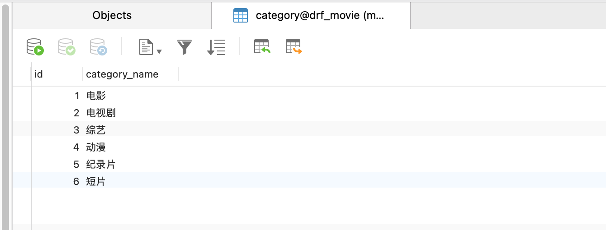
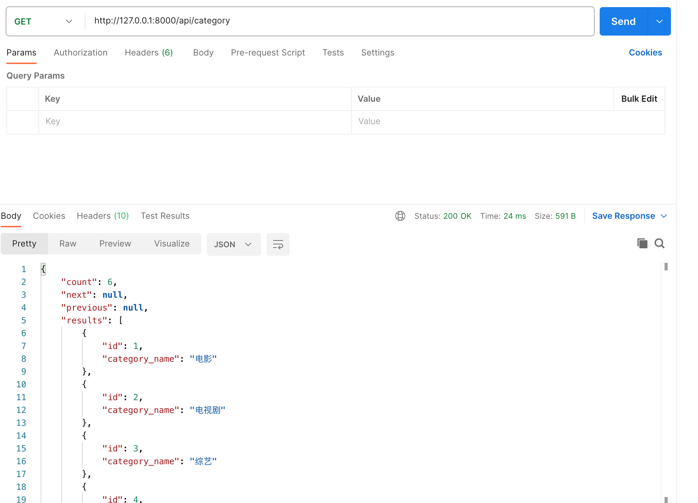

# 实现顶部导航栏分类功能


本接我们将介绍如何实现分类功能。目前，页面顶部的分类是静态编写的，但实际情况下，这些分类应从数据库中获取。让我们看看数据库中的Category表，它包含了多条记录，我们需要将这些数据显示在页面上。




## 创建分类接口

首先，我们需要准备一个分类接口。在后台中，我们创建一个名为CategoryViewSet的class，并让它继承ViewSet类。在这个过程中，我们需要导入Category模型，并创建一个新的Serializer，命名为CategorySerializer。代码如下：


```python titile='dx_movie/movie/serializer.py
from movie.models import Movie, Category
from movie.serializers import MovieSerializer, CategorySerializer

class CategoryViewSet(viewsets.ModelViewSet):
    queryset = Category.objects.all()
    serializer_class = CategorySerializer
```

上面代码引入了CategorySerializer， 接下里在serializers下创建CategorySerializer， 代码如下：

```python title='dx_movie/movie/serializers.py'
from rest_framework import serializers
from movie.models import Movie, Category


class MovieSerializer(serializers.ModelSerializer):
    
    class Meta:
        model = Movie
        fields = '__all__'


class CategorySerializer(serializers.ModelSerializer):
    
    class Meta:
        model = Category
        fields = '__all__'
```

接下来注册url, url.py文件代码如下:

```python title='dx_movie/dx_movie/url.py'
from django.contrib import admin
from django.urls import path, include
from rest_framework.routers import DefaultRouter
from movie import views


router = DefaultRouter()
router.register(r'movie', views.MovieViewSet)
router.register(r'category', views.CategoryViewSet)

```

完成这些步骤后，我们将该视图通过URL注册，这样我们就成功地创建了一个分类接口，整个过程包括视图、序列化器以及URL配置，代码行数不超过十行。

我们接着向这个新创建的接口发起请求。新建一个名为分类接口的API请求，输入URL“api/category”。此时，我们可以看到结果中包含了六条数据。虽然返回结果中包含了分页信息，但我们当前不需要使用它。分类接口如下图所示。


后台接口数据准备就绪后，我们转向前端页面进行数据展示。首先，我们在Header组件中找到分类信息的部分。为了代码的模块化和易维护性，我们考虑将其提取为一个独立的子组件。在Components目录下，我们新建一个名为Category.vue的文件，并将相关内容提取到这个新文件中。
Category.vue代码如下：
```js titile='frontend/src/components/Category.vue'
<template>
  <div id="nav" class="px-4">
    <ul class="md:flex items-center space-x-4 ml-2">
      <li>
        <a href="/">首页</a>
      </li>
      <li
        v-for="category in info.results"
        v-bind="category.id"
        class="dropdown-menu flex items-center relative hover: cursor-pointer select-none"
      >
        {{ category.category_name }}
      </li>
    </ul>
  </div>
</template>

<script>
import axios from "axios";

export default {
  name: "Category",
  data: function () {
    return {
      info: "",
    };
  },
  mounted() {
    this.get_category_info();
  },
  methods: {
    get_category_info() {
      axios.get("/api/category/").then((response) => {
        this.info = response.data;
      });
    },
  },
};
</script>

```

:::info[代码解析]
Category.vue中使用axios发送请求到分类接口，并获取数据。我们定义一个名为getCategoryInfo的方法，通过axios.get方法向API/Category发送GET请求。请求成功后，我们将响应数据赋值给this.info，并在mounted生命周期钩子中调用getCategoryInfo方法。在页面中，我们使用v-for指令遍历this.info中的数据，并在li标签中展示每个分类的名称。
:::


在Header组件中，我们导入Category组件，并在相应位置替换原有的分类信息。Header.vue代码如下:
```js titile='frontend/src/components/Header.vue'
<template>
  <div id="header" class="h-12 py-1 bg-primary-100 flex items-center justify-center">
    <div class="w-full px-4" style="max-width: 1440px">
      <div class="flex justify-between">
        <div class="flex items-center">
          <a href="/">
            
          </a>
          <Category />
        </div>
        
</template>

<script>
import Category from "./Category.vue";
export default {
  components: { Category },
  name: "Header",
  data() {
    return { keyword: "" };
  },
  methods: {
    searchMovies() {
      const keyword = this.keyword.trim(); //去除左右空格
      this.$router.push({ name: "home", query: { search: keyword } });
    },
  },
};
</script>
```


这样，我们就实现了从后台获取分类数据，并在前端页面动态展示这些数据的功能。至此，分类功能的实现介绍完毕，我们将在下节课继续深入讨论。感谢观看，下次再见。