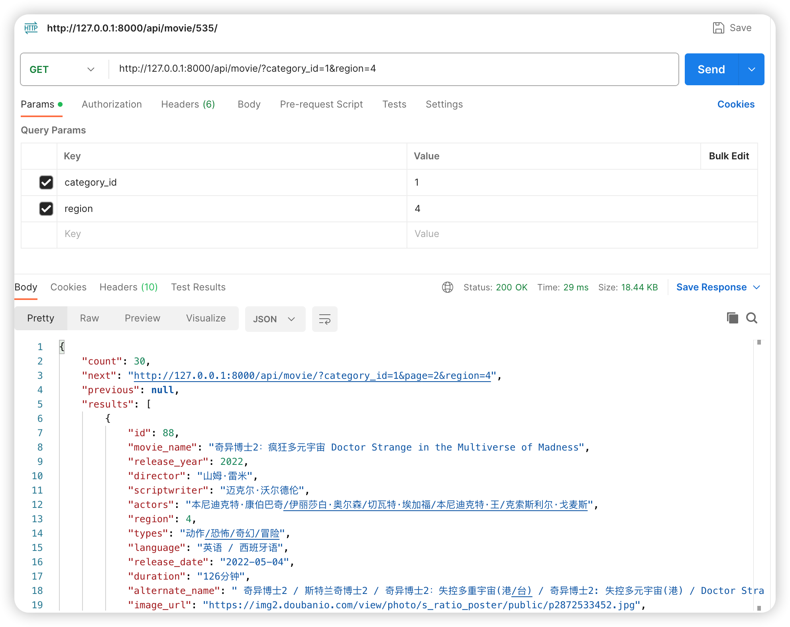

# 分类下地区查询功能实现


本节课程将介绍如何在网页中实现分类下的地区筛选功能。此功能允许用户根据不同地区筛选电影、电视剧和综艺等内容。


## 后端接口实现步骤

### 1 筛选功能实现
1. **查询电影列表接口：** 在查询电影列表接口后添加对应的字段属性，根据`moviename`、`region`（地区）和`categoryid`（分类ID）进行筛选。
2. **过滤条件设置：** 在`MovieViewSet`中使用`FilterSetClass`，添加查询字段和过滤器，例如`categoryid filters.NumberFilter` 和 `region filters.NumberFilter`。


MovieFilter代码如下:

```python title='dx_movie/movie/views.py'
class MovieFilter(filters.FilterSet):
    movie_name = filters.CharFilter(lookup_expr='icontains')
    category_id = filters.NumberFilter()
    region = filters.NumberFilter()

    class Meta:
        model = Movie
        fields = ['movie_name', 'category_id', 'region']
```


### 2 接口测试
 **接口测试：** 向接口发送带有`categoryid`和`region`参数的请求，验证返回的结果是否符合预期。
请求接口如下图所示：


## 前端实现步骤

### 创建下拉菜单

1. **样式拷贝：** 将所需样式复制到目标位置，确保有一个下拉菜单用于展示所有地区。
2. **添加分类标签：** 在页面上添加一个分类标签（例如电影），并旁边加上一个下拉图标。
3. **展示地区分类：** 使用`span`标签下方追加各种地区分类。使用Tailwind样式框架时，注意检查是否有`hidden`属性，该属性决定是否显示所有地区。

Category.vue代码如下：

```js title='frontend/src/components/category.vue'
<template>
    <ul class="hidden md:flex items-center space-x-4 ml-2">
        <li>
        <a href="/">首页</a>
        </li>
        <li>
        <a href="">热门</a>
        </li>
        <li v-for="category in info.results" @click="toggle(category)" class="dropdown-menu flex items-center relative hover: cursor-pointer select-none">
            {{ category.category_name}}
            <span>
                <svg xmlns="http://www.w3.org/2000/svg" class="h-5 w-5" viewBox="0 0 20 20" fill="currentColor">
                <path fill-rule="evenodd" d="M5.293 7.293a1 1 0 011.414 0L10 10.586l3.293-3.293a1 1 0 111.414 1.414l-4 4a1 1 0 01-1.414 0l-4-4a1 1 0 010-1.414z" clip-rule="evenodd" />
                </svg>
            </span>
            <div :class="{hidden: !category.hidden}" class="dropdown-item-content absolute top-9 w-32 transition ease-in-out delay-150 z-50">
                  <ul class="bg-primary-700 py-2 px-4">
                    <li class="plx-2 py-2">
                      <a :href="'/?category_id='+category.id">全部</a>
                    </li>
                    <li v-for="region in regions" class="plx-2 py-2">
                      <a :href="'/?category_id='+category.id+'&region='+region.id">
                        {{ region.name }}
                      </a>
                    </li>
                  </ul>
            </div>           
        </li>
    </ul>
</template>


<script>
import axios from 'axios'

export default {
    name: 'Category',
    data: function(){
        return {
            info: '',
            regions: [
                { id: 1, name: '中国大陆'},
                { id: 2, name: '中国香港'},
                { id: 3, name: '中国台湾'},
                { id: 4, name: '美国'},
                { id: 5, name: '日本'},
                { id: 6, name: '韩国'},
                { id: 7, name: '其他'},                
            ]
        }
    },
    mounted() {
        this.get_category_info()
    },
    methods: {
        toggle(category) {
            category.hidden = !category.hidden
        },
        get_category_info() {
            axios
                .get('/api/category')
                .then(response => {
                    this.info = response.data
                })
        }
    }
}
</script>
```

:::info[代码解析]

1. **添加点击事件：** 在`li`标签添加点击事件`@click`，并在事件中执行`toggle`函数，传递当前的Category对象。
2. **动态控制显示隐藏：** 使用`:class`在点击事件中切换`hidden`属性的状态，实现点击一次显示，再次点击隐藏的切换效果。
3. **添加URL参数：** 在每个分类链接下面添加参数（例如`category_id=1`和`region=1`），确保链接正确反映了用户的选择。
4. **数据获取与追加：** 在`MovieList`中获取当前的`category`和`region`参数，并在存在时将它们追加到请求中。

:::

页面效果如下图所示。


但是，当我们点击分页的时候， 会发信虽然url显示正确，但是页面数据不对。这是因为跳转到home路由下，但是没有获取到category_id和region这2个参数。所以需要在MovieList.vue中进行修改，代码如下：
```js title='frontend/src/components/MovieList.vue'
<script>
import axios from "axios";
import Page from "@/components/Page.vue";

export default {
  name: "MovieList",
  data: function () {
    return {
      info: "",
    };
  },
  components: { Page },
  mounted() {
    this.get_movie_data();
  },
  methods: {
    get_movie_data: function () {
      let url = "/api/movie"; // /api/movie/?page=3&movie_name=我
      // 获取page参数值
      const page = Number(this.$route.query.page);
      // 获取search参数
      const search = this.$route.query.search;
      // 获取category_id参数
      const category_id = this.$route.query.category_id;
      // 获取region参数
      const region = this.$route.query.region;
      const params = new URLSearchParams();

      // if (!isNaN(page) && page !== 0) {
      //   url = url + "/?page=" + page;
      // }
      if (page) {
        params.append("page", page);
      }
      if (search) {
        params.append("movie_name", search);
      }
      if (category_id) {
        params.append("category_id", category_id);
      }
      if (region) {
        params.append("region", region);
      }
      url = url + "?" + params.toString();
      axios
        .get(url)
        .then((response) => (this.info = response.data))
        .catch((error) => {
          console.log(error);
        });
    },
  },
  watch: {
    // 监听路由的变化
    $route() {
      this.get_movie_data();
    },
  },
};
</script>
```


## 小结
本节课我们详细介绍了分类下地区筛选功能的前端实现、后端接口配置和前后端数据绑定。此功能的成功实现为用户提供了更加丰富和定制化的内容浏览体验。


