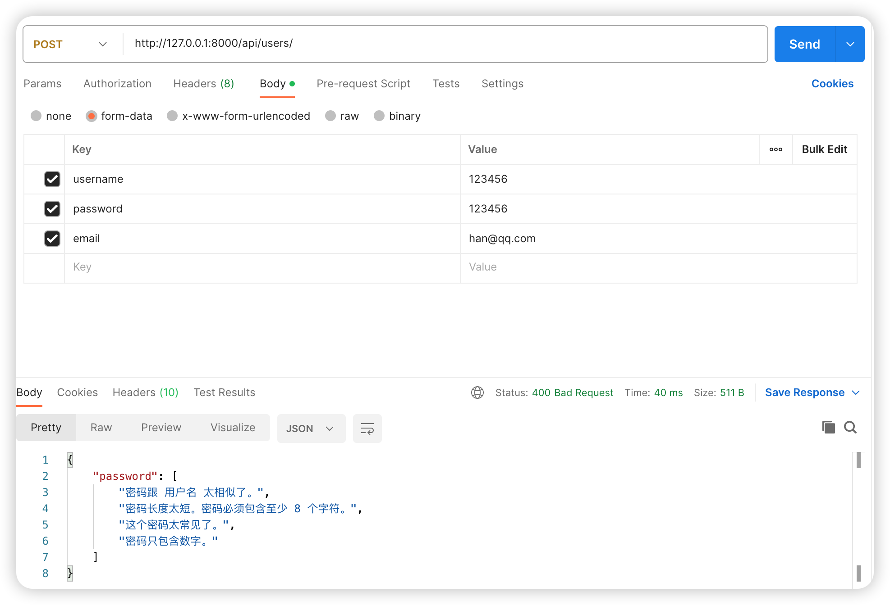
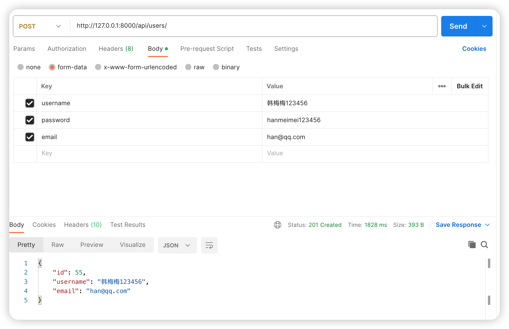

# 用户模块djoser介绍

## 1. 引言
欢迎观看大熊课堂。我是Andy。在本节课中，我们将探讨用户模块的实现，这是大多数网站的基础和必需模块，包括登录、注册、登出、修改密码等功能。本项目采用邮箱认证方式，注册成功后需要通过邮箱验证链接来完成注册。

## 2. 用户模块概述
用户模块包括但不限于以下功能：
- 用户注册、登录、登出
- 修改密码
- 邮箱认证
- 登录状态验证
- JWT权限认证

## 3. 使用Djoser模块实现用户功能

### 3.1 简介
[Djoser](https://djoser.readthedocs.io/)是Django中的一个模块，提供了用户模块的大多数功能，包括用户创建、用户确认、密码设置、密码重置、用户信息修改等。

### 3.2 功能和验证方式
- **功能：** Djoser支持大量用户相关的接口，例如用户创建、确认用户、重新激活、设置密码、重新设置密码、修改用户信息等。
- **验证方式：** 支持Token认证和JWT认证。本项目中使用JWT认证。

### 3.3 Djoser与DRF的集成
Djoser支持Django REST Framework (DRF) 以及 DRF Simple JWT，为项目提供JWT认证方式。

## 4. Djoser模块安装与配置

### 4.1 安装
1. 使用pip安装Djoser模块：`pip install djoser`
2. 安装Django REST Framework Simple JWT：`pip install djangorestframework-simplejwt`

### 4.2 配置
1. 在全局配置文件中（`settings.py`）添加`djoser`模块到`INSTALLED_APPS`。

   ```python title='dx_movie/dx_movie/settings.py'
   INSTALLED_APPS = [
       # ...
       'djoser',
       # ...
   ]
   ```

2. 在全局URL配置文件中添加djoser的URL模式，示例代码：
   ```python title='dx_movie/dx_movie/urls.py'
   urlpatterns = [
       # ...
       path('api/', include(router.urls)),
       path('api/', include('djoser.urls')),
       # ...
   ]
   ```


## 5. 测试用户接口

### 5.1 使用Postman测试
1. 创建一个新请求，设置请求方式为Post。
2. 在Body部分添加用户信息，包括用户名、密码和确认密码。
3. 设置请求URL为API的用户端点（例如：`/api/users/`）。
4. 发送请求，观察响应和数据库中用户信息的变化。

### 5.2 密码强度验证
Djoser会验证密码强度。如果密码太弱或仅包含数字，将返回错误信息。确保使用符合要求的强密码。
注册时会进行验证，效果如下图所示。


注册成功时，效果如下图所示。


## 6. 小结
使用Djoser模块，我们可以轻松实现用户模块的大多数功能，包括用户注册、登录、密码重置等。Djoser为这些常见的用户操作提供了默认实现，并允许进行必要的自定义配置。

## 7. 后续步骤
Djoser模块提供了丰富的功能，本节课仅介绍了基础使用。后续课程将深入探讨更多高级功能。感谢观看，我们下次再见。

