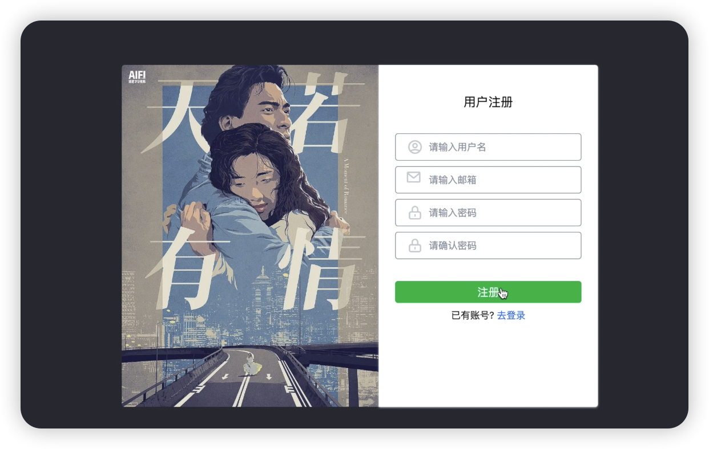

# 用户注册接口实现


## 1. 引言
欢迎观看大熊课堂。我是Andy。在本节课中，我们将介绍如何实现用户模块中的注册功能，这包括用户信息的填写、邮箱验证，以及利用Djoser模块简化实现过程。

## 2. 用户注册功能概述
用户注册是网站的基础功能，要求用户填写用户名、密码及邮箱。注册成功后，需要通过邮箱验证以完成注册流程。本节课将使用Djoser模块来简化用户注册和邮箱验证的实现。



## 3. 使用Djoser模块实现注册功能

### 3.1 Djoser模块介绍
Djoser是一个为Django应用提供用户认证解决方案的模块，支持用户创建、邮箱验证等功能。通过配置而非编写代码，Djoser可以大幅减少实现用户认证所需的工作量。

### 3.2 Djoser模块配置
#### 3.2.1 基本配置
在Django的配置文件（`settings.py`）中设置Djoser相关配置，代码如下：

```python title='dx_movie/dx_movie/settings.py'
# 配置djoser使用的User模型
DJOSER = {
    'USER_ID_FIELD': 'username',
    'LOGIN_FIELD': 'email',
    'ACTIVATION_URL': 'activate/{uid}/{token}',
    'SEND_ACTIVATION_EMAIL': True,
    },
}
```

:::info[代码解析]

1. **`'USER_ID_FIELD': 'username'`**:
   - 这个参数指定了 Djoser 在用户模型中用作唯一标识符的字段。在这个例子中，它被设为 `'username'`。这意味着 Djoser 会使用 User 模型的 `username` 字段来唯一地识别用户。

2. **`'LOGIN_FIELD': 'email'`**:
   - 这个参数定义了用于登录的字段。在这里，它被设置为 `'email'`，这意味着用户将使用他们的电子邮箱地址进行登录而不是用户名。

3. **`'ACTIVATION_URL': 'activate/{uid}/{token}'`**:
   - 这个参数定义了用户账号激活链接的URL模式。`{uid}` 和 `{token}` 是占位符，Djoser在发送激活邮件时会替换成用户的唯一标识符和一个安全令牌。例如，如果你的网站域名是 `example.com`，那么激活链接可能看起来像这样：`http://example.com/activate/MjQ/5gh-23dggd`。

4. **`'SEND_ACTIVATION_EMAIL': True`**:
   - 这个参数控制了当新用户注册后是否发送账户激活邮件。将其设置为 `True` 意味着当用户注册后，他们会收到一个包含激活链接的邮件，他们需要点击这个链接来激活他们的账户。

这些配置大多与用户注册和激活流程相关，确保了用户注册后需要通过邮箱验证来激活账户，同时允许用户使用邮箱而不是用户名来登录。这是一个比较常见的安全实践，可以避免用户名泄露，并确保用户邮箱的有效性。
:::


## 6. 后续步骤
本节课程介绍了如何使用Djoser模块实现用户注册功能。后续课程将继续深入其他用户认证相关的主题。感谢观看，我们下次再见。