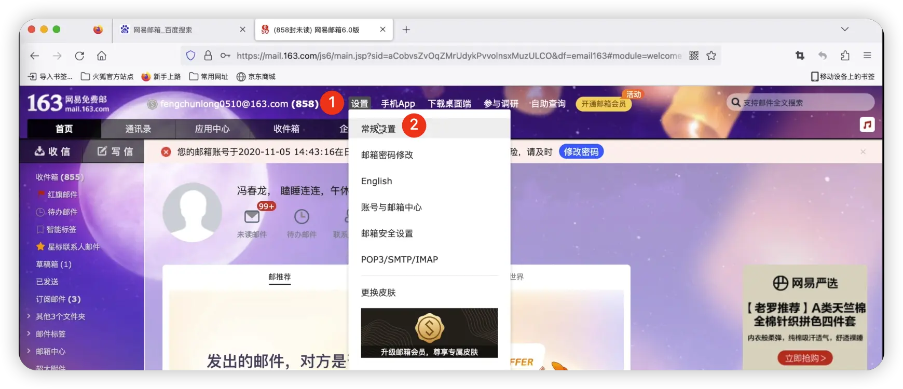
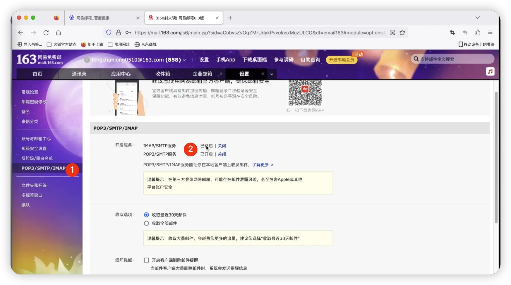
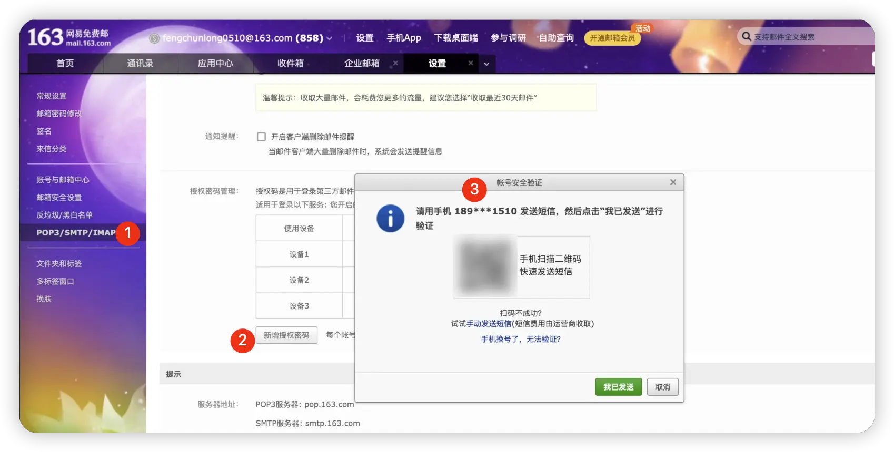
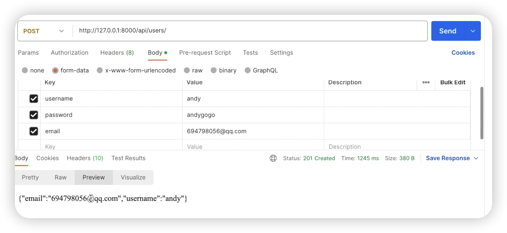
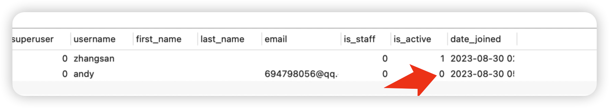
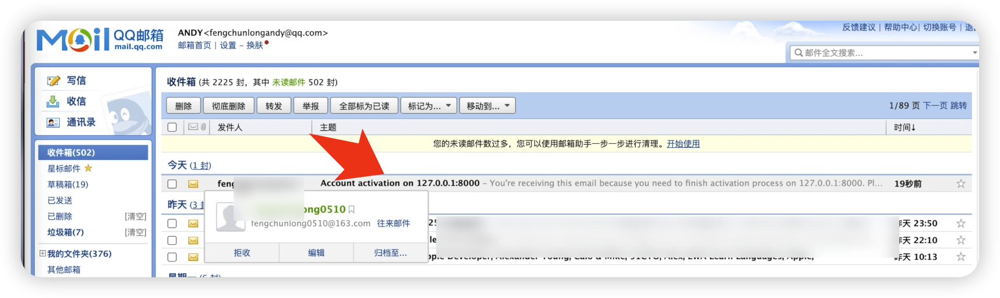
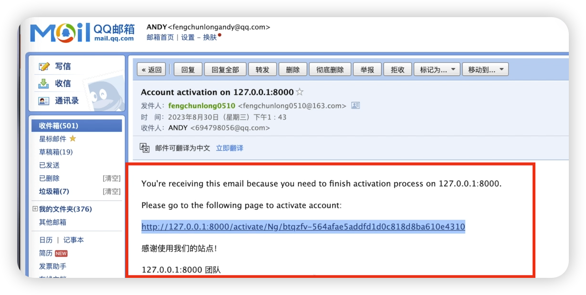
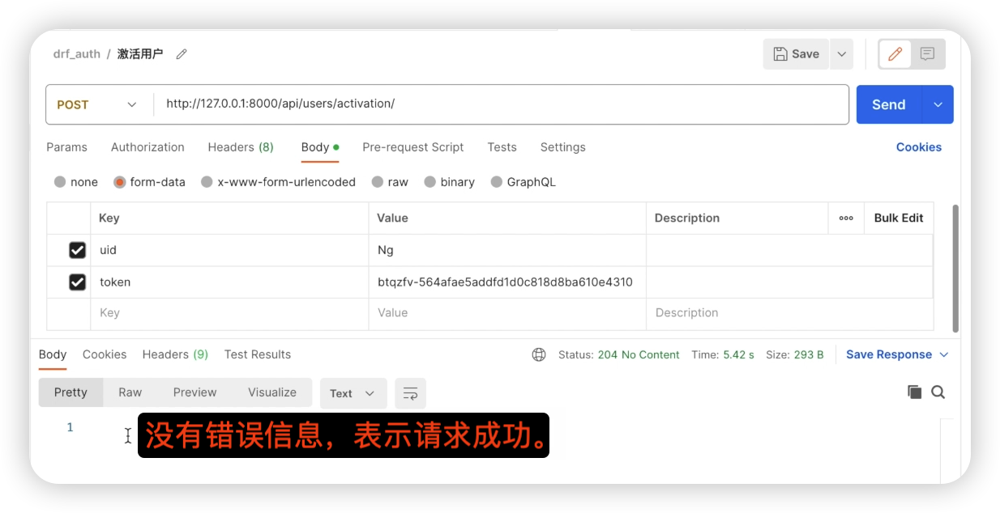
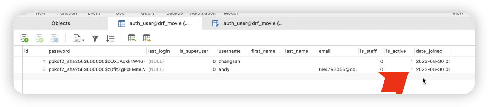

# 用户注册邮箱配置


## 1. 引言
欢迎收看大熊课堂，我是Andy。本节课我们将详细介绍用户模块的注册功能，并特别着重于邮箱验证和激活配置，使用163邮箱作为示例进行配置。

## 2. 邮箱服务器配置
为了实现邮箱验证功能，需要配置邮箱服务器。本示例将使用网易163邮箱进行配置。

### 2.1 设置SMTP服务
1. **登录邮箱：** 登录您的163邮箱账户。
2. **设置SMTP：** 进入设置，找到SMTP服务选项并开启。
3. **获取授权密码：** 开启服务后，下拉到授权密码部分，点击新增授权密码。通过扫描二维码并发送短信来获取新增的授权码。








### 2.2 配置Django中的邮箱设置
在Django项目的`settings.py`文件中配置以下参数：
```python title='dx_movie/dx_movie/settings.py'
EMAIL_HOST = 'smtp.163.com'
EMAIL_PORT = 25
EMAIL_HOST_USER = '****@163.com'  
EMAIL_HOST_PASSWORD = '****'
DEFAULT_FROM_EMAIL = '****@163.com'
```


:::info[参数说明]
- **EMAIL_HOST:** 邮箱服务器地址，对于163邮箱使用SMTP，通常是`smtp.163.com`。
- **EMAIL_PORT:** 邮箱端口号，通常为25。
- **EMAIL_HOST_USER:** 您的邮箱地址。
- **EMAIL_HOST_PASSWORD:** 您在邮箱设置中获取的授权密码。不是密码。
- **DEFAULT_FROM_EMAIL:** 默认发送邮件的邮箱地址，通常与`EMAIL_HOST_USER`相同。
:::


## 3. 用户注册及邮箱激活

### 3.1 使用Djoser模块配置注册及邮箱验证
在`settings.py`文件中配置Djoser相关设置，主要包括：
- **SEND_ACTIVATION_EMAIL:** 设置为True，以便在用户注册后自动发送激活邮件。
- **ACTIVATION_URL:** 配置激活链接的URL，通常包含`UID`和`token`参数。
- **SEND_CONFIRMATION_EMAIL:** 设置为True，以便在用户激活后发送确认邮件。

### 3.2 测试用户注册功能
使用Postman或类似工具来测试用户注册功能：
1. 设置请求类型为POST。
2. 填写必要的用户信息，如用户名、密码和邮箱。
3. 发送请求到用户注册端点（例如`/api/users/`）。
4. 检查邮箱是否收到激活邮件，并点击链接完成激活。


虽然请求成功了，但是当前的用户只有激活邮箱后，才能成为已经正常使用的账户，我们可以查看数据库中的auth_user表，其中is_active字段是0, 表示当前用户还未激活。


此时，邮件已经发送成功，如下图所示。


邮件内容如下图所示。


在收到激活邮件后，用户需要点击邮件中的链接进行账户激活：
 **激活链接点击：** 用户点击邮件中的激活链接。
注意：链接中的端口号是8000， 这是后端django服务的端口，而现在我们使用的是8080这个端口，我们可以暂时把8000改为8080进行访问，后期上线的时候，可以统一配置为域名形式。

2. **激活请求发送：** 点击链接后，发送POST请求到`/api/users/activation/`，携带`UID`和`token`参数。

使用postman工具，请求接口，如下图所示。



3. **验证激活状态：** 在用户表（auth_user）中验证`is_active`字段是否已更新为1，表示用户已激活。

auth_user表如下图所示。



## 4. 小结
通过配置163邮箱和使用Djoser模块，我们成功实现了用户注册和邮箱激活功能。这样的配置方法大大简化了代码编写工作，使用户注册流程更加流畅和安全。

## 5. 后续步骤
本节课程介绍了用户注册及邮箱激活的配置和实现。后续课程将继续探讨用户模块的其他功能实现。感谢观看，我们下次再见。