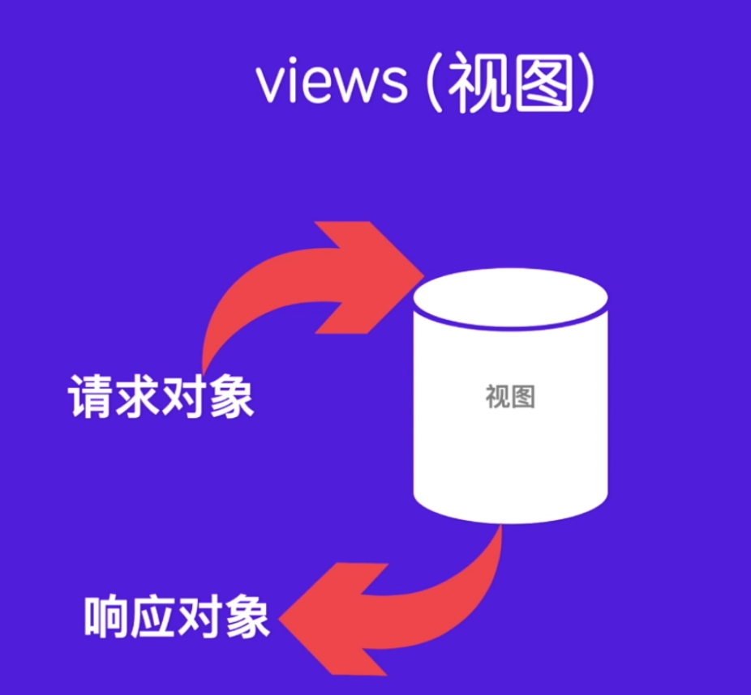
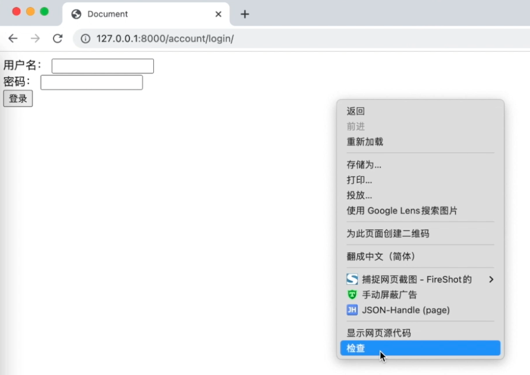
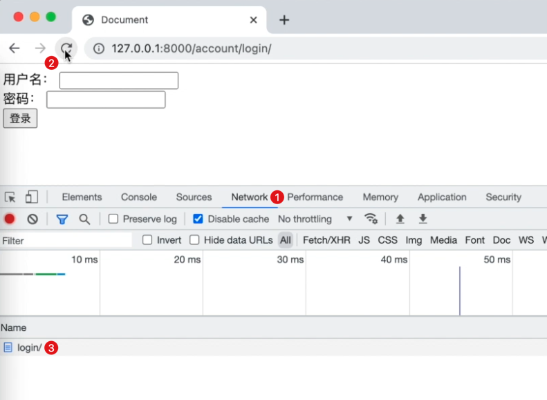
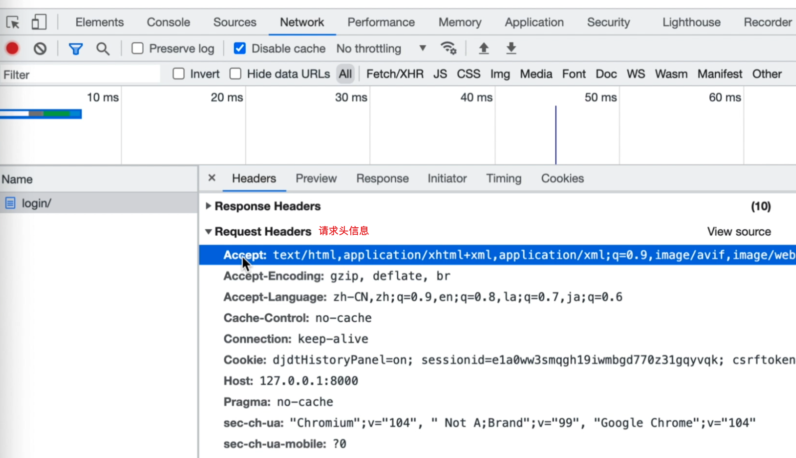
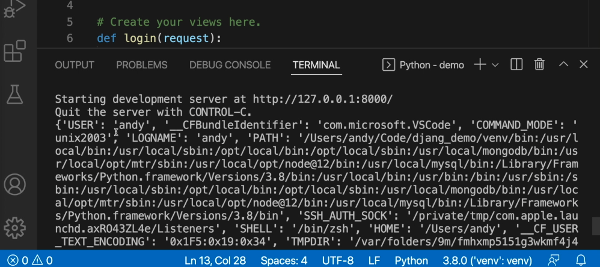
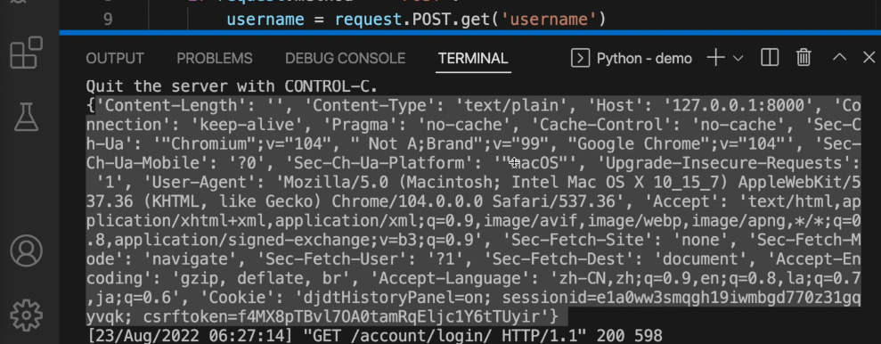

# 请求对象

当我们在讲解视图的时候， 
我们说过视图函数呢，需要接收一个请求对象，
然后需要返回一个响应对象。


什么是请求对象，什么是响应对象呢？
请求对象是HttpRequest这个类,
然后想对象呢，使用的是HttpResponse,
从这两个名字上我们就可以猜测到，它们都是HTTP协议的请求和响应。
接下来我们先来介绍这个HttpReques请求对象。

<!-- trancate -->

对于请求对象，它主要包含的内容有 
请求头和请求参数。我们先来介绍请求头，然后再来介绍请求参数 

## 请求头

为了能够直观的看到效果，我们可以 
以我们之前的登录页面为例。
在谷歌浏览器中，我们单击右键， 
点击检查。


然后找到network。 
这里有一个网络。
接下来咱们来刷新一下页面，
看一下这个时候它就发送了一个请求。 


我们可以看一下 
右侧这里 
 general，
这是通用信息。
然后下面有一个response headers，
再下面一个就是 
 requests headers。
它们分别是响应头和请求头。 
咱们重点看这里的请求头。


当我们使浏览器向这个服务器发送请求的时候 
虽然说呢，我们没有添加这个参数 
但是呢，它自动的就会使用这些请求头信息。



为了获取这行请求头信息，通常可以使用HttpRequest的2个参数：
- META
- heades

## 获取META信息
常见的请求头Meta信息如下:

那么如何通过程序获取这些信息呢？
下面通过一个例子来演示一下。

```python title='demo/account/views.py'
def login(request):
    if request.method == "POST":
        username = request.POST.get('username', '')
        password = request.POST.get('password', '')
        
    elif request.method == 'GET':
        print(request.META)
```
浏览器中访问：127.0.0。1:3000/account/loign/ , 在vscode终端查看print输出的内容，
如下图所示。

如果要获取某一个参数，比如，REMOTE_ARRD, 可以使用request.META.get('REMOTE_ARRD')，也就是字典取值的方式来获取。

## 获取heades信息
除了使用META之外呢，还有一个参数：HttpRequest.headers。
 
这个headers中的很多参数都在刚才的META中包含了, 
它也是一个不区分大小写的类似字典的对象,
提供了对请求中所有的HTTP前缀开头的访问,
那除此之外还有content length和content type ,
然后再显示每个请求头时,
请求头的名称都是用标题的形式来显示的, 
例如这种: User-Agent。

好，我们可以看一下它有哪些？

```python title='demo/account/views.py'
def login(request):
    if request.method == "POST":
        username = request.POST.get('username', '')
        password = request.POST.get('password', '')
        
    elif request.method == 'GET':
        print(request.META)
```
headers信息如下：

如果要获取某一个信息，同样可以使用request.headers.get()

那么更多参数咱们可以在使用的时候 
使用类似的方式来进行获取 
这就是获取请求头 


