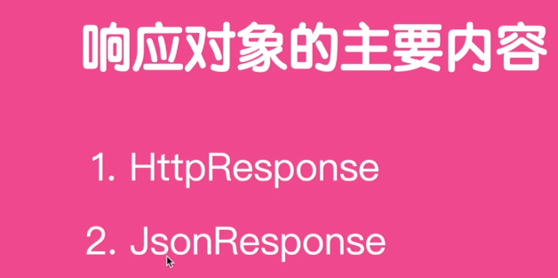
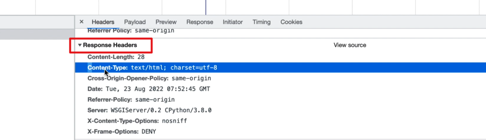
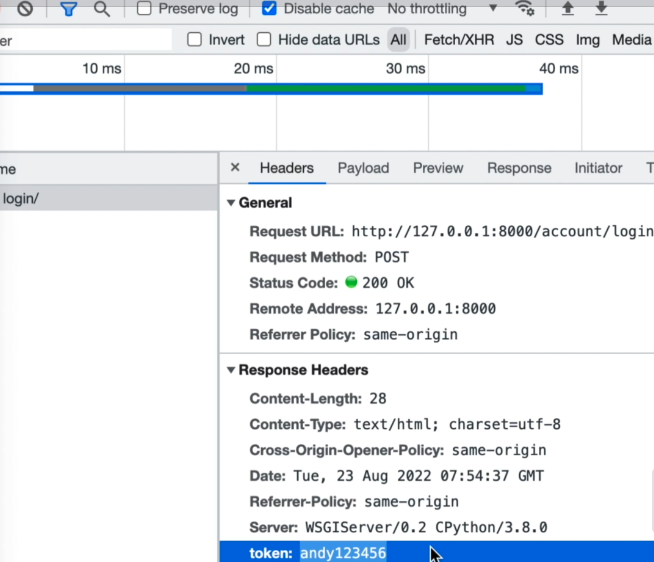
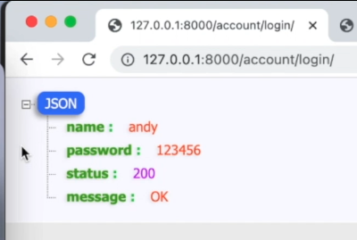

# 响应对象


介绍完了请求对象，接下来我们介绍响应对象。

<!-- trancate -->
最常见的响应对象就是这里的HttpResponse,
除此之外还有一种比较常见的就是JsonResponse。



接下来我们就来分别介绍一下它们。

## HttpResponse

在前面的代码中，我们已经大量的使用了HttpResponse,
它可以返回一个数据。
我们看一下在页面中， 
当使用Get请求访问这个页面的时候，我们可以看到这里有很多的响应信息。
包括响应长度类型、日期等等特别多的内容。


那么除此之外，还可以在这里添加上我们的一些信息。
比如说，
在HttpResponse这里我们可以添加一个headers，
这样的我们来定一个headers,
使用一个字典来组织一个headers形式,
我们就可以把所有的,
和headers相关的内容全部定义到这里。

```python title='demo/account/views.py'
def login(request):
    if request.method == "POST":
        username = request.POST.get('username', '')
        password = request.POST.get('password', '')
        # 业务逻辑判断
        headers = {
            'token': 'andy123456'
        }
        return HttpResponse(f"用户{username}的密码是{password}", 
                content_type="text/html; charset=utf-8", 
                status=200 ,headers=headers)
```

:::info[代码解析]
构造一个响应头headers,包含一个'token'。
使用HttpResponse构造响应,返回包含用户名和密码的内容,设置content_type和状态码,以及刚才构造的响应头headers。
:::



请求成功以后，我们看到这里的status code就变成200， 新增了一个token， 值是'andy123456'。
这是HttpResponse它的常用方式。

## JsonResponse

接下来我们看一下JsonResponse。
那很显然，通过名字我们就能猜测出来，
它返回的是一个json格式数据。 
我们通过一个示例来演示一下。

```python title='demo/account/views.py'
from django.http import HttpResons, JsonResponse # 新增代码

def login(request):
    if request.method == "POST":
        username = request.POST.get('username', '')
        password = request.POST.get('password', '')
        # 业务逻辑判断
        headers = {
            'token': 'andy123456'
        }
        # return HttpResponse(f"用户{username}的密码是{password}",
        #         content_type="text/html; charset=utf-8",
        #         status=200 ,headers=headers)
        res = {
            'name': username,
            'password': password,
            'status': 200,
            'message': 'OK'
        }
        return JsonResponse(res)
```

将要返回的数据组织成一个字典形式，然后直接使用JsonResponse对象，最后在页面中就会显示json数据。

接下来我们在浏览器中输入网址:127.0.0.1:8000/account/login, 
输入用户名、密码，点击登录，运行结果如下：



现在我们看到这里返回的就是一个json格式数据 
然后有name 
有password, 有status，有message。
:::tip
这里之所以显示这么漂亮的，是因为我使用了一个插件json-handle。
:::

至此呢，我们就介绍完了请求对象和常见的2个响应对象，
小伙伴们，我们下节再见。