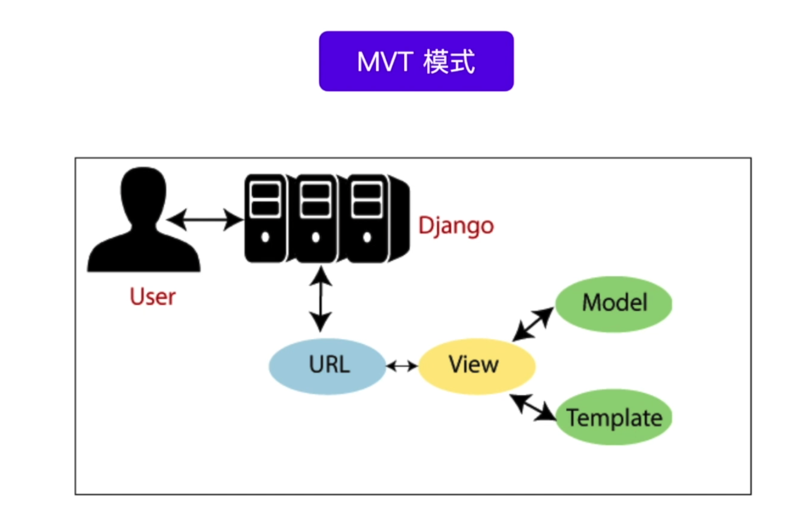
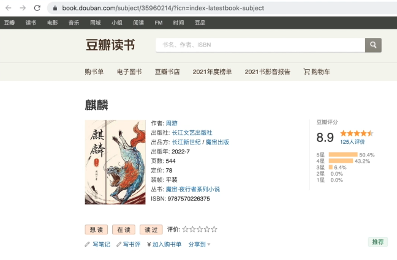
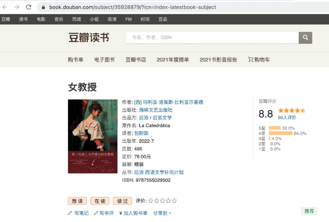

# [模板]:模板引擎

介绍完了MVT中的V， 本节开始我们来介绍T， 也就是模板相关的内容。


其实呢，Django中的模板它就是用来动态生成html的。
例如当我们在这个网站中访问图书的时候，
我们仔细观察这两个页面。




它们的整体结构都是一样的， 
只是由于这两个图书的ID不同就导致了，
它们的内容介绍是不同的。

那么我们就可以使用模板来实现 
页面的整个结构不变，
然后呢，随着图书的ID发生变化， 
而将这里的图书信息进行更改，
这就是模板可以实现的功能。

好，我们来看一下模板的主要内容 
在介绍模板的时候，我们主要介绍5个最常用的内容，分别是 
1. 模板引擎和配置
2. 模板中的变量
3. 模板标签
4. 模板过滤器 
5. 模板继承和包含 

<!-- trancate -->

## 模板引擎

在Django中呢，它是有一个自带的模板引擎的,
就是因为有模版引擎的存在,
我们才可以按照一定的
语法, 
或者称之为接口, 
来实现相应的功能。

那么在Django中它是有自带的模板引擎的，
叫做DTL。
除此之外呢，我们也可以更换自己喜欢的模板引擎，
比如说，
比较常见的jinja2等等。
我们可以在setting文件中进行配置。
回到我们的代码中，在全局配置文件中有一个setting.py这个文件 
在这里面我们来搜索一下templates。
```python title='demo/demo/settings.py'
TEMPLATES = [
    {
        'BACKEND': 'django.template.backends.django.DjangoTemplates',
        'DIRS': ['templates'],
        'APP_DIRS': True,
        'OPTIONS': {
            'context_processors': [
                'django.template.context_processors.debug',
                'django.template.context_processors.request',
                'django.contrib.auth.context_processors.auth',
                'django.contrib.messages.context_processors.messages',
            ],
        },
    },
]
```

:::info[配置参数说明]
- BACKEND:指定使用Django的模板引擎,默认就可以使用这个。
- DIRS:模板文件的路径,这里指定的是templates目录。
- APP_DIRS:是否要在app的目录下搜索模板文件,设置为True表示搜索。
- OPTIONS: 一些模板引擎的配置选项。
- context_processors: 指定模板上下文处理器,这些函数会对每个请求处理后传入模板的上下文进行修改。这里包含了一些默认的context processor。
:::

前面我们介绍过这个'DIRS', 我们这里设置为
```python title='demo/demo/settings.py'
'DIRS': ['templates'],
```

如果这个这里不设置，默认为
```python title='demo/demo/settings.py'
'DIRS': [],
```
那么则表示，模板文件默认存在于对应的应用下的templates路径下。
例如，对于account应用，需要在account目录下新建一个templates文件夹，在下面创建对应的html文件。
app01和app02也是如此。
那么Django是如何找到这个应用的呢？
我们需要在settings.py文件中，INSTALLED_APPS添加我们创建的应用。代码如下：
```python title='demo/demo/settings.py'

INSTALLED_APPS = [
    'django.contrib.admin',
    'django.contrib.auth',
    'django.contrib.contenttypes',
    'django.contrib.sessions',
    'django.contrib.messages',
    'django.contrib.staticfiles',
    'account', # 新增应用
    'app01'    # 新增应用
]

```

:::tip
模板文件放到什么位置，没有固定答案，大家可以根据喜好自行选择。
:::


