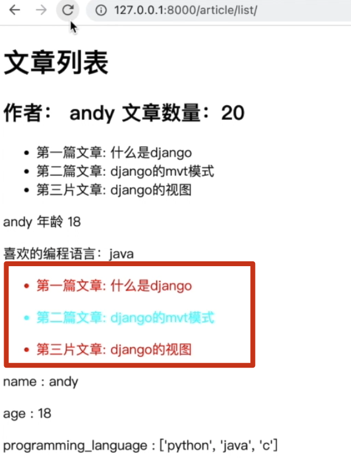
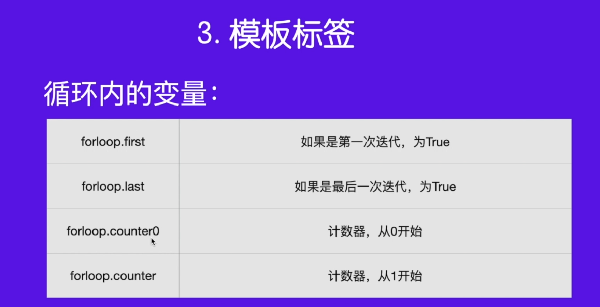

# [模板]:模板标签

Django中的模板标签有非常之多，那么按照分类可以分为
- 循环控制标签
- 条件控制标签
- 模板注释标签
- url解析标签
- with语句块标签 
- 直接显示标签，
- 继承与包含标签

那本节课我们介绍最常用的循环控制和条件控制标签。

<!-- trancate -->

## 循环控制
提到循环，我们通常会想到循环列表 
或者元组 
字典或者集合。 
我们先来看一下，这是一个循环的示例。
```python

    <li> 内容 </li>

    <li> 暂无内容 </li>

```

:::warning
注意模板中的控制语句和变量的区别。如果是变量，用`{{}}`, 如果是控制语句用 ``.
此外，标签都是成对出现的，有点类似html中的标签。比如，for 对应着 endfor, if 对应着endif。
:::

接下来，我们通过代码来使用for标签实现遍历。我们依然以[模板变量]那节中，app01下的list函数为例。

### 遍历列表

```python title='demo/templates/list.html'
  
  <ul>
    <li>
        {{ article }}
    </li>
  </ul>
  
    <p>暂无数据</p>
  
```

:::info[代码解析]
 这段代码的意思是:

1. 使用 for 循环遍历 article_list 中的所有 article。

2. 在 `<li>` 标签内输出 article 的内容。

3. empty 标签表示,如果 article_list 为空,则输出 `<p>`暂无数据`</p>`。

4. endfor 标签结束 for 循环。

所以这段代码的作用是输出 article_list 中的所有 article。如果 article_list 为空,会输出提示没有数据。
:::

### 遍历字典
字典中包含key和value,也就是键值对。在python中，我们会通过dict.items()来获取key和value, 在django模板中也使用了这种方式。

```python title='demo/templates/list.html'
  
    <p >{{ key }} : {{value}}</p> 
  
```

:::tip[代码解析]
 这段代码的意思是:

1. 使用 for 循环遍历字典 info 中的所有键值对。

2. info.items 会返回字典的 (key, value) 键值对列表。

3. 在循环中,key 变量表示字典的键,value 变量表示对应的值。

4. 对于每个键值对,输出一个 `<p> `标签,在标签里输出 key 和 value 的值。

5. endfor 结束 for 循环。

所以这段代码的作用是遍历字典 info 中的所有键值对,并将键和值输出至 HTML 中。

所以这段 Django 模板代码实现了同样的字典遍历输出功能。
::: 

### 重复循环

使用 `cycle`控制循环，代码如下：

```python title='demo/templates/list.html'
  <style>
    .row1 {
        color: red
    }
    .row2 {
        color: green
    }
  </style>


  
  <ul>
    <li class="">
        {{ article }}
    </li>
  </ul>
  
    <p>暂无数据</p>
  
```

:::info[代码解析]
 这段代码的功能是:

1. 定义了两个 CSS class:.row1 将文字设置为红色,.row2 将文字设置为绿色。

2. 使用 for 循环遍历 article_list 中的所有文章。

3. 每个文章输出在一个 `<li>` 标签中,li 标签的 class 属性在 .row1 和 .row2 之间轮流切换。

4. 这样就实现了一个奇偶行颜色交替的列表效果。

5. 如果 article_list 为空,会输出提示文字"暂无数据"。

:::

运行结果如下图所示。



更多循环内变量如下图所示。


## 条件控制
条件控制语句和python中的if非常类似。结构如下:
```python








```
下面通过一个例子来演示一下它的用法。

```python title='demo/templates/index.html'
  
    未成年
  
    青年才俊
  
    潜力股
  
```
结合for循环代码如下：
```python title='demo/templates/index.html'
  
  <ul>
    <li class="">{{ article }}
      
        置顶
      
    </li>
  </ul>
  
    <p>暂无数据</p>
  
```

 


