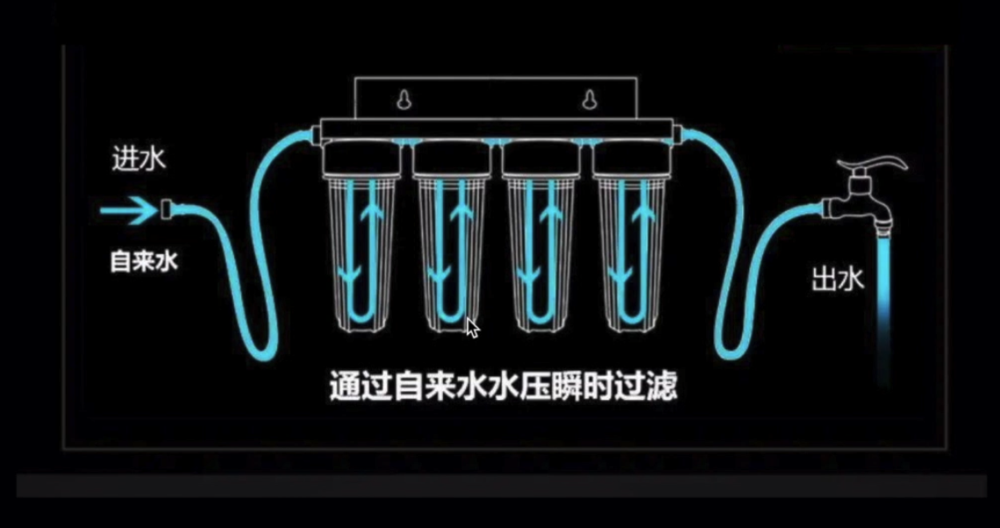
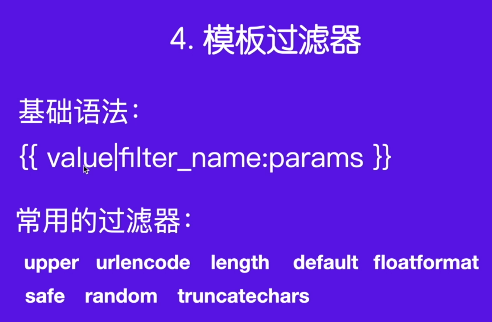

# [模板]:模板过滤器

一提到过滤器呢，很多时候我们就想到了这个自来水的过滤。



它在我们的Django中,
这里有进水口,
就相当于咱们的视图也就是view，
就相当于HTML页面最终看到的效果。 
那有的时候咱们一个变量传递过来，
我们需要对它进行一些中间的处理，
这个时候就可以使用这里的过滤器。
过滤以后将最终的效果输出在这个HTML模板上。


好，我们看一下在Django模板过滤器是怎么使用的。

<!-- trancate -->



```python title='demo/templates/index.html'
  <h1>文章列表</h1>
  <h2>作者： {{ author|upper }}  文章数量：{{ number }}</h2> 
  <ul>
    <li>{{ article_list.0 }}</li>
    <li>{{ article_list.1|truncatechars:15 }}</li>
    <li>{{ article_list.2 }}</li>
  </ul>
  <p>{{ info.name|upper }} 年龄 {{ info.age}} 性别 {{ gender|default:'未知' }}</p>
  <p>喜欢的编程语言：{{ info.programming_language|random}}</p>
  
  
  <ul>
    <li class="">{{ article }}
      
        置顶
      
    </li>
  </ul>
  
    <p>暂无数据</p>
  

  
    <p >{{ key }} : {{value}}</p> 
  

  
    未成年
  
    青年才俊
  
    潜力股
  
  --------------------------
  {{ content|safe }}
```

:::info[代码解析]
 这个模板代码中使用了多个过滤器(filter),我来解释下其中的作用:

1. `{{ author|upper }}`

upper过滤器将author变量转换为全大写。

2. `{{ article_list.1|truncatechars:15 }}`

truncatechars:15过滤器将article_list的第2个元素截取为15个字符。

3. `{{ gender|default:'未知' }}`

default:'未知'过滤器如果gender变量为空,则输出默认值'未知'。

4. `{{ info.programming_language|random }}`

random过滤器从info.programming_language中随机选择一个元素输出。

5. `{{ content|safe }}`

safe过滤器将禁用对content的转义,输出原始内容。

总结:

- upper:转换为大写
- truncatechars:截取N个字符
- default:指定默认值  
- random:随机选择元素
- safe:输出不转义的原始内容

这些过滤器用于处理变量的显示格式和内容。
:::
