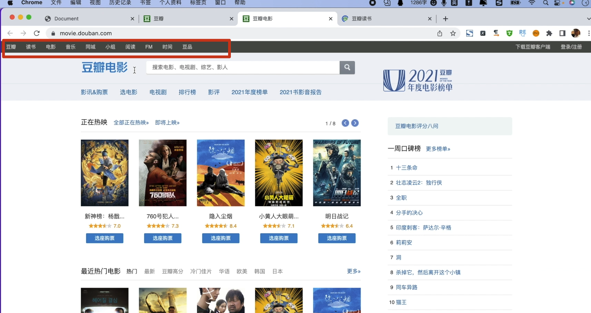
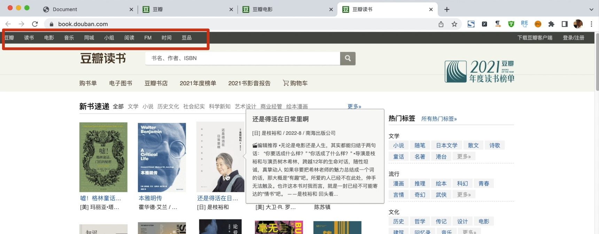

# [模板]:模板继承和包含
为什么要使用的模板的继承呢？
我们在学习面向对象的时候就学习过继承，
子类呢，可以继承父类，
然后继承了
父类的一些相应的属性和方法。

在我们的模板中呢，也是同样可以使用继承的。



第1张图显示的电影信息，
第2张图显示的图书信息，
而它们的顶部和底部。
都是相同的，
所以说呢，对于相同的内容，我们就可以使用一个父模板。
然后中间不同的地方， 
用相应的内容进行一个替换。

<!-- trancate -->

## 模板继承

接下来我们就来演示一下如何实现模板的继承 
在我们的模板页面中我们找到templates，
在这里我们新建一个HTML页面，
就叫做base.html。
这是基类，
也就是父模板。 
然后在这里面呢，我们写上一些 
通用的信息。 
比如说在一个页面中有 
头部 
和底部 
这是一个导航栏。

```python title="demo/templates/base.html"
<!DOCTYPE html>
<html lang="en">
<head>
  <meta charset="UTF-8">
  <meta http-equiv="X-UA-Compatible" content="IE=edge">
  <meta name="viewport" content="width=device-width, initial-scale=1.0">
  <title>Document</title>
</head>
<body>
  <nav>
    豆瓣 读书 电影 音乐 同城 小组 阅读 FM 时间 豆品
  </nav>
  
  
  <footer>
    © 2005－2022 douban.com, all rights reserved 北京豆网科技有限公司关于豆瓣 · 在豆瓣工作 · 联系我们 · 法律声明 · 帮助中心 · 图书馆合作 · 移动应用 · 豆瓣广告
  </footer>
</body>
</html>
```

上面代码中使用一个占位符叫做 `block`,
然后给它起个名字叫做"content"， 
这个名字可以自己定义。
:::warning
注意标签都是一组的，由`block`就有`endblock`。
:::

接下来，我们需要让子模板继承base.html这个父模板。

比如说在list.html模板中，继承父模板。父模板中已经有了这些了 
已经有了html这些内容，所以我们就直接给它替换掉 
这些head和body都可以删除。
代码如下：
```



<h1>文章列表</h1>
... 省略中间代码
{{ content|safe }}


```

:::info[代码解析]
 这段代码使用了Django模板中的继承(extends)和块(block)标签:

1. `` 表示此模板继承自 base.html 模板。

2. `` 和 `` 定义了一个内容块,名称为 content。

3. 这个模板本身并没有内容,只是定义了content块。

4. 当渲染使用此模板的页面时,会先渲染 base.html 模板,在base模板中的 `` 标签所在位置会被替换为本模板中的 content 块的内容。

5. 由于本模板content块没有内容,所以渲染出来的页面内容将完全继承自 base.html 模板,仅仅是定义了额外的一个空的content块。

6. 其他模板可以继承这个模板,并在content块中扩展内容,来定制页面部分内容,实现模板的重用。

总结:

这段代码定义了一个继承自 base.html 并且定义一个空 content 块的 Django 模板,主要用于模板的重用和扩展。

子模板可以通过填充 content 块来重用基模板的代码而只定制部分内容。
:::

此时，当我们访问网址:127.0.0.1:8000/article/list 时，就会发现该页面新增了顶部和底部信息。
那如果我们还有其它页面，比如说login和register也是一样的道理。
我们一样把这里进行一个替换，
全部删掉，
然后使用标签 
先来继承父标签 
```

```
继承完了以后，需要把父标签中的内容content这一块进行替换 
```



```

OK，这就是模板的继承。 
如果有多个页面，我们每一个页面都需要这里的顶部信息和底部信息的话， 
我们就可以这样使用继承的方式来进行实现。
所以说它极大的简化了我们代码，
此外当我们要修改的时候，修改这里的一处就够了。
这就是`extends`标签。

## 模板引入

接下来我们来介绍另一个`include`标签引入。

那什么时候要使用这个引入呢？
例如在这里它有一个分页功能，
当我点击的时候，
进入下一页，
再点击又进入下一页， 
而这里也同样的， 
那么对于这两块儿，
它们都是相同的功能，我们就可以把它单独拿出去，
作为 
include进行引入。

比如说如果我们这里有一个分页功能 
我们可以在templates下新建一个 page.html。
它的功能就是用来实现分页的。
这里呢，我们可以把一些分页的样式写到这里。
代码如下：
```html title='demo/templates/page.html'

<div>
  <span>前一页</span>
  <span>1</span>
  <span>2</span>
  <span>3</span>
  <span>下一页</span>
</div>

```
当我们用到的时候我们就可以把它引入过来。
比如说，在这个list中我们用到了分页。
那我们就可以使用`include`标签把它引进过来。代码如下：
```html title='demo/templates/list.html'




<h1>文章列表</h1>
... 省略中间代码
{{ content|safe }}

<!-- 新增include -->
 



```
再次访问这个页面，就会看到引入的page.html的分页内容。
当其他页面使用这个分页样式时，同样的可以使用include引入。
不然的话这里每次都要写完整代码，也是比较繁琐的事情。

这就是extends标签和include标签的使用。
那除此之外Django还有非常非常多的标签啊，我们这里只介绍了一些最常用的标签，
更多的标签，当我们在使用的时候再来跟大家详细的介绍。

至此我们的模板内容就要告一段落了，
小伙伴们 
我们下节再见。