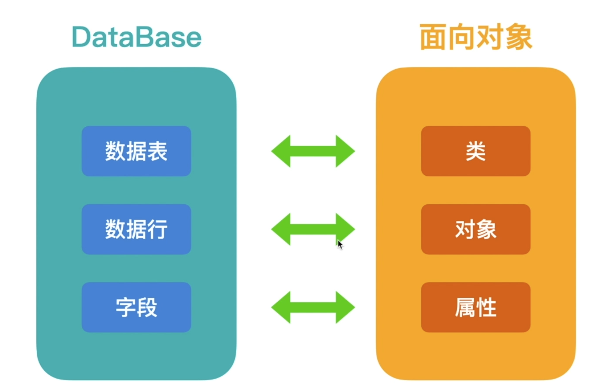

# [模型]:什么是ORM

我们已经介绍完了`MVT`中的`V`和`T`, 
那接下来我们来介绍最后一个'M', Model,就是模型的意思。
那么在介绍模型之前，我们需要先来了解一下ORM。

<!-- transcate -->

## 为什么要使用ORM

我们先来介绍一下，为什么要使用orm？

做的web开发,其实很多时候呢，就是在面向数据库编程。 
操作数据库呢，咱们就需要使用SQL语句， 
比如这里，我要查询用户名为andy的数据， 
可以使用这样的SQL语句
```sql
select * from users where name = 'andy'
```

但是呢，我们需要使用编程语言， 
例如Python、Java
来操作数据库。


:::tip
更多python操作数据库内容，可以观看大熊课堂[《Python零基础入门动画课》](https://study.163.com/course/introduction/1209570828.htm?share=2&shareId=480000001946434)。
:::

而这些编程语言支持面向对象， 
所以是否可以通过一种映射关系，
不需要我们写SQL语句，
而是使用这种面向对象的方式来实现。
对数据库的查询和操作呢？
这个时候ORM就应运而生了。

## 什么是ORM
ORM 全称 Object Relational Mapping,
翻译过来就是对象关系映射。

简答来说，ORM 就是让我们使用编程语言,
而不是SQL语句与数据库进行交互。
在数据库中有数据表，数据行和字段， 
那么呢，它们分别对应着咱们orm对象中的类、 
对象、以及属性。


