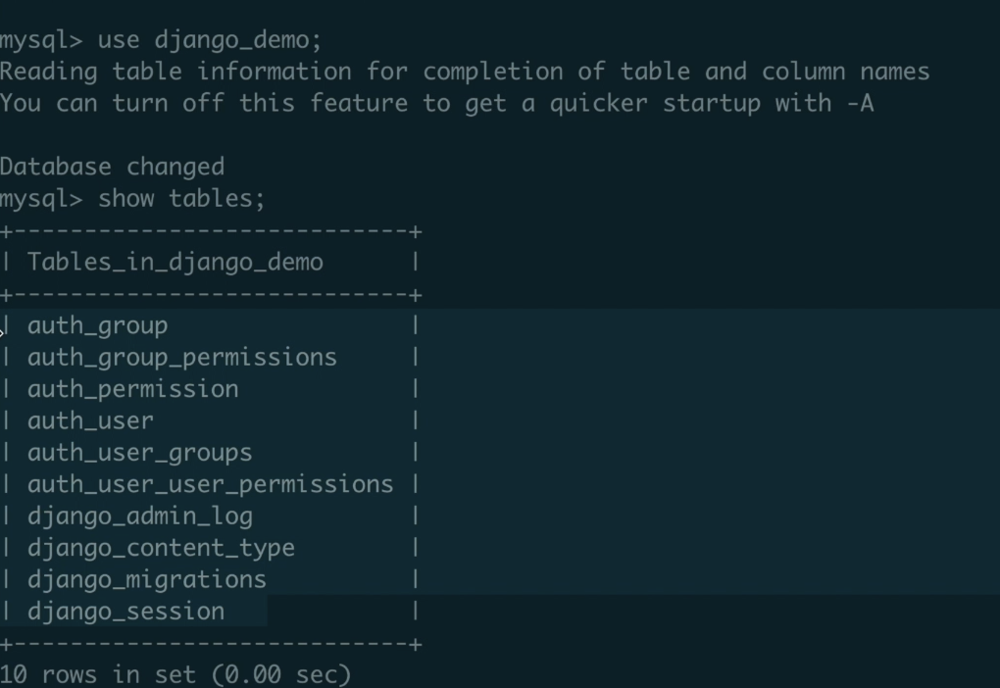
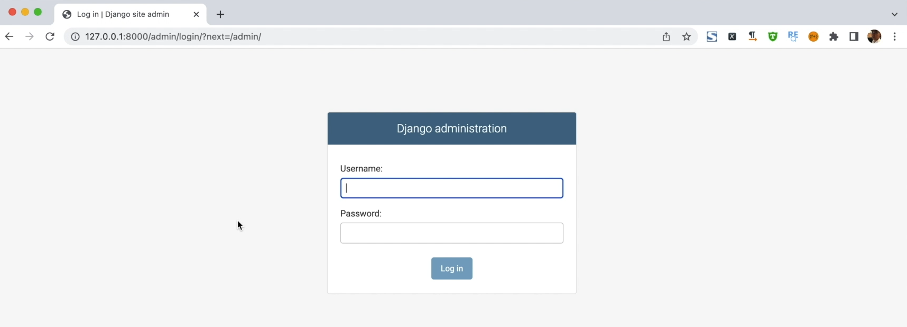

# [模型]:配置MySQL

本节我们来介绍一下如何在Django中配置MySQL数据库。
在Django中默认使用的数据库呢是SQLlite,
而我们后面要讲解的项目中应用到的是MySQL。 
所以呢，我们这里需要先来配置一下，MySQL数据库。


<!-- trancate -->

## settings中配置MySQL
在全局配置文件中，配置MySQL。

```python title='demo/demo/settings.py'
# 注释下面的代码
# DATABASES = {
#     'default': {
#         'ENGINE': 'django.db.backends.sqlite3',
#         'NAME': os.path.join(BASE_DIR, 'db.sqlite3'),
#     }
# }
# 新增代码
DATABASES = {
   'default': {
       # 使用mysql数据库
       'ENGINE': 'django.db.backends.mysql',  
       # 数据库名称  
       'NAME': 'django_demo',
       # 数据库地址,这里是本地
       'HOST': '127.0.0.1',
       # 数据库用户名
       'USER': 'root',
       # 数据库密码
       'PASSWORD': 'andy123456'
   }
}
```

接下来需要创建一个名为'django_demo'的数据库。
:::tip
你可以使用MySQL可视化工具，或者MySQL命令。小伙伴可以观看大熊课堂[《Python零基础入门动画课》](https://study.163.com/course/introduction/1209570828.htm?share=2&shareId=480000001946434)。
:::

我们直接使用mysql命令来创建数据库。先来连接MySQL。
```
mysql -u root -p
```bash
输入密码。连接成功后，继续输入命令创建数据库:
```bash
create database django-demo
```

## 连接MySQL

接下来在连接数据库的时候，我们需要使用一个数据库引擎PyMySQL.
这是一个第三方模块，我们需要先来安装一下，
启动我们的虚拟环境，输入如下命令进行安装:
```bash
pip install pymysql
```
接下来我们需要配置一下。在这个demo全局配置文件中我们找到init.py,
这是初始化文件, 我们添加如下代码：
```python title='demo/demo/__init__.py'
import pymysql
# 让PyMySQL兼容MySQLdb接口
pymysql.install_as_MySQLdb()
```

:::info[代码解析]
这段代码的作用是让PyMySQL包兼容代替MySQLdb包,来连接MySQL数据库。
Python连接MySQL数据库需要使用MySQLdb模块。但是在新版本的Python中,需要安装PyMySQL模块,然后让PyMySQL兼容模拟MySQLdb的接口,从而达到连接MySQL的目的。
:::

## 执行数据迁移操作

配置完了MySQL以后，接下来我们来执行数据库迁移命令。
我们一张表都没有建立，那为什么直接可以执行这个数据库迁移呢？
这是因为python自带了一个后台，
这个后台就使用到了很多的数据表， 
所以它已经给我们准备好了这样的文件， 
我们直接生成迁移文件就OK了。

我们可以直接使用命令行的方式执行迁移数据库。
```bash
python manage.py migrate
``` 

:::tip
还记得我们只用过python manage.py --help命令吗？这里就包含这个migrate， 所以记不住没关系，执行--help查看一下即可。
:::

执行成功了， 说明它自动已经就创建了自带的数据表。
可以是使用mysql的show table命令查看，如下图所示。



上图可以看到新增了10张表，
都是系统自动生成的，
就是因为这里执行了一个迁移文件。
 
那接下来呢，我们来启动服务，执行
```bash
python manage.py runserver
```

:::tip
小伙伴可以通过键盘中的向上的箭头回到上一个命令。
:::


我们现在就可以访问后台了。在浏览器中输入网址:127.0.0.1:8000/admin,
我们就已经进入到了Django自带的一个后台。运行结果如下图。



只是现在我们还没有创建用户名和密码,
后面我们在讲解Django后台的时候，再来详细介绍它,
那这也证明了我们刚才创建的这些表已经生效了.
好本节我们先介绍到这里,
小伙伴，我们下节再见。

