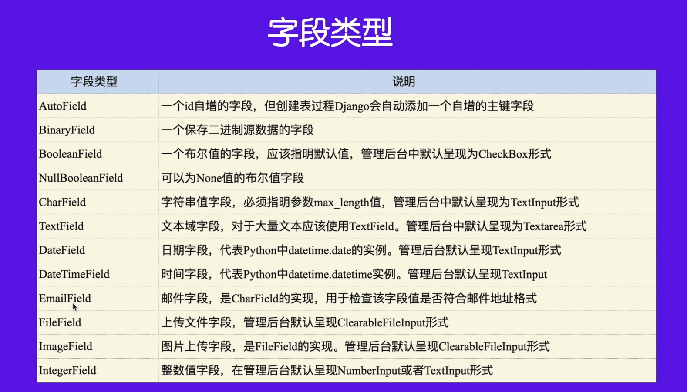
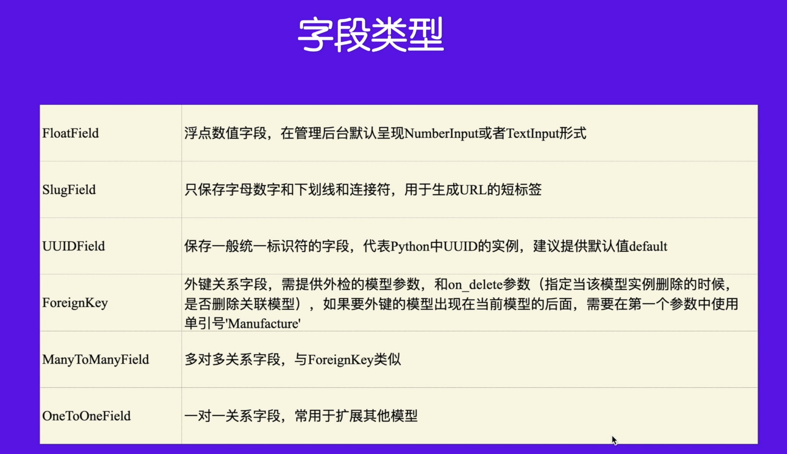
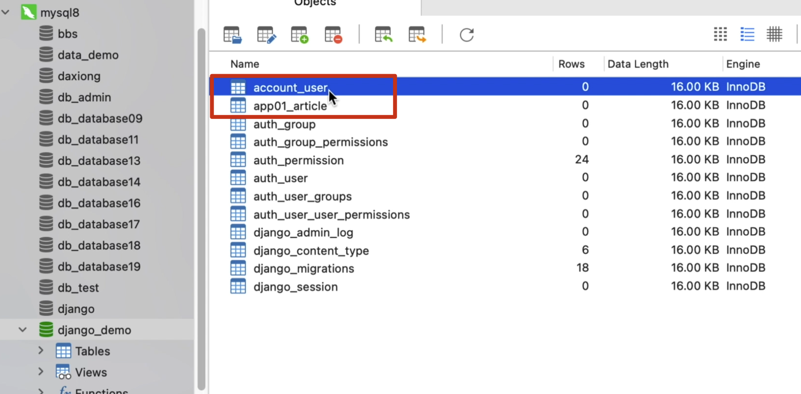

# [模型]:创建模型

数据库我们已经准备好了， 
那接下来呢，我们就通过OrM的方式 
来创建模型。

<!-- trancate -->

那么在创建模型之前，我们需要知道 
这个模型属于哪一个应用下的。
以我们这里为例，
现在这里我们有三个应用account、 app01和AP02 
那比如说我想在这个account应用下
来创建模型，
那么这个时候呢，我就需要在我的配置文件中 
把这个应用安装上。


找到配置文件settings.py, 找到INSTALLED_APPS, 代码如下：
```python title='demo/demo/settings.py'
INSTALLED_APPS = [
    'django.contrib.admin',
    'django.contrib.auth',
    'django.contrib.contenttypes',
    'django.contrib.sessions',
    'django.contrib.messages',
    'django.contrib.staticfiles',
    'account',
    'app01'
]
```

## 创建User模型

接下来咱们需要找到对应的模型文件 
也就是models.py。
在每个应用上面都有一个叫做models.py这样的文件，
在该文件中创建模型，代码如下:

```python titel='demo/account/models.py'

from django.db import models

# Create your models here.
class User(Model):
    id = models.AutoField(primary_key=True) 
    username = models.CharField('用户名', max_length=30,null=True,blank=True,unique=True)
    password = models.CharField('密码',max_length=30)
    email = models.EmailField('邮箱', null=True,blank=True, unique=True)
```

:::info[代码解析]

 这是用Django模型定义一个User类的代码。

1. 从django.db.models导入BaseModel基类。

2. 定义了四个字段:

  - id:自增ID主键
  - username:用户名,最大长度30,允许为空,必须唯一
  - password:密码,最大长度30
  - email:邮箱,允许为空,必须唯一

3. 每个字段都使用了models.字段类型作为类型声明。

4. 字段名之后可以通过参数设置额外的字段选项,如max_length、null、blank、unique等。

5. verbose_name参数用于设置模型的显示名称。

:::

常用的字段类型如下所示：


除此之外，表与表之间还有很多关联关系，比如一对一，一对多，和多对多等等。
创建的关联字段如下所示:



## 关联Article模型

一个用户可以写多篇文章，所以User模型和Article模型是一对多关系。
接下来我们再来一个文章Article模型，放在app01这个应用下了。代码如下：

```python title='demo/app01/models.py'
from django.db import models
from account.models import User


class Article(model):
    id = models.AutoField(primary_key=True)
    title = models.CharField(max_length=120)
    slug = models.CharField(max_length=200, default='')
    content = models.TextField()
    publish_date = models.DateTimeField()
    user = models.ForeignKey(User, on_delete=models.CASCADE)
```

:::info[代码解析]
 这段代码定义了一个Article模型,主要功能如下:

1. 从django.db导入models模块

2. 从account应用导入User模型

3. 定义Article模型,包含以下字段:

  - id - 自增主键
  - title - 文章标题
  - slug - 文章别名
  - content - 文章内容
  - publish_date - 发布时间
  - user - 外键,关联的User,CASCADE表示级联删除, 如果用户删除，该文章会一起删除

4. title、slug、content为文章的基本信息

5. publish_date记录发布时间

6. user外键关联了account应用的User模型,用于记录文章作者

7. on_delete=models.CASCADE表示删除用户时,该用户的所有文章也会被删除

:::

## 执行数据迁移

现在就创建了两个模型: User和Article。他们之间是一对多的关系。
创建好了类以后，我们需要把它提交到数据库上， 
那这个时候呢，咱们就可以使用数据迁移了。
好看一下执行数据库迁移，
咱们首先来生成迁移文件,先执行如下命令:
```
python manage.py makemigrations
```
执行完毕后，在对应的应用下就会生成一个migrations文件夹，下面就会有一个名为0000*文件。
然后再去执行下面的命令, 用于执行迁移,将最新的模型结构同步到数据库中:
```
python manage.py migrate
```
执行完成后，发现我们的django_demo数据库中,就会新增2张表。

:::info[总结]
makemigrations:生成迁移文件,记录模型变更。

migrate:执行所有未应用的迁移,完成同步。

两者配合使用可以在模型发生变化时自动将变化应用到数据库,实现模型和数据库的同步管理。
所以在模型有任何修改后,都需要依次运行这两个命令。
:::

最终将我们模型类中的表以及字段, 
全部创建到我们的数据库中了.
不需要我们使用SQL命令,
就可以实现了。
如下图所示。


好本节我们先介绍到这里，
小伙伴们，我们下节再见。