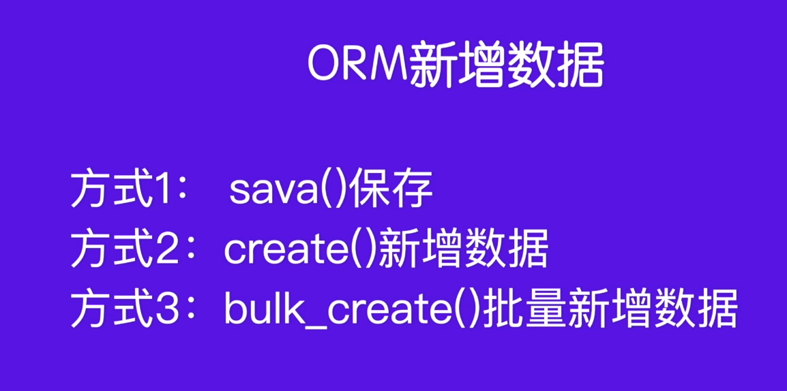
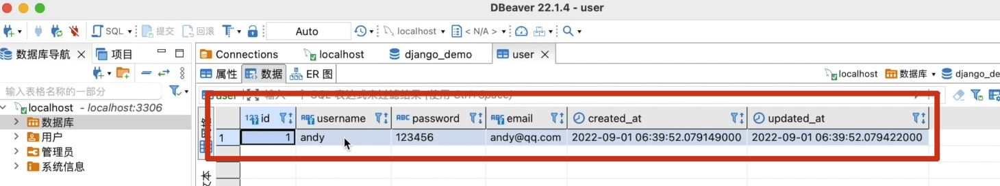
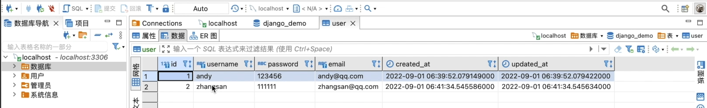
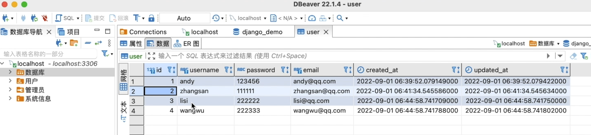
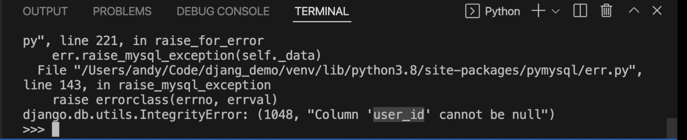
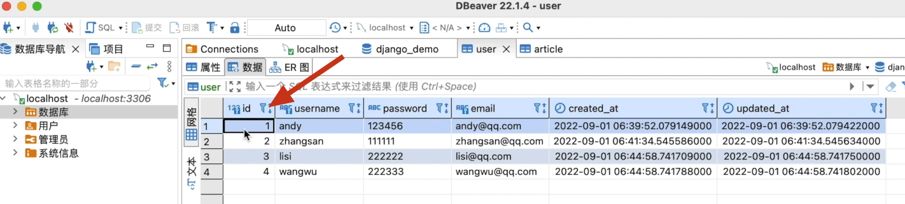
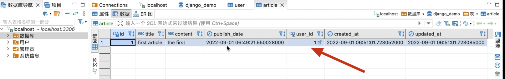

# [模型]:ORM新增数据

从本节开始我们要介绍ORM的增删改查操作,
也就是我们常说的crud,
- c代表着create,增加的意思,也可以叫插入。
- r代表着read就是读取。或者叫查询。
- u代表着update,修改。
- d代表着delete,删除。

本节我们先来介绍新增。

<!-- trancate -->

在Django中新增数据主要有三种方式, 如下图所示。



接下来咱们就通过代码来演示如何实现orm的新增数据。

那么在演示的时候呢，通常我们就使用,
Django中的shell,
这个shell其实就是一种语句行的方式。
不然的话，每次我们都需要运行程序来执行,
这样的话就很麻烦。

所以呢，我们后面的增删改查操作,
都是直接通过shell来演示。

我们可以通过语句来启动shell, 语句如下：
```bash
python manage.py shell 
```
启动后如下图所示。
![图21-启动shell])(imgs/图21-启动shell.png)

我们就已经启动了这个shell,
接下来我们在这里操作。

## 方式1：save保存

那首先我们要操作一个模型，就需要先把这个模型导入进来, 代码如下:
```bash
>>> from account.models import User
>>> user_obj = User(username='andy', password='123456', email='andy@qq.com')
>>> user_obje.save()
```

:::info[代码解析]
1. 从account应用的models.py文件中导入User模型类

2. 创建一个User对象,用户名是'andy',密码是'123456',邮箱是'andy@qq.com'

3. 调用save()方法将这个用户对象保存到数据库中

所以这段代码的作用就是在Django项目中通过模型类创建了一个新的用户,并保存到了数据库。
:::

执行完成以后,我们再来刷新这个数据库,
此时我们就看到这里新增了一条记录。如下图所示。



username是Andy,
它的ID是1,
username是andy,
还有password，Email。
:::warning[注意]
创建时间和更新时间是它自动增加的，不需要设置。如果你想设置这个字段也可以，因为我们在定义模型时，设置了
```bash
editable=True
```
:::

以上就是方式一使用save的使用。

## 方式2：create()新增
好，那接下来咱们看方式2，使用create。
在shell中，我们编写如下语句:
```bash
user2 = User.objects.create(username='zhangsan', password='111111',email='zhangsan@qq.com')
```
执行完成后，查看数据库，又新增了一条记录。如下图所示。


:::info[说明]
直接调用user.object的create方法,就可以进行创建。
而使用save的时候呢，需要先来实例化这个模型,
然后调用它的save方法。
:::


## 方式3：bulk create 批量创建

既然要同时创建多条记录，所以呢，咱们需要先来实例化多个用户,然后再批量的创建。语句如下：
```
>>> user3 = User.objects.create(username='lisi', password='222222',email='lisi@qq.com')
>>> user4 = User.objects.create(username='lisi', password='222222',email='lisi@qq.com')
>>> user_list = [user3, user4]
>>> User.objects.bulk_create(user_list)
```
:::info[代码解析]
 这段代码的意思是:

1. 使用User模型类的objects管理器的create()方法创建了两个用户对象user3和user4。

2. 创建了一个列表user_list,包含了user3和user4这两个用户对象。

3. 调用User模型管理器objects的bulk_create()方法,批量插入user_list中的多个用户对象。

具体来说:

- user3和user4通过create()方法创建,相当于:

        user3 = User(username='lisi', password='222222',email='lisi@qq.com') 
        user3.save()

- bulk_create()方法可以批量插入多个对象到数据库,避免多次IO操作。

- 该方法接收一个包含多个模型实例的可迭代对象,如这里的user_list。

所以这段代码使用了bulk_create()方法,通过一条SQL语句,批量插入了user_list中的两个用户到数据库。

相比逐个调用save(),bulk_create()方法可以大大提高数据插入的效率。
:::


我们来运行看一下效果,
这个时候再来刷新我们的数据库,
此时到这里就新增了,
李四和王五,
也就是说我们一次性就增加了两条记录。
如下图所示。



## 表关联的使用
除此之外还有一点需要特别注意的就是,
我们在插入的时候要考虑到关联的情况。
比如说,Article和User它俩之间有关联关系。新增Article数据的时候，
需要填写是谁创建的。回顾一下我们的Article模型:
```python title='demo/app01/models.py'
class Article(model):
    id = models.IntegerField(primary_key=True)
    title = models.CharField(max_length=120)
    slug = models.CharField(max_length=200, default='')
    content = models.TextField()
    publish_date = models.DateTimeField()
    user = models.ForeignKey(User, on_delete=models.CASCADE)
```
上面代码中有一个user,
这里它是作为一个外键,
那应该怎么填呢？
在shell中输入如下语句:
```bash
>>> from app01.models import Article
>>> from datetime import datetime
>>> now = datetime.now()
>>> article1 = Article(title='fisrt aritle', content='the first', publish_date=now);
>>> article1.save()
```
此时就会报错，如下错误:


这里提示我们,user_id不能为null。
也就是说我们需要设置一个user_id。
但是我们在创建这个表的时候，我们并没有使用user_id,
而是使用了一个user类。
所以，这里我们在传递的时候应该给它传一个user类对象。

我们看一下，刚才我们创建user的时候，实例化了一个
user_obj对象，在实例化Article模型的时候，我们就来使用他。
我们调用一下它的username属性。
```bash
>>> article1 = Article(title='fisrt aritle', content='the first', publish_date=now, user=user_obj);
>>> article1.save()
```
这一次就保存成功了。Article表就新增了一条记录，其中user_id字段就是关联的User表的id字段。
2个表的关联关系如下图所示。






## 总结
现在呢，我们就介绍完了orm新增数据的三种方式,
- 第1种使用save
- 第2种使用create
- 第3种是bulk create

:::danger[注意]
如果某些表存在关联关系，我们就需要注意,
Article实例化在赋值的时候，这里需要赋值User实例化的名字,
而不是一个具体的user_id。
在保存的时候它自动的就会将这个字段转化为user_id字段,
存的值就是对应的User表的id, 也就是User表的主键。
:::

好,
本节课我们就先介绍到这里,
小伙伴们，我们下节再见。