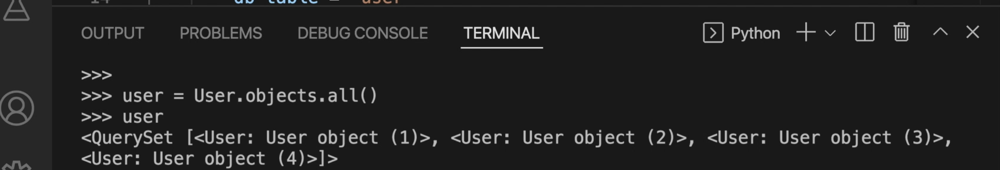
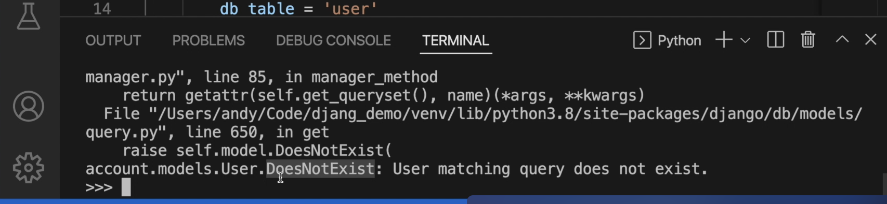
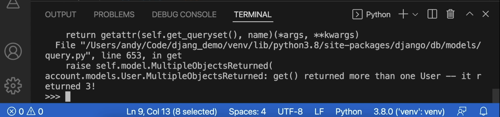

# [模型]:ORM查询数据

本节就来介绍ORM查询数据。 
查询的时候，通常有这么4种常用的方法，
- all: 查询所有。
- get: 查询一条。
- filter: 查询多条。
- first, last: 第一条和最后一条。


同样的，我们在shell中来进行演示。
<!-- trancate -->

## 方式1: all()
我们创建了几个用户，接下来呢我们就查询一下所有的用户。
在shell中输入如下语句:
```bash
>>> user = User.objects.all()
>>> user
```
这里显示的就是4条记录, 它们都是user对象，如下图所示。


如果要获取每一个用户的各种信息 
例如我们可以使用for循环进行遍历，语句如下:
```bash
>>> for item in user:
        print(item.username)
```
此时我们看到这里获取了andy、
张三、李四、王五这么4条记录。

## 方式2：get()

接下来我们演示一下使用get。
在shell中输入语句:
```bash
>>> user = User.objects.get(username='zhangsan')
>>> user
```
此时会输出一个user对象: `<User: User object (2)>`
:::info[说明]
`<User: User object (2)>` 这里的（2）代表User表中id=2的用户信息。
:::
有了user对象后，我们就可以获取它的各种信息。
```bash
>>> user.id, user.username, user.password, user.email
```
会显示user_id为2的所有用户信息。

上面是根据username条件进行查询，此外，还可以根据其他条件查询，通常是根据主键查询，因为主键是唯一的，可以查到唯一的一条记录。
```bash
>>> user = User.objects.get(id=2)
```
或者
```bash
>>> user = User.objects.get(pk=2)
```

:::tip
pk 就是primary key, 主键的意思，是我们在模型中设置的。
:::

使用get()查询，如果查询的数据不存在会怎么样?
例如，在User表中只有4条件记录，如果查询id=5的记录，语句如下：
```bash
user = User.objects.get(id=5)
```
错误信息如下：


如果要根据条件进行查询，例如查询id>1的记录，语句如下:
```
users = User.objects.get(id__gt=1)
```
:::info[说明]
id__gt=1表示id字段大于1的条件过滤。注意，不支持‘id>1’这样的写法。
`__`是双下划线。
:::

该代码会报错,错误信息如下:


因为get() 方法一次只能返回一个满足条件的模型实例。但这里id>1条件可能匹配到多个User实例,因此会报错。

要解决这个问题,可以使用filter()方法替代get()。

## 方式3：filter
filter()会返回一个匹配查询条件的模型对象列表(QuerySet),不会只返回一个实例。

```bash
>>> users = User.objects.filter(id__gt=1)
```
如果只返回一个，也可以使用 order_by() 和 first() 方法实现:
```bash
>>> user = User.objects.filter(id__gt=1).order_by('id').first()
```
这会按id排序,并获取第一个对象,等同于限定获取唯一对象的效果。

所以要注意get()方法的特点是获取一个匹配的对象。如果匹配到多个,需使用filter()或者先排序限定条件再取第一个。

## 方式4： first和last

如果要获取第1条记录，可以使用first, 语句如下：
```bash
>>> user = User.objects.first()
>>> user
```
输出结果为: `<User: User object (1)>`

如果要获取最后1条记录，可以使用last, 语句如下：
```bash
>>> user = User.objects.last()
>>> user
```
输出结果为: `<User: User object (4)>`

## 总结

:::tip[总结]
当我们要查一条记录的时候，就使用get。

当要查询多条记录的时候，就使用filter。

当要查所有数据的时候，就使用all。

当要查第一条或最后一条记录的时候，就使用first或者last。
:::

好，本节课我们先介绍到这里，
小伙伴们 
我们下节再见。