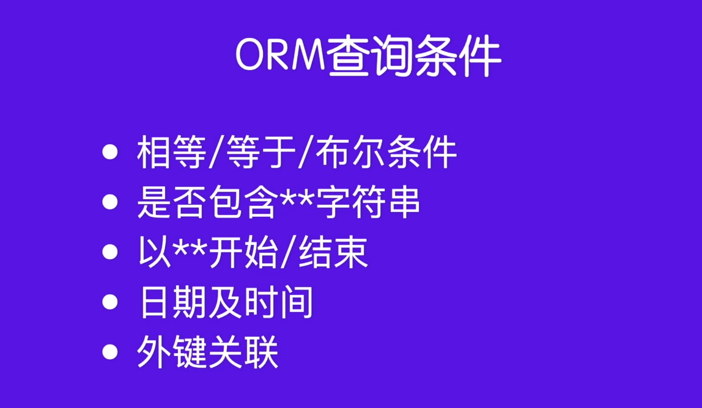
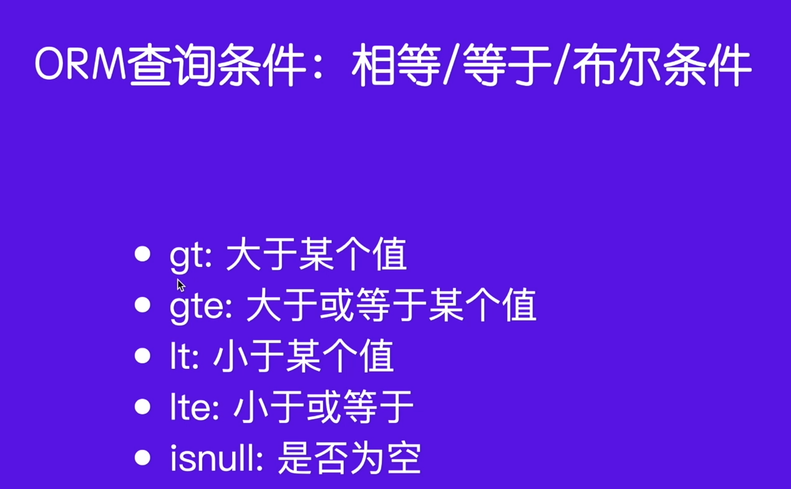
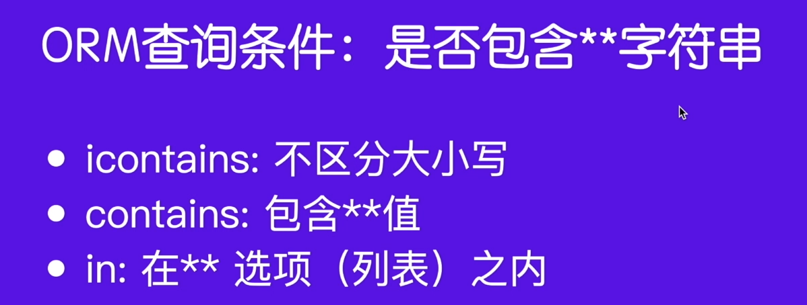
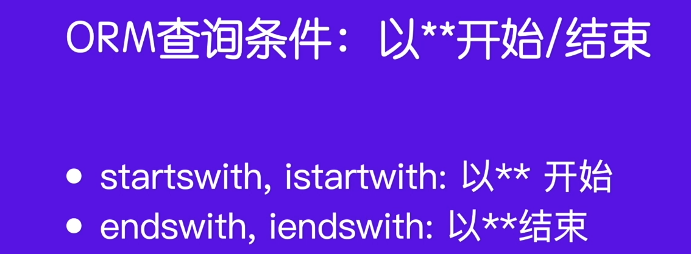

# [模型]:ORM查询条件

这些查询条件呢，咱们可以概括为这么几大类, 如下图所示。


<!-- trancate -->

## 相等/等于/bool条件 

### `exact` 和 `iexact`

通常会使用这个`exact` 和 `iexact`。
我们看一下它们是如何使用的以及它俩之间有什么区别。

上一节我们在查询User表id=2的记录时，使用了下面的语句:
```bash 
>>> User.objects.get(id=2)
```
此外，我们可以使用`exact`精确查找，语句如下:
```bash
>>> User.objects.get(id__exact=2) 
```
`exact`是不缺分大小写的。例如：
```bash
>>> User.objects.get(username__exact='Andy') 
```
同样可以获取到User表中用户名是‘andy’的记录
如果要区分大小写，可以使用'iexact'。

### 大于/小于

“大于”和“小于”等需要用特殊的字符表示。例如：


:::tip
gt: greater than, 大于

gte: greater than or equal to, 大于等于

lt: less than, 小于

lte: less than or equal to, 小于等于
:::

```bash 
>>> users = User.objects.filter(id__lte)
```
:::warning[注意]
查询多条，用`filter`, 而不是`get`。
:::

如果查询某个字段为null的值，可以使用如下语句:
```bash
>>> User.objects.filter(username__isnull=True)
```

## 包含条件

查询数据中是否包含某些字符时，可以使用包含条件，如下所示:


例如，查找所有的User表中username包含`an`这个字符的, 语句如下:
```bash
>>> User.objects.filter(username__contains='an')
``` 
如果要区分大小写，可以将`contains`修改为`icontains`。

如果查看是否在某些值中，可以使用in。例如，查找id在[2,4,6]中的任意一个，示例如下:
```bash
>>> User.objects.filter(id__in=[2,4,6])
```
如果数据表中没有[2,4,6]中的任何一个，那么返回一个空:`<QuerySet []>`。

## 开头和结尾



例如，查询username以'an'开头和以'an'结尾的记录，可以使用如下语句：
```bash
>>> User.objects.filter(username__startswith='an')
>>> User.objects.filter(username__endswith='an')
```

## 查询日期和时间


例如查询created_at创建时间。语句如下:
```bash
>>> User.objects.filter(created_at__year=2024)
>>> User.objects.filter(created_at__month=9)
>>> User.objects.filter(created_at__minute=44)
```

## 外键查询

User表和Article表是一对多关系，那么我们可以通过User表来查看某个用户下所有的文章，也可以根据一篇文章，找到这个user, 同时获取它的各种信息。

在"ORM新增数据"小结，我们建立了一个User和Article的关系。也即是Article这篇文章的作者是User表id为1的用户。

通过user表获取article, 可以使用如下语句:
```bash
>>> user = User.objcts.get(id=1)
>>> articles = user.article_set.all()
```

:::info[代码解析]

这里的`article_set`是根据Article模型中指向User的外键字段自动生成的反向关系管理器。

我们可以通过`user.article_set`来查询这个User对象相关的所有Article记录。

另一种更Pythonic的方式是在User模型中定义一个相关名,比如:

```python
class User(models.Model):
    # ...
    articles = models.ManyToManyField(Article, related_name='authors')
```

然后通过这个相关名查询:

```python 
user.articles.all()
```

这种方法通过定义相关名使得从User模型查询到相关Article更加清晰直观。

:::


可以获取id为1的用户的所有文章。

```bash
>>> article = Article.objcts.get(id=1)
>>> article.user
```

:::info[代码解析]
通过外键关系字段author,查询所属的用户:
user = article.user

这里我们通过article对象的user字段,即Article模型中定义的指向User模型的外键字段,来获取这个文章所属的用户。

另一种方法是在Article模型中定义一个related_name,比如:

```python
class Article(models.Model) 
    user = models.ForeignKey(
        User,
        on_delete=models.CASCADE,
        related_name='articles'
    )
```

然后可以通过这个related_name反向查询:

```python
user = article.user 
# 等同于
user = article.articles
```

这种方法允许从文章对象方便地通过related_name直接访问所属用户,避免了多层跳转查询。

所以Django通过外键字段和related_name提供了从一端反向查询另一端模型的机制,使关系模型的查询更加方便。
:::


  