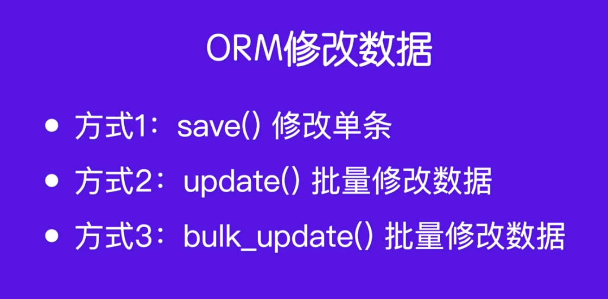

# [模型]:ORM更新数据

修改数据或者叫更新数据通常有3种方式，如下图所示。


那通常咱们最常用的就是方式1和2。 
接下来我们就用代码来演示一下 
<!-- trancate -->
在修改数据的时候，首先我们需要知道你要修改的是哪一条数据, 
那么呢，我们就需要先把这条数据给它查询出来。
## 方式1：save()

```bash
user = User.objects.get(username='andy')
user.email = 'andy@163.com'
user.save()
```
:::warning[注意]
一定要用save()进行报错，否则服务同步到数据库。
:::

## 方式2：update()
使用update方式，示例如下:
```bash
user = User.objects.get(id=2)
user.update(password='222222', email='zhangsan@163.com')
```
此时会自动更新这2个字段的值。

那么要如何更改关联表的数据呢？比如我们现在要更新article表中id为1的数据的user。可以这样操作:
```bash
>>> user2 = User.objects.get(id=2)
>>> Article.objects.get(id=1).update(user=user2)
```
这里直接用1行代码实现，当然你也可以拆分开，例如:
```bash 
>>> user2 = User.objects.get(id=2)
>>> article = Article.objects.get(id=1)
>>> article.update(user=user2)
```

## 方式3：

可以使用bulk_update()方法来批量更新多个模型实例:

```python
from django.db.models import BulkUpdate

# 查询要更新的文章实例
articles = Article.objects.filter(status='D')

# 创建要更新的字段数据
data = [{
    'id': article.id,
    'status': 'P'
} for article in articles]

# 批量更新
Article.objects.bulk_update(data, ['status'])
```
:::info[代码解析]
bulk_update() 方法步骤:

1. 查询要更新的模型实例

2. 构造要更新的字段数据字典列表,这里我们构造了id和status字段

3. 调用bulk_update(),传入数据列表和要更新的字段名列表

这样bulk_update()会构造一条合理的SQL语句,进行批量更新。

与update()相比,bulk_update():

- 可以一次更新不同实例的不同字段
- 更新更灵活
- 性能也可能更好

所以bulk_update()是实现批量更新的一个更高级和灵活的选择。

:::