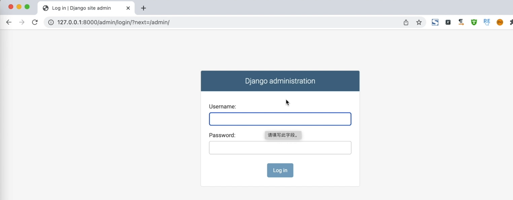
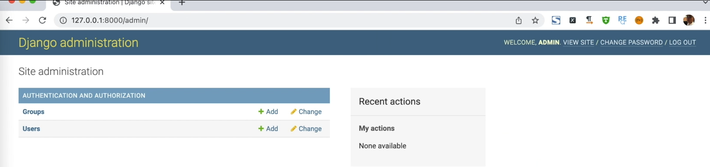
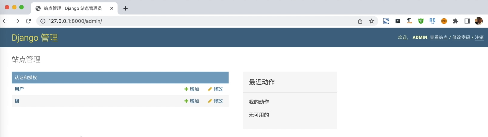
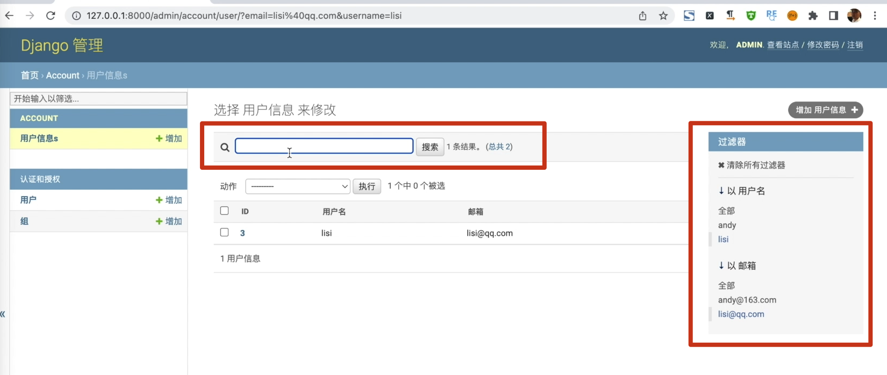
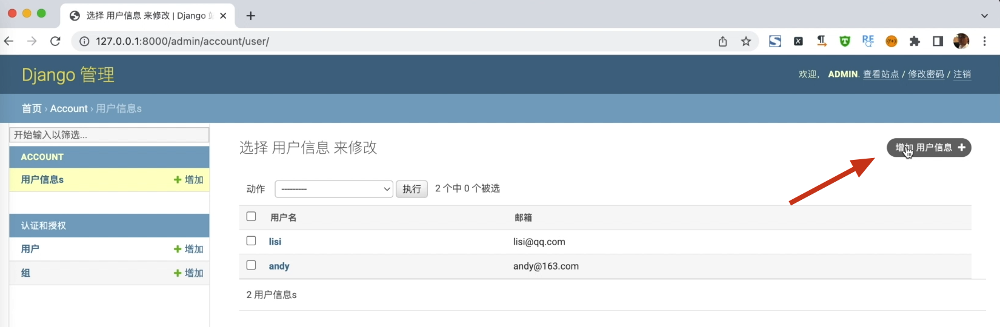
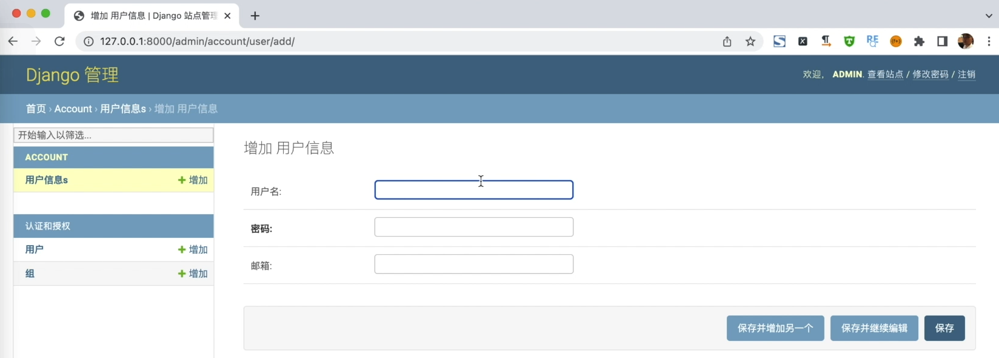
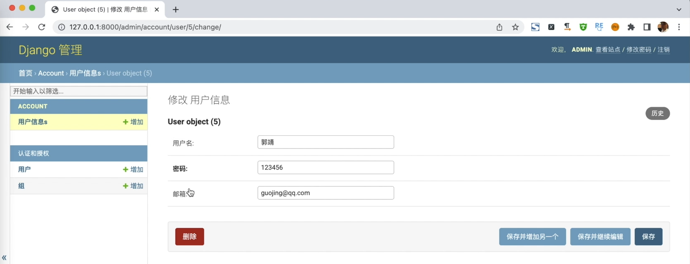
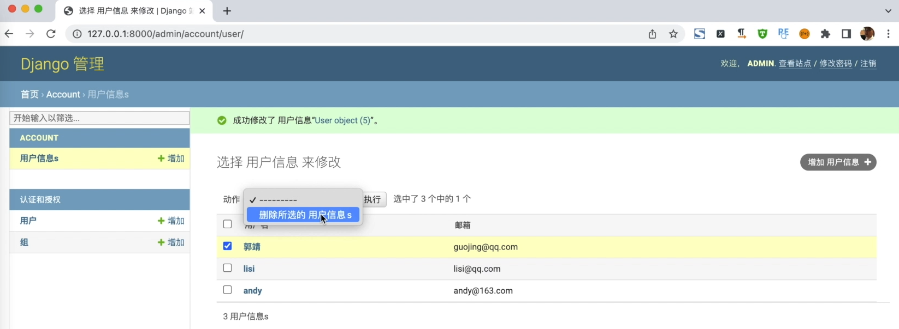
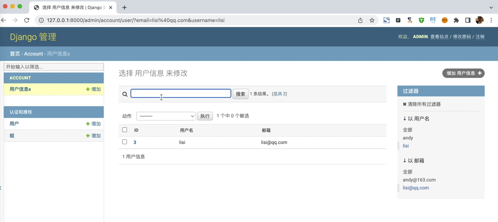

# [Django后台]: 注册后台模型

我们知道Django是一个大而全的Web框架，
它自带了一个管理后台，
我们看一下怎么来使用它。

<!-- trancate -->
 
 ## 创建管理员用户

首先咱们先来启动项目,在虚拟环境下，执行如下命令：
```bash
python manage.py runserver
```
 
启动以后，在浏览器中输入网址：127.0.0.1:8000/admin, 
运行结果如下图所示。

这样的话咱们就可以访问到这个后台页面，
需要我们填写用户名和密码,
我们现在还没有,
接下来咱们来创建一个管理员账号和密码。

创建管理员同样的也可以使用命令来进行创建，
我们先把服务关掉 
```bash
ctrl + c
```
然后使用命令:
```bash
python manage.py createsuperuser
``` 
好，然后它提示我们默认的是"andy"，
那么这里呢，我们修改一下，使用"admin"，
然后填写邮箱，
填写密码和确认密码。
如果密码过于简单，他会提示：太常见了。 
因为我们是在本地测试，所以不需要换，直接 ，点击yes
好创建成功了。

接下来，再次启动服务:
```bash
python manage.py runserver
```

接下来，再次访问后台网址，输入正确的“用户名”和“密码”，进入后台。页面如下所示：


现在我们就进入到了Django的后台。

## 配置语言和时区

这个后台默认是英文的,默认是UTC时区。
我们可以将其配置成中文，并且设置为上海时区。
找到配置文件settings.py， 修改相应的配置。 
```python title='demo/demo/settings.py'

# LANGUAGE_CODE = 'en-us'
LANGUAGE_CODE = 'zh-hans'
# TIME_ZONE = 'UTC'
TIME_ZONE = 'Asia/Shanghai'
```
配置完成后，
重新启动一下服务， 
再来刷新一下页面， 
现在呢就变成了中文站点了。如下图所示。


## 后台注册应用

这个后台呢，它自带了一个认证和授权,
也就是我们可以对用户进行分组设置。
然后其它的功能还没有添加，
接下来我们把用户和文章的模型
追加到我们的后台上。

在account应用下找到admin.py, 填写如下代码:
```python title='demo/account/admin.py'
from django.contrib import admin
from account.models import User

# Register your models here.
class UserAdmin(admin.ModelAdmin):
    # 配置展示列表
    list_display = ('id','username','email')


admin.site.register(User, UserAdmin)
```
:::info['代码解析']
 这段代码是在Django管理后台中注册User模型的配置。

1. 导入需要的admin和User模型

2. 定义一个UserAdmin类,继承admin.ModelAdmin

3. 在UserAdmin中使用list_display指定在管理后台的用户列表页中显示id、username、email字段

4. 使用admin.site.register将User模型类与UserAdmin管理类关联注册

这样就在Django管理后台设置了User模型的展示方式:

- 用户列表页会显示id、用户名、邮箱三列

- 可以点击列头进行排序

- 用户名和邮箱能点进链接查看详细信息

- 这些列也会显示在添加/编辑用户的表单中

以此来配置管理后台更好的展示User模型的数据。

所以这段代码利用ModelAdmin自定义了Django管理后台的User模型管理 DISPLAY 方式。
:::

运行效果如下图所示。


接下，我们就可以使用Django字段的增删改操作了。
添加用户信息，点击“添加用户”：

然后填写用户信息，如下：

修改用户信息，如下：

删除用户，如下：


接下里，我们还可以配置搜索和过滤功能。在account/admin.py文件中配置，代码如下：
```python title='demo/account/admin.py'
from django.contrib import admin
from account.models import User

# Register your models here.
class UserAdmin(admin.ModelAdmin):
    # 配置展示列表
    list_display = ('id','username','email')
    # 新增，配置过滤字段
    list_filter = ('username', 'email')
    # 新增，配置搜索信息
    search_fields = ('username', 'email')


admin.site.register(User, UserAdmin)
```

重启服务，再次查看后台管理页面，效果如下所示。



同理，来配置一下app01/admin.py, 代码如下：
```python title='demo/app01/admin.py'
from django.contrib import admin
from app01.models import Article

# Register your models here.
class ArticleAadmin(admin.ModelAdmin):
    # 配置展示列表
    list_display = ('id', 'title', 'content')
    list_display_links = ('id', 'title', 'content')
    # 配置过滤字段
    list_filter = ('title', 'id')
    # 配置搜索信息
    search_fields = ('title',)

admin.site.register(Article, ArticleAadmin)
```
后台访问article应用，同样可以实现常规的增删改查功能。
