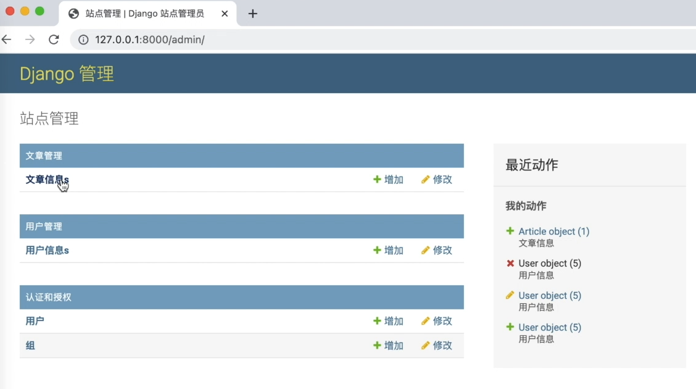

# [Django后台]: 配置后台


在后台这里我们看到这个应用名称呢，还是我们创建的应用名称，
那显然这里app01就会让人很多误解,
所以咱们需要改变一下它,
以及涉这里的account我们都给它改成中文,
那在哪里配置呢？
本节让我们来介绍一下常用的后台配置。

<!-- trancate -->

## 配置应用信息

先来配置app01, 在app01下找到apps.py， 新增如下代码:

```python title='demo/app01/apps.py'
from django.apps import AppConfig


class App01Config(AppConfig):
    default_auto_field = 'django.db.models.BigAutoField'
    name = 'app01'
    verbose_name = '文章管理'
```

同样的方式配置一下account, 在account下找到apps.py, 新增如下代码:
```python title='demo/account/apps.py'
from django.apps import AppConfig


class AccountConfig(AppConfig):
    default_auto_field = 'django.db.models.BigAutoField'
    name = 'account'
    verbose_name = '用户管理'

```

修改后，站点信息如下所示。



## 配置模型信息
访问文章时，Article模型中，id字段现在是可以编辑的，如下图所示。


我们应该设置为只读。可以这样设置。
```python title='demo/app01/admin.py'
class ArticleAadmin(admin.ModelAdmin):
    # 配置展示列表
    list_display = ('id', 'title', 'content')
    # 配置点击id和title和content，执行跳转
    list_display_links = ('id', 'title', 'content')
    # 配置过滤字段
    list_filter = ('title', 'id')
    # 配置搜索信息
    search_fields = ('title',)
    # 新增，只读属性
    readonly_fields = ('id',)
```

:::info[代码解析]
- 配置点击id和title和content，执行跳转
```python
list_display_links = ('id', 'title', 'content')
```
- 新增，只读属性
```
readonly_fields = ('id',)
```

- 内容可以在列表页直接修改
```
list_editable = ('title', 'content')
```

:::