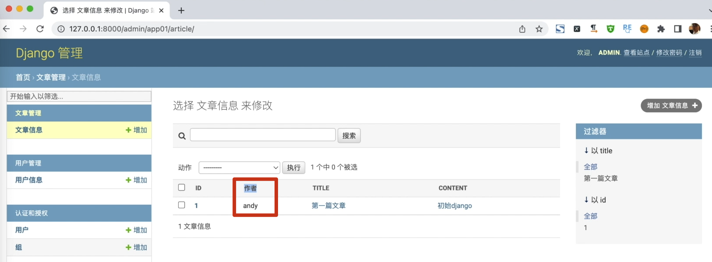
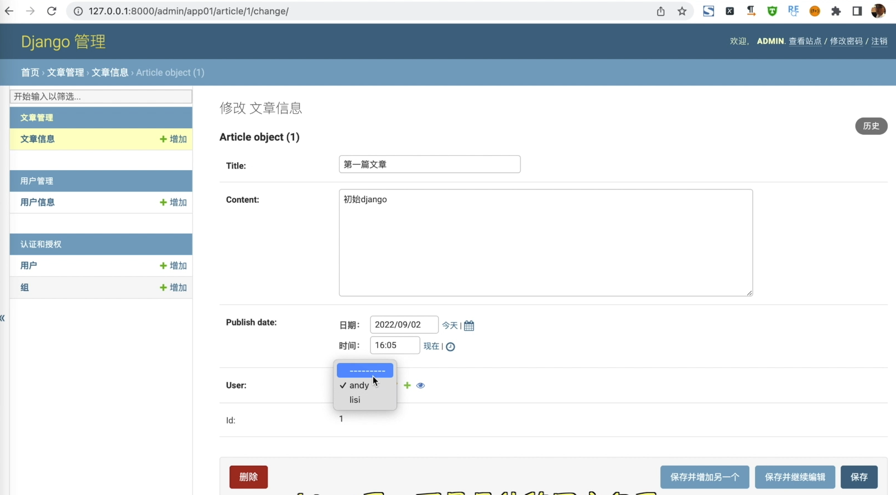

# [Django后台]: 设置函数


<!-- trancate -->

在展示列表的时候,并没有显示这个文章的作者。
因为Article没有作者这个字段，而是关联到User表，
那我怎么办呢？
我们可以自己来自定义函数来实现它。

在app01/admin.py中定义一个函数，名字是get_author， 代码如下:
```python title='demo/app01/admin.py'
from django.contrib import admin
from app01.models import Article
# Register your models here.

# 新增函数
def get_author(obj):
    return obj.user.username


class ArticleAadmin(admin.ModelAdmin):
    # 新增get_author, 配置展示列表
    list_display = ('id', get_author, 'title', 'content')
    list_display_links = ('id', 'title', 'content')
    # 配置过滤字段
    list_filter = ('title', 'id')
    # 配置搜索信息
    search_fields = ('title',)
    # 只读属性
    readonly_fields = ('id',)
    # 可以修改
    # list_editable = ('title', 'content')

get_author.short_description = '作者'

admin.site.register(Article, ArticleAadmin)

```

:::info[代码解析]
 在这个Django管理后台的示例代码中,get_author函数是一个用于动态获取文章作者用户名的方法:

```python

当在管理后台渲染Article列表时,会对每个article对象执行get_author方法,来动态获取article.user.username,从而实现文章作者列的展示。

这个函数的一些关键点是:

- 函数接收article对象作为参数
- 通过article的user外键获取对应的User对象
- 返回User的username作为作者名
- 使用short_description修改了管理页面上的列名显示

所以get_author函数允许我们在模型的admin管理器中动态获取字段,进行更复杂的列数据渲染和处理。

:::

运行效果如下图所示。


除此之外，添加文章时，需要选择作者，这里是下拉框，但是显示的都是对象信息，如下图所示。


下面我们来解决这个问题。
我们在创建模型的时候 
来找到account模型，可以定义一个函数名字是__str__, 代码如下:
```python title='demo/account/models.py'
class User(BaseModel):

    class Meta:
        pass

    def __str__(self):
        return self.username
```

好，那接下来咱们再来运行一下,效果如下图所示。



至此呢，我们就介绍完了在模型中使用函数以及来配置一些相应的信息。
