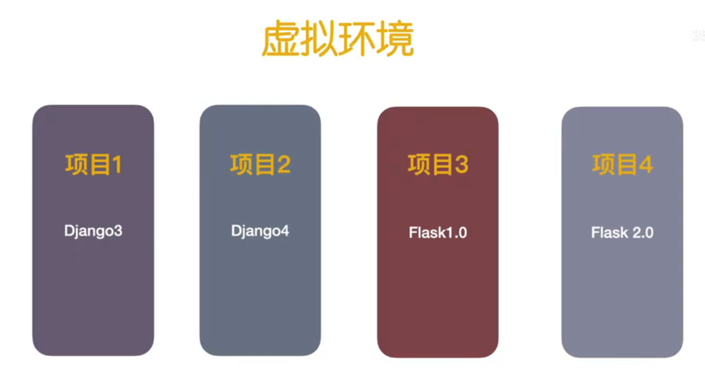
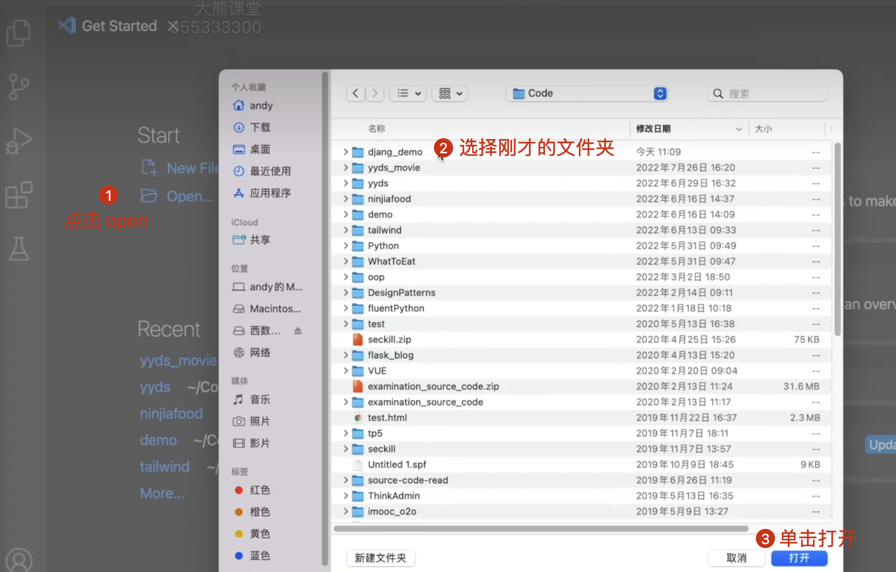
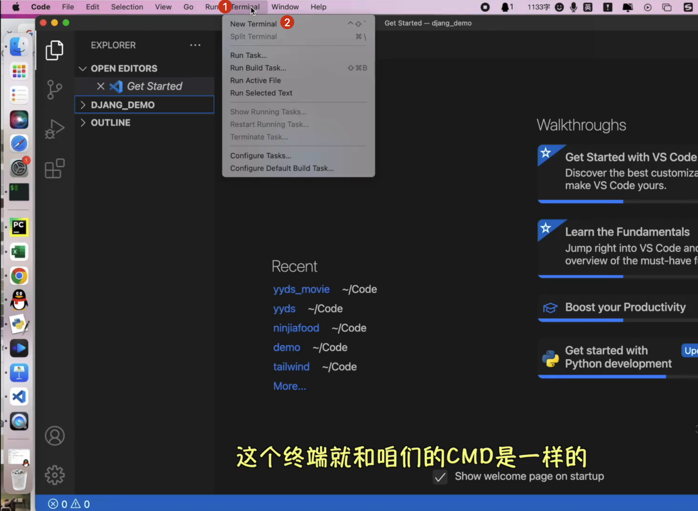
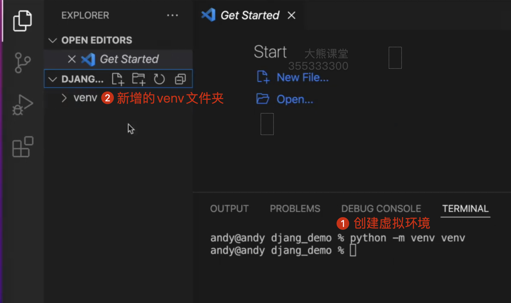
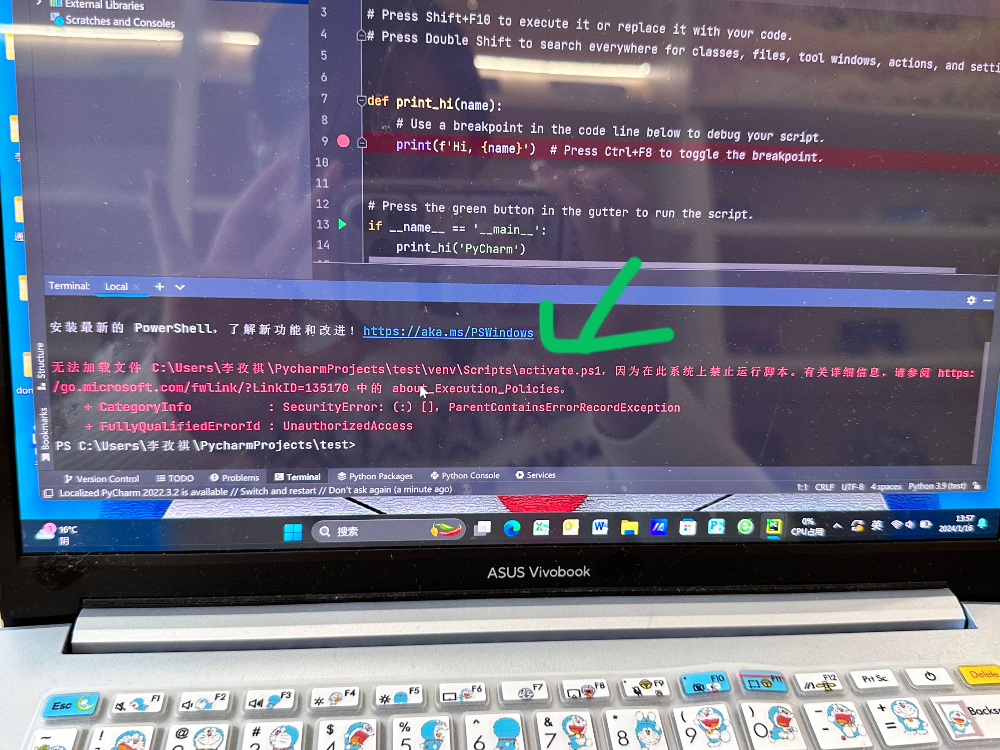

# 虚拟环境下安装Django


<!-- truncate -->
## 为什么使用虚拟环境

当我们在创建项目的时候，经常会使用第三方包和模块。而这些包和模块也会随时间的增加而变更版本。

例如，在我们创建第1个应用程序时，使用的框架是Django 1.0。当我们开发第2个应用程序时，
Django 版本已经升级到 2.0。这意味着安装一个 Python 环境可能无法满足每个应用程序的要求，
这就导致需求存在冲突，只安装版本 1.0 或 2.0 将导致某一个应用程序无法运行。如何解决这种问题呢? 

Python 提供的解决方案就是创建多个虚拟环境(virtual environment)。
一个虚拟环境就是一个目录树，其中安装有特定的 Python 版本，以及许多其他包。 ™™
对于不同的应用可以使用不同的虚拟环境，这样就可以解决前面需求相冲突的例子。应用程序 A 可以拥有自己的安装了 1.0 版本的虚拟环境，而应用程序 B 则拥有安装了 2.0 版本的另一个虚 拟环境。如果应用程序 B 要求将某个库升级到 3.0 版本，也不会影响应用程序 A 的环境。多个
虚拟环境的使用如下图所示。



## 虚拟环境下安装Django

### 创建虚拟环境
在你喜欢的路径下创建一个空文件夹，命名“django_demo”, 然后使用vscode打开它。如下图所示。


打开终端，如下图


接下来创建虚拟环境


### 激活虚拟环境：

windows使用命令：
```bash
venv/scripts/activate
```
如果提示如下错误


请参考下文解决：
[解决方案](https://blog.csdn.net/LEILEI18A/article/details/125959134)


mac使用命令:
```bash
source venv/bin/activate
```

启动后，命令行右侧会多一个“(venv)”标识。

:::tip
关闭虚拟虚拟环境：将activate 替换成deactivate.例如，mac关闭可以使用命令：
```
venv/bin/deactivate
```
:::

## 虚拟环境下安装django
执行如下命令：
```bash
pip install django==4.1
```
如果不添加版本号，表示安装最新版
```bash
pip install django
```

:::warning
请尽量与教程保持一致。
:::


