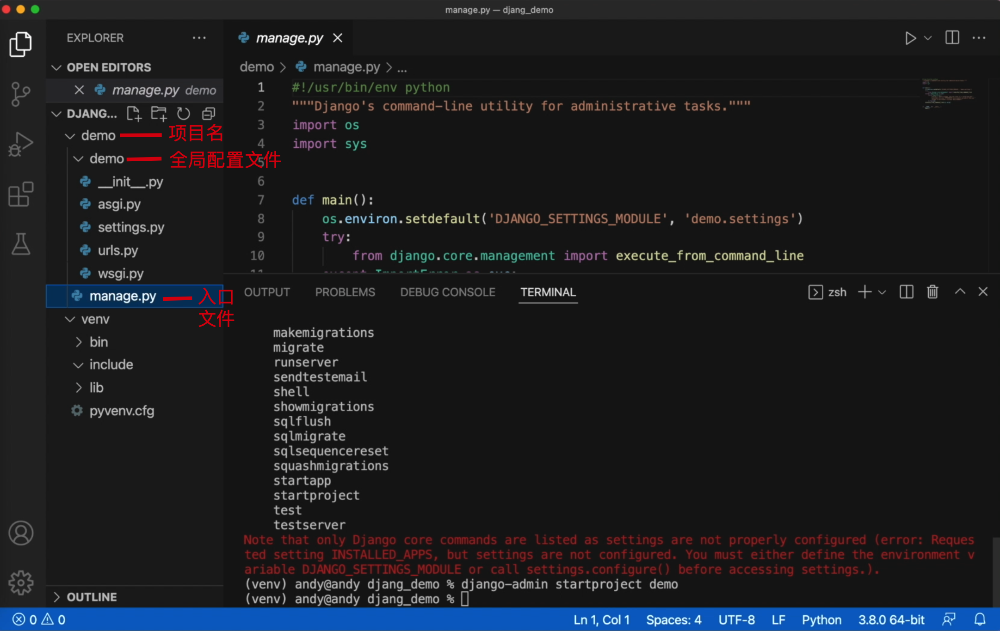

# 创建Django项目
现在呢，我们已经安装完了Django，
那接下来我们就创建一个Django项目。 
但是Django项目的创建和其它框架并不一样，
其他框架可能会要求你创建一个python文件，
然后再导入Django框架开始运行，
但是Django却不是这样。
Django为我们提供了一个`命令行`的方式， 

:::tip
一提到命令行，我们自然而然就会想到Linux啊，
的确是很多框架的开发都受到了Linux的影响，
也就是说程序员能用一行命令来操作的话，他绝对不会一个一个的去创建文件，
然后通过`命令行`来实现。 
:::

好，接下来我们来看一下Django的命令行 

## 创建Django项

同样的在我们的虚拟环境中,
我们在这里输入Django命令,
```bash
django-admin --help
```
看一下帮助，
在这里呢，
有这么多的 ，
Django相关的命令 。
```
(venv) andy@andy djang_demo % django-admin --help 

Type 'django-admin help <subcommand>' for help on a specific subcommand.

Available subcommands:

[django]
    check
    compilemessages
    createcachetable
    dbshell
    diffsettings
    dumpdata
    flush
    inspectdb
    loaddata
    makemessages
    makemigrations
    migrate
    optimizemigration
    runserver
    sendtestemail
    shell
    showmigrations
    sqlflush
    sqlmigrate
    sqlsequencereset
    squashmigrations
    startapp
    startproject
    test
    testserver
```

接下来，
创建一下Django项目，项目名字是demo
使用命令：
```bash
django-admin starproject demo
```

创建完成以后，目录结构如下图：


在我们的Django目录下，Django下面就新增了一个demo文件夹。 
那这个文件夹下面还有文件夹， 
然后下面又多了一个manage.py。
这就是Django的入口文件。


那现在呢，我们就已经成功的创建了一个项目, 
这个项目名字是demo。


## 启动Django项目

接下来我们就启动这个Django项目。

启动的时候，我们要执行这个manage.py的入口文件。

:::warning
首先进入这个目录。manage.py文件在django_demo/demo/ 路径下，所以我们先进入这个路径。
如果当前目录是django_demo/ , 需要使用命令 `cd demo` 进入。此时当前路径就是
django_demo/demo/
:::

接着输入命令启动Django项目:
```bash
python manage.py runserver
```
:::tip
它也有很多参数. 我们可以这样 
可以使用，--help来查看一下,
```bash
python manage.py --help
```
:::


好，此时我们看到这里有一些提示信息 
告诉我们Django当前的版本，然后使用的 
配置文件 
这里启动的是url以及这个端口号 
我们复制一下 


我们直接来复制一下 
我们在浏览器中输入这个网址 
```
127.0.0.1:8000   
```
此时呢，我们就看到了一个这样的Django首页.


这就是Django为我们提供的 
也就是说我们没有写任何一行代码，他就给我们提供了一个这样的效果。
小伙伴如果你也看到这样的页面，那恭喜你，你的项目创建成功了🎉🎉🎉

## 关闭服务
怎么样才能停止这个服务，按下`Ctrl + c`键就可以停止服务，此时网页就无法访问了。 

本节我们先介绍到这里。