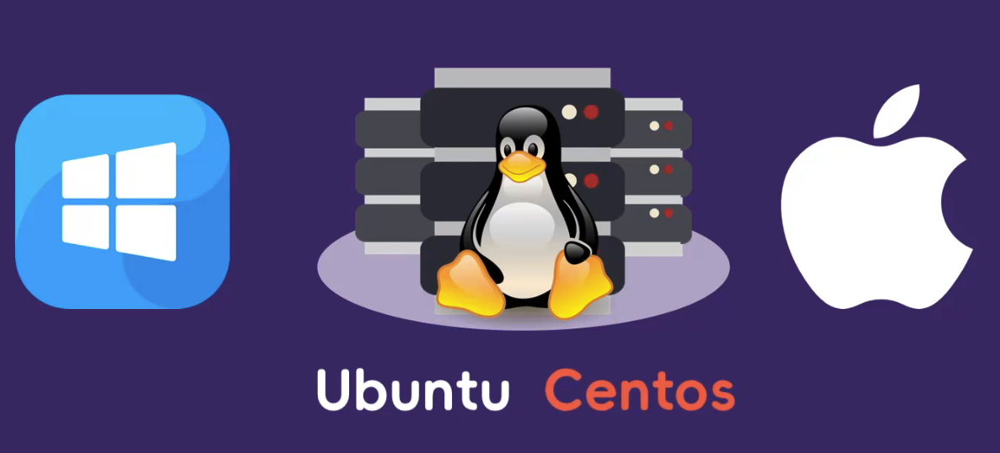
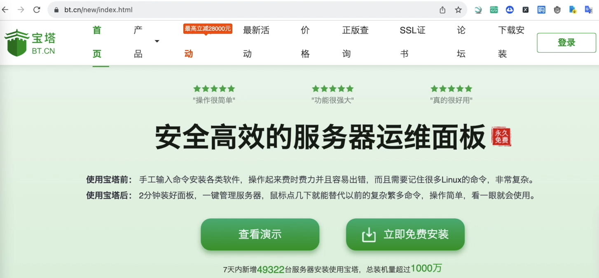
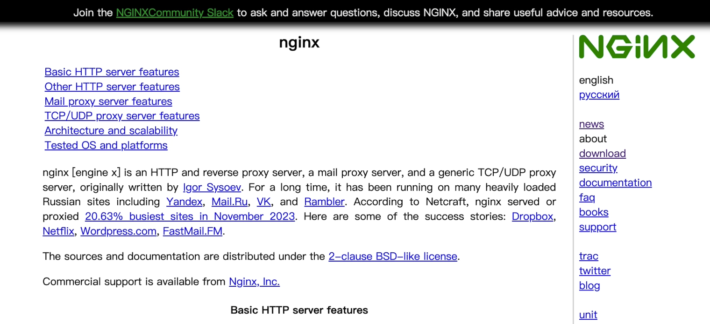
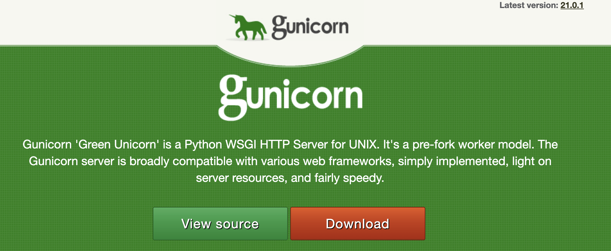
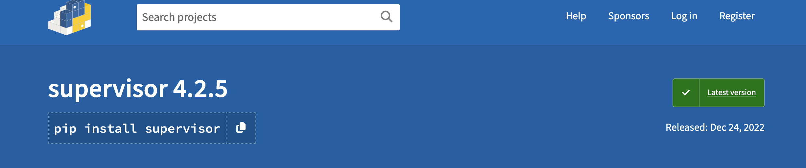

# 项目部署简介
现在我们的Django项目已经开发完成了，
那么现在项目只有我们在本地才能可以访问，
或者说只有在局域网内的小伙伴才能够进行访问，
如何让更多的人看到我们的网站呢?
正所谓独乐乐不如众乐乐，
这个时候我们就需要将我们的网站部署到服务器上，
这样世界各地的小伙伴都可以通过网络来访问我们的项目了。

那接下来的章节我们就开始介绍如何实现项目的部署
<!-- trancate -->

对大多数小伙伴而言,项目的部署其实是一个难点,
这主要是因为我们平时在开发的过程中。
使用的都是Windows电脑或者是Mac笔记本，
而现在呢我们要部署项目的时候，
大多数作为服务器的电脑，
我们通常会选择Linux系统。比如说我们常见的Ubuntu、Centos等等这些。

因为作为服务器而言，
它们的性能更高。
那么问题就来了，
针对于很多不习惯使用Linux的小伙伴，
这些都会带来很多头疼的问题，
比如说Linux的目录结构，
Linux命令的使用，
各种软件的安装等等，
这些都成为小伙伴的难点。

不过没有关系，
Andy老师会使用尽量简单的方式，
教大家如何将我们的项目快速的部署到服务器上，
在讲解的过程中，
我会一步一步的演示，
小伙伴跟着我一起操作绝对没有任何问题，
此外我们还要介绍为什么要这样做。

好,那接下来我们来介绍一下
要进行项目部署
我们需要哪些东西
首先呢
我们需要有一台服务器。
那这个服务器呢，
现在有很多，
你可以选择阿里云服务器，
腾讯云服务器，
华为服务器等等等等。
各种云服务器，
大家可以任选其一。
虽然界面稍有不同，
但是它们的操作流程都是一样的。

好,有了服务器以后,
我们需要把我们的代码上传到服务器。
那这个时候呢，
我们通常会使用git命令，
来将我们本地代码上传到仓库，
然后再从仓库克隆到服务器上。

那小伙伴如果对git命令不熟悉的话,
也没有关系,
我们可以使用宝塔,
就是相当于将我们的文件夹拖到服务器上,
一样方便。

好,代码上传到服务器以后,
是不是我们直接运行Python程序就可以执行了呢?

是可以运行的,
但是外网的小伙伴是无法访问的,
那如果想要更多的人访问,
我们可以使用nginx反向代理,
将我们本地的端口暴露出去,
让外网的小伙伴可以进行访问。

除此之外,
我们的项目启动,
如果使用RunServer的话,
它使用的是django自带的一个本地的服务,
这个性能非常之低,
所以我们为了提升服务器的性能,
我们可以使用gunicorn。
来设置多进程进行访问,
提升服务器的性能。

那除此之外呢，
我们为了更好的管理我们的进程，
我们还会引入一个supervisor。

小伙伴听到这些可能已经晕头转向了,
不过没有关系,
我会全程演示如何部署Django项目,
在整个过程中，
我会教大家如何去查看错误信息，
然后去解决问题。
通过我们项目的部署，
小伙伴就能够完全掌握整个流程，
并且将你的项目部署上线。
