# [项目部署]:购买阿里云服务器

本节课我们来介绍一下如何购买并且使用阿里云服务器，
大家可以选择任何一款云服务器。
这里选择的是老牌的阿里云服务器。
虽然说每个服务器的界面并不相同，
但是他们的使用方式都是一样的。
<!-- trancate -->

我们就以阿里云服务器为例，
首先我们先来访问到阿里云的官方网址，
如果我们没有账户的话，我们可以先去注册一个账户。

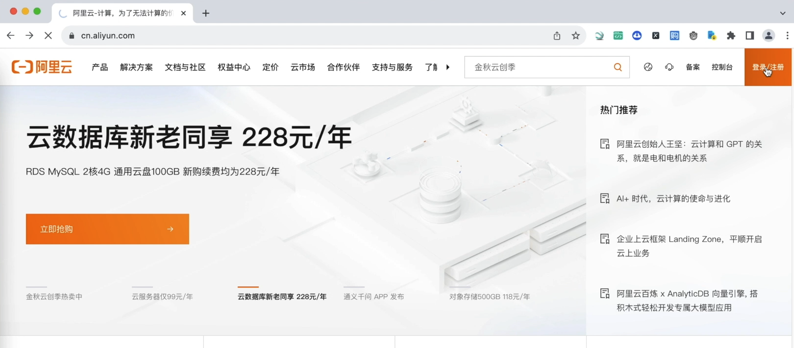

注册成功以后，
我们再来进行登录。
我们可以输入阿里云服务器，
然后选择云服务器ECS。
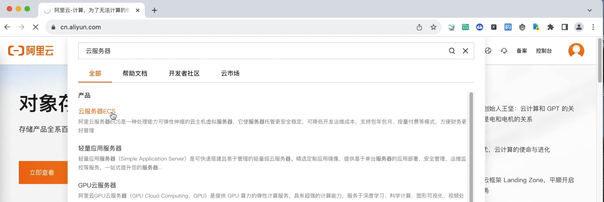

这里有很多不同类型的服务器，
小伙伴需要根据自己的需求来选择不同的服务器类型。

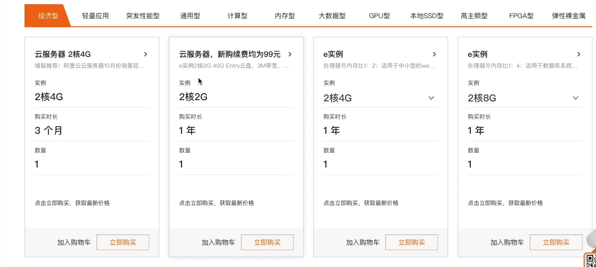

比如说两核4G，
两核8G等等，
这些看你自己的需求。

我们就演示选择一个比较便宜的一款，
然后我们看一下这里的配置，
区域我们就选择华北。
这里的操作系统我们选择Ubuntu。
选择一个版本号，就选择这个稳定版本的Ubuntu 22。

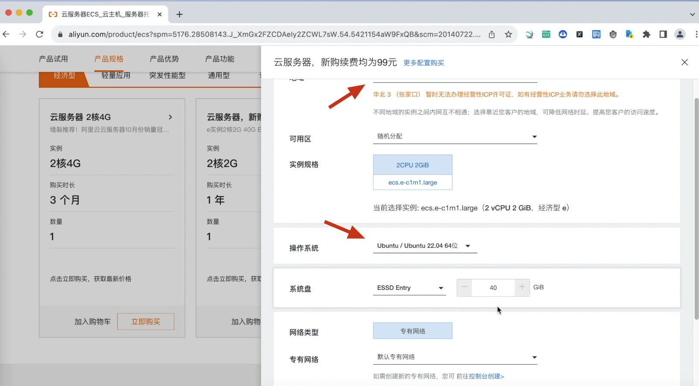

配置完成以后，
点击立即购买，
然后进入支付页面，
点击去支付。

支付成功后，点击管理可以进入到云服务器，
在实例这里，
如果你发现没有实例，
是因为地区不同，
所以没查到，
我们可以切换一下地区，
我们选择的地区是这个张家口，
所以你选择这里看一下，
就可以正常选择实例了。

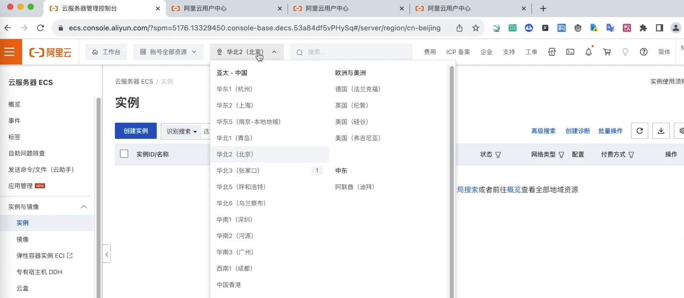

那创建完实例以后，
我们可以对它进行管理。
点击管理，
我们可以看到各种实例的相关信息，
比如说监控啊，
安全组啊，
云盘等等，
后面呢，
我们需要对它进行设置。

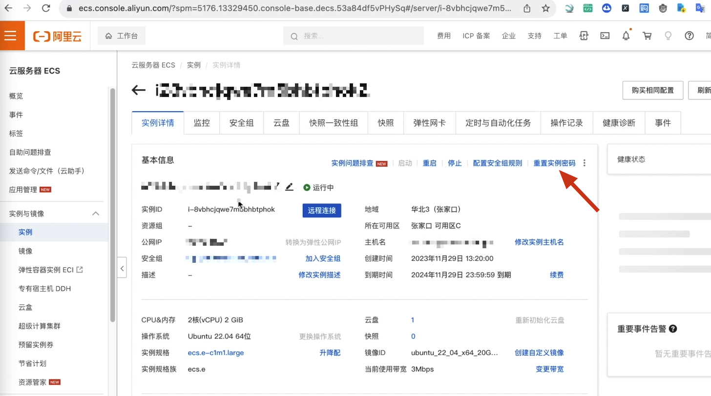

我们要访问这个服务器的时候，
可以这样首次登录，
点击这里重置密码。
我们填写用户名和密码
这里是root用户的用户名和密码，
输入新密码和确认密码。
点击保存密码，
然后它会发送一个短信。
我们接收一下验证码。

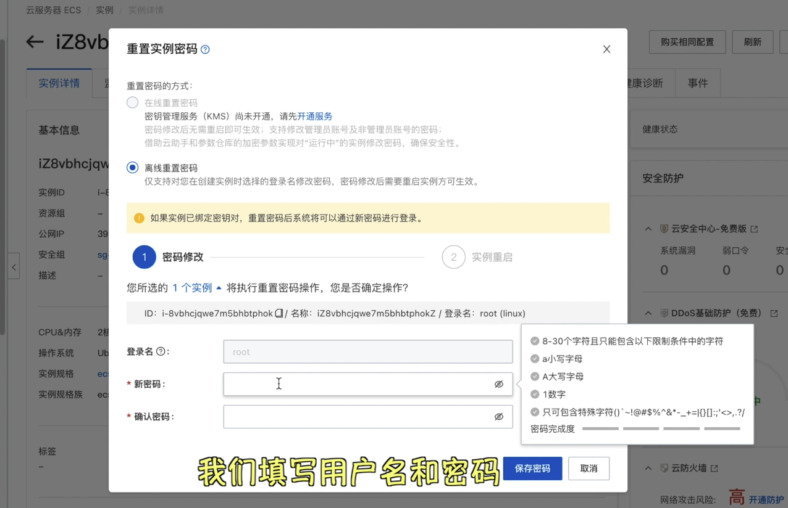

现在密码已经生效，
我们可以立即重置。
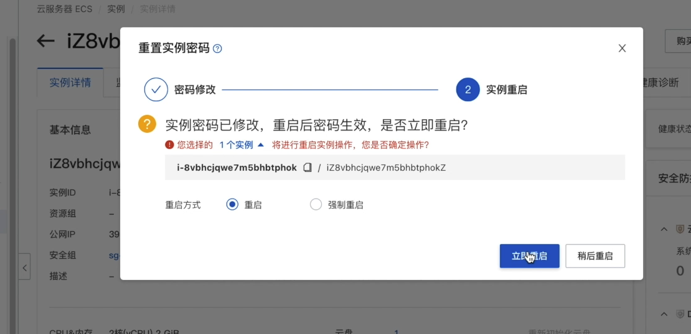

重置成功以后，
我们再来远程连接。

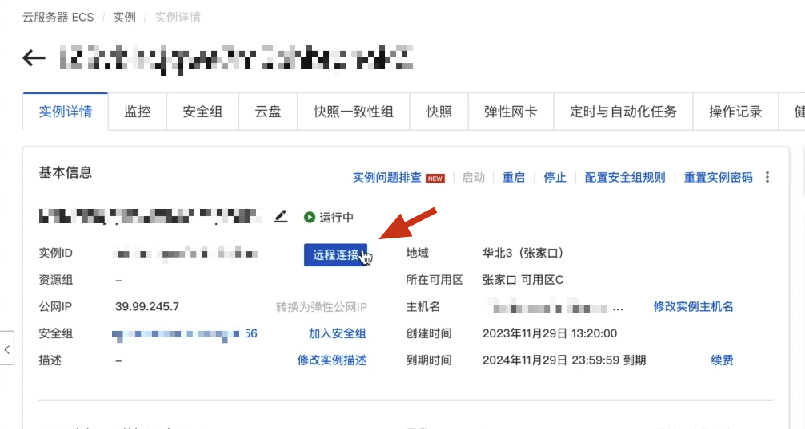

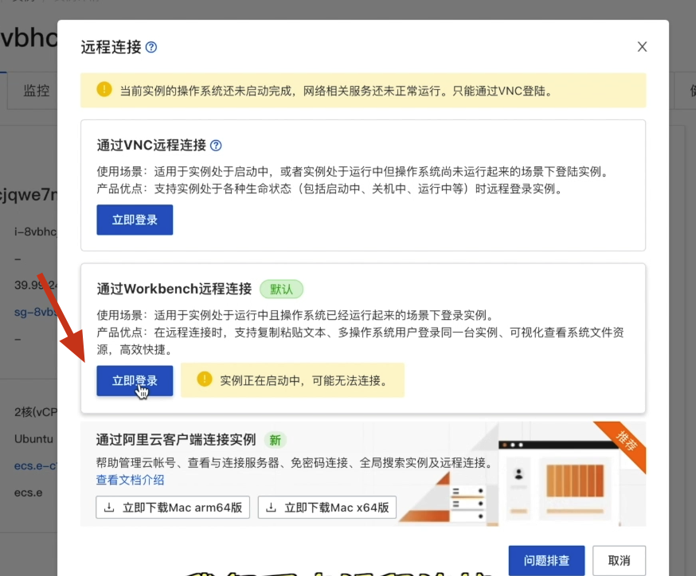

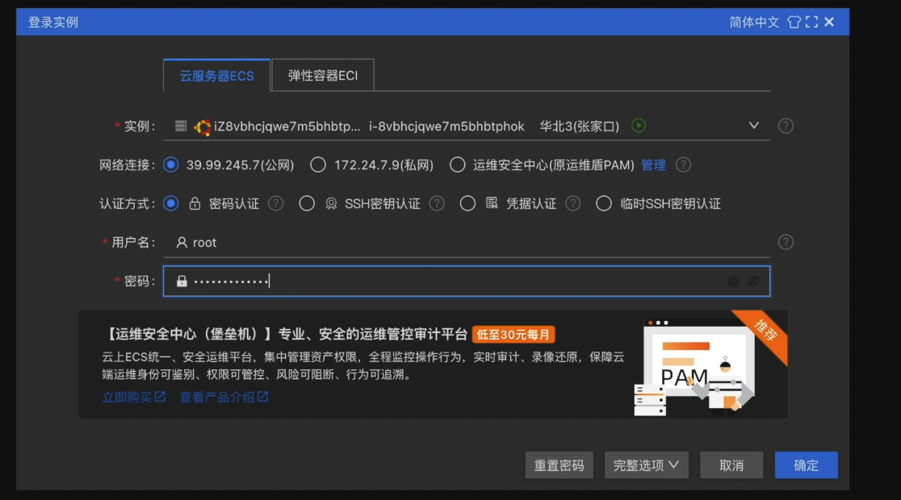

这样的话,我们就进入到了这个Ubuntu系统。
我们就可以在这里使用各种Linux命令了。

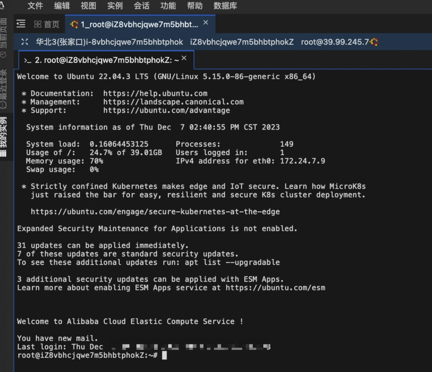

