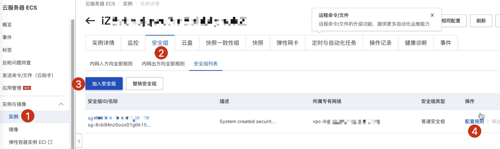

# [项目部署]:安装和配置宝塔面板

现在我们已经拥有了一台服务器,
但是这台服务器的操作系统是Ubuntu,
也就是Linux系统,
而大多数小伙伴经常使用的是Windows或者是Mac,
对于Linux系统,我们操作的时候通常会使用命令行的方式,
而大多数小伙伴又非常的不熟悉,
没有关系,本节课我们向大家推荐一个高效的服务器运维面板。
也就是说我们可以通过界面的方式来操作Linux，
这个运维服务器面板就叫做宝塔。

好,我们看一下如何使用它。

<!-- trancate -->
## 下载并安装宝塔

首先我们访问它的官方网址，
然后点击这里的立即免费安装。

找到这里的Ubuntu。

OK,我们直接复制这行命令,
然后粘贴到终端，
点击回车,开始执行。
这个安装的过程比较长,小伙伴需要耐心等待。

好,安装成功以后,这里有个面板提示信息。

我们复制一下这个URL，
前面是一个IP地址,后面是冒号，
冒号后面跟着的就是端口号16194，
那平时我们在访问一个网站的时候，
后面没有写这个端口号，
因为它默认的是80。
而我们这里是16194，
接下来我们需要开启这个16194这个端口。

回到我们的阿里云服务器,
找到我们的实例，
然后点击这里的安全组。
在安全组这里我们点击配置规则。

在这里我们点击手动添加,
在这个端口这里我们写上16194。
这里写上0.0.0.0，
然后这个描述你可以写宝塔，
点击保存。

复制一下网址,粘贴到浏览器，运行如下:

为什么是这种情况呢?
是因为我们的http还没有开启,
所以我们可以直接点击"高级",
然后点击"继续前往”,
这里就出现了宝塔的登录页面。

我们在这里输入宝塔的用户名和密码，
这个用户名和密码，
就是我们刚才在终端看到的用户名和密码。

## 配置宝塔信息

OK,登录完成以后，
这里推荐安装一个PHP的开发环境，
我们不需要把它勾选掉。
这时就进入到宝塔的控制面板首页。

那接下来我们点击面板设置。
修改一下这里的“安全入口”。

接下来我们来修改这个面板的用户名,
点击设置,
写一个新的用户名,
下次我们就用这个用户名来访问面板。

## 忘记密码怎么办
那如果小伙伴担心时间长了，
我的密码忘记了怎么办?
或者端口号我改完以后忘记怎么办?
或者说端口的路径改完以后忘记怎么办?
没关系,
我们可以通过阿里云的这个终端,
在这里呢,
我们输入命令,
bt也就是宝塔的缩写,
这里会弹出一个面板的命令行。

比如说我们这里重启面板,
停止面板,
启动面板等等。

那假如说我们要看一下这个面板信息。
那这时候我们可以输入一个14。
这里显示的就是面板的网址。
我是通过它进行访问。
然后用户名是他。
密码是隐藏的。

此外,我们还可以看到各种内容。
比如说强制修改MySQL密码，
或者是显示面板错误信息等等。

就通过对应的端口号就可以查看了，
比如说我们这里要修改面板密码，
我们可以输入"bt 5"
这个时候就在执行输入面板新密码。

如果我们在使用过程中遇到什么问题,也可以查看
[宝塔使用手册](https://www.kancloud.cn/chudong/bt2017/424204)。

