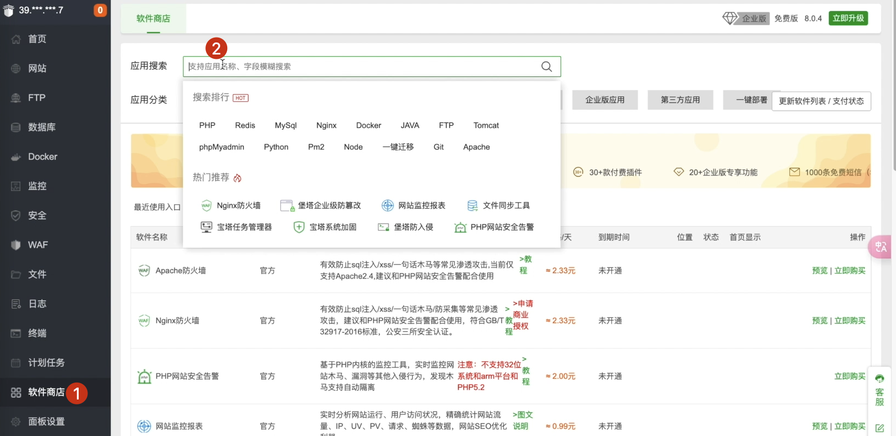
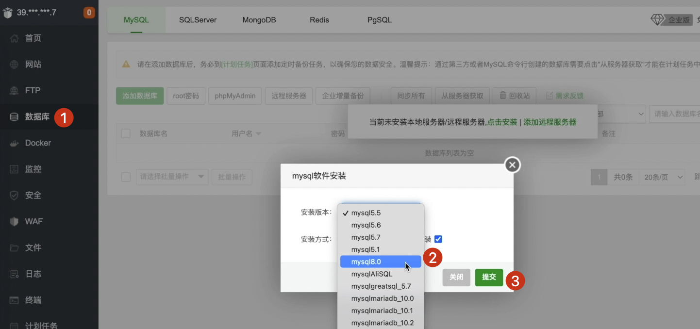
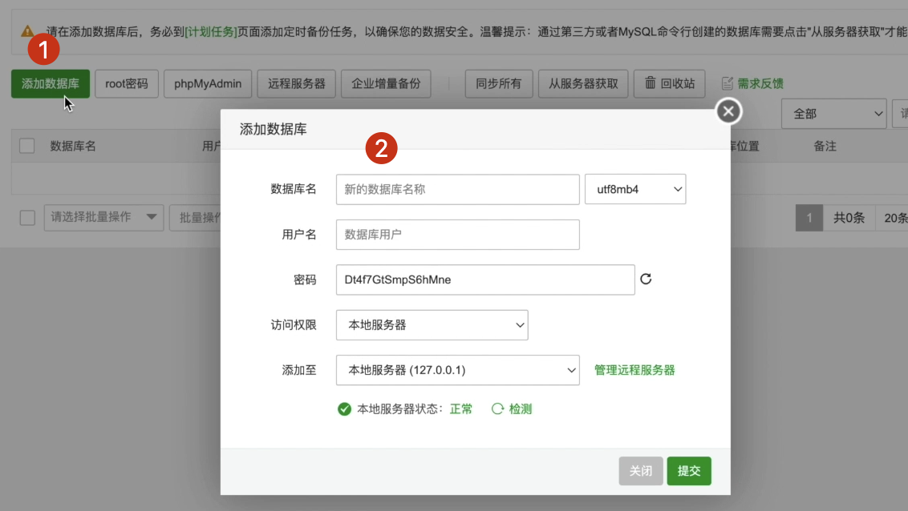
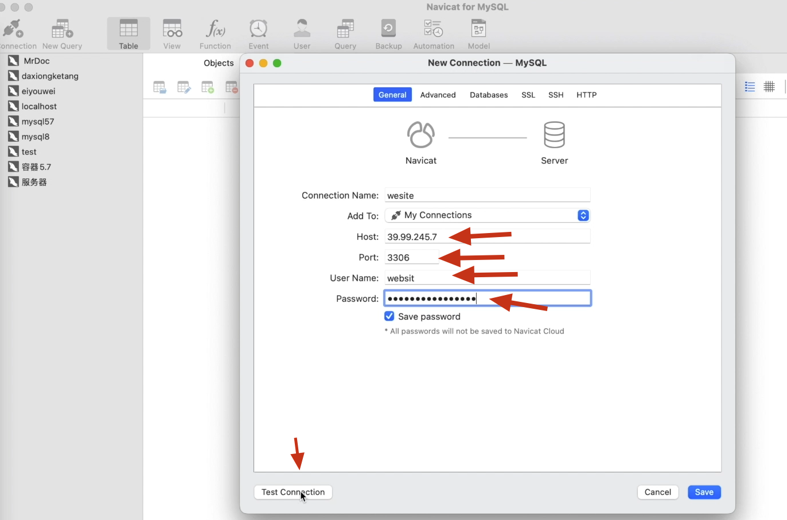
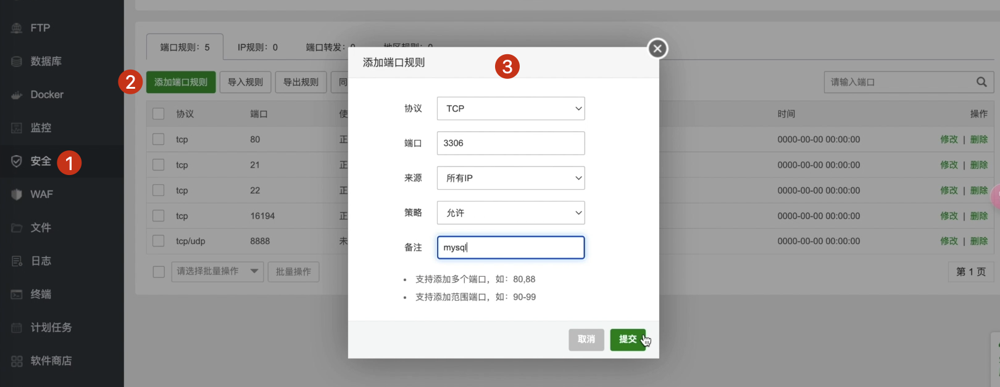
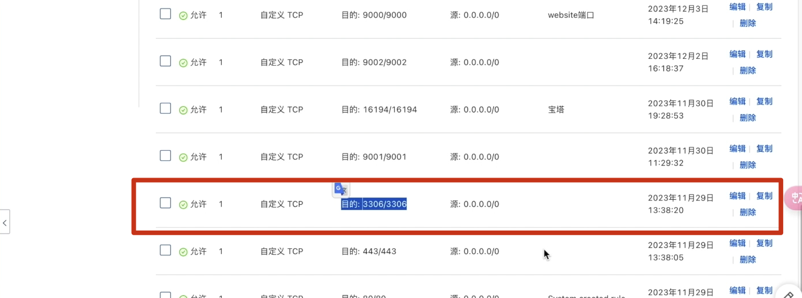

# [项目部署]:安装并配置MySQL

<!-- trancate -->
我们已经配置好了宝塔的面板,
那接下来我们就可以使用它来安装软件了。
这样的话就可以帮助很多不懂Linux命令的小伙伴来进行安装。

比如说我们要安装什么软件，
我们直接可以点击软件商店，
然后在这里搜索对应的软件名字，
在右侧就可以点击安装了。

那此外呢,当我们使用这些服务的时候,
比如说当我点击数据库的时候,
它也会提示点击安装,
然后呢我们可以点击安装,
这个时候它也会提示我们安装对应的MySQL版本,
我们选择MySQL 8,
OK,它也开始安装了。

安装完MySQL以后,
接下来我们就可以在这里进行配置了。
我们可以添加数据库，
填写一个数据库名称叫做website，
这里会生成一个默认的用户名和密码。

这里的访问权限默认的是本地服务器,
那么我们想让所有人访问,
所以这里我们选择所有人。
点击提交。
那这个MySQL服务就创建成功了。

接下来我们来试一下能否连接上这个数据库，
我们可以使用本地的MySQL可视化软件，
然后进行连接，
打开以后我们点击，
然后找到MySQL，
给它起个名字就叫做website，
这里注意主机名就是我们这里的IP，
端口号3366,这是MySQL默认的，
然后用户名我们是website，
这里有个密码，
我们可以复制一下，
密码是它默认的，
然后可以连接测试，
点击Test Connection，
看一下能否连接成功。

这里可能会提示连接超时，
这是因为我们没有开放这个3306的端口。
所以接下来我们要把这个端口开放，
回到我们的宝塔，
找到安全，
这里有个添加端口，
这些端口是已经默认的，
然后我们点击添加端口，
写上MySQL数据库的3306，
允许所有人，
然后备注咱们可以写下MySQL，
点击提交，
添加成功。

此外，我们还需要在阿里云服务器上添加3306端口，具体操作，请参见[安装和配置宝塔面板]小节中设置16194端口方式。

那本节课我们就介绍完了,如何在宝塔上安装软件,以及如何配置MySQL。
