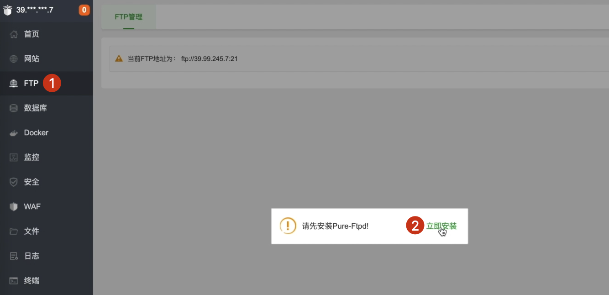
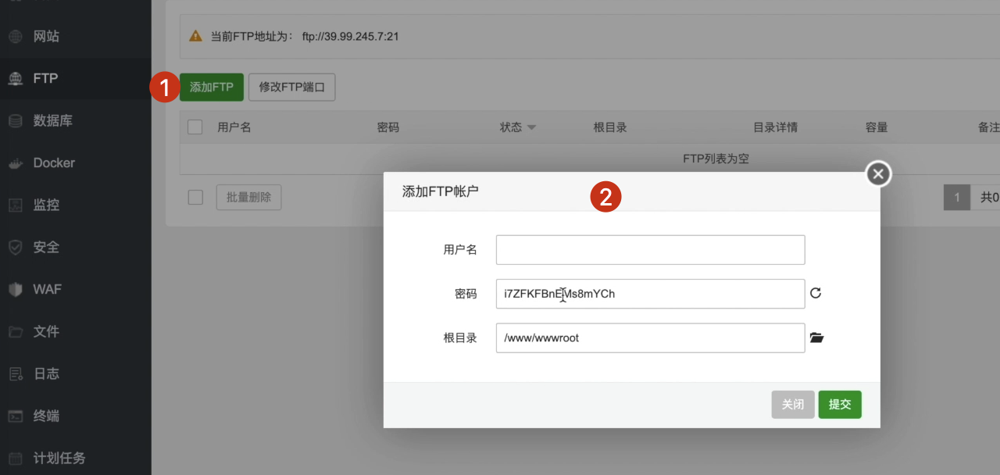
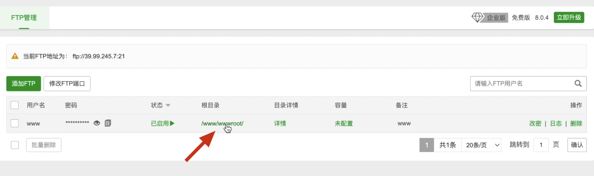
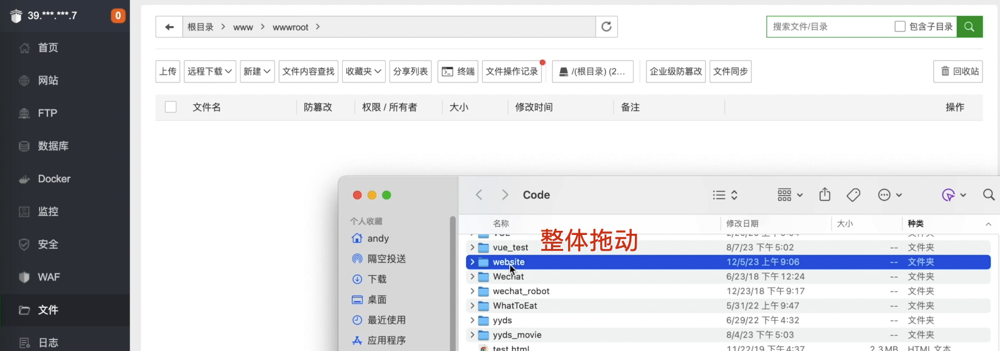
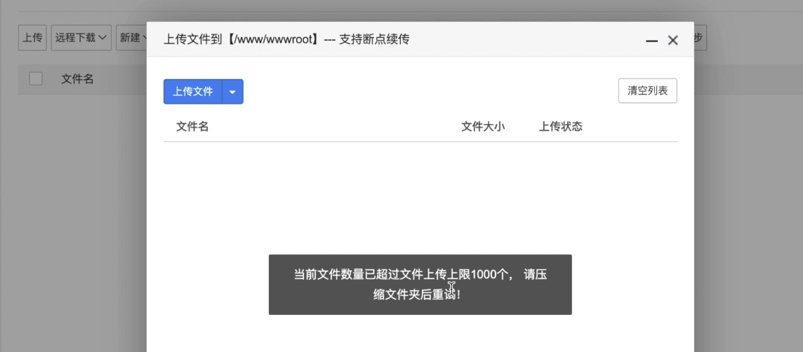
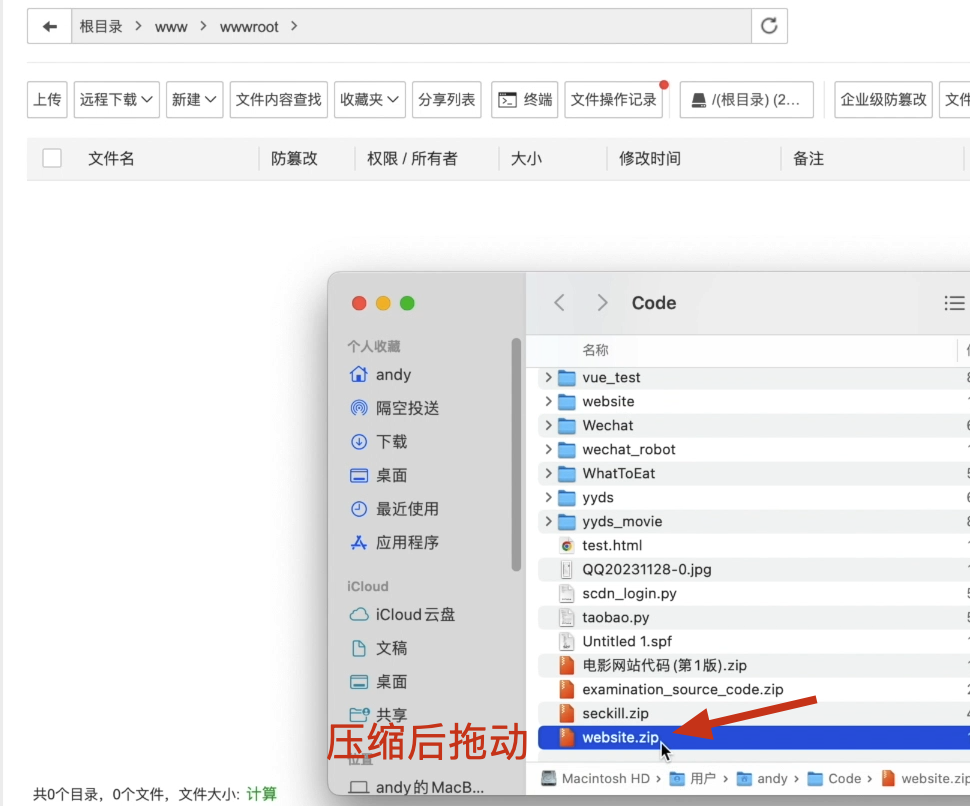
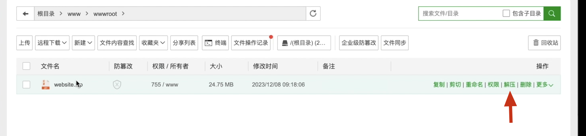
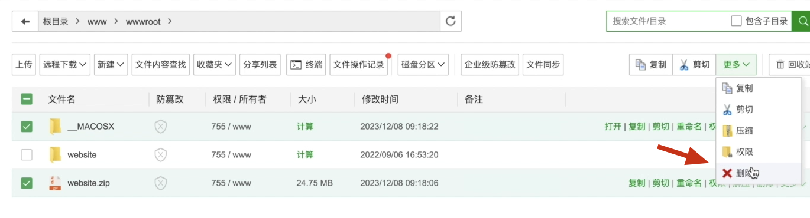

# [项目部署]:上传代码到服务器方式1-FTP上传

我们已经在服务器上安装好了我们所需要的各种软件，
那接下来我们就开始把我们的代码上传到服务器，
然后运行我们的程序了。
我们先来部署第一个纯django的企业官网项目，
要将我们的代码上传到服务器,通常我们有两种方式。

第一种是使用FTP的方式，
这种方式比较简单,小白都可以上手。
第二种就是使用git的方式，
git的方式需要我们掌握一些git命令，
它的好处就是可以对版本进行控制，
本节课我们教大家先使用FTP方式进行上传，
下一节课我们再教大家使用git的方式进行上传，
小伙伴可以任选其一。
<!-- trancate -->

## 宝塔安装Pure-Ftpd

可以在软件中下载一个叫做PureFTP,
也可以侧边栏的”FTP“菜单，
首次的话它会提示请安装。
然后我们点击立即安装，
点击确定。
现在就已经开始安装了。

好,现在已经安装成功,
然后我们刷新一下,
这里会有一个添加FTP的按钮。
我们点击,然后让我们写一个用户名。
这个用户名我们就写”www“

OK,那此时它有个密码,我们可以直接修改。
还有一个根目录,
这个根目录我们看一下,
宝塔中的根目录是在www/www/root下面，
也就是说我们会将所有项目全都放到这里。

点击提交
OK,这里的根目录就变成了wwwroot。
接下来呢
我们可以点击这里的根目录
进来以后
我们就进入到了www/root这个目录下面
那通常情况下
我们宝塔中的项目全部放到www/www/root这个目录下。

点击目录进入， 将我们的项目文件加整体拖入。

这里提示提示上传超过1000个。

那么我们需要压缩一下，再提交压缩包文件。

点击”开始上传“，上传成功后，它是一个ZIP文件，
我们需要把它解压。
宝塔提供了一个解压的按钮，
直接点击解压按钮，
然后解压密码是空，
我们直接点击解压。

现在就把我们的web项目上传到这里了。

这是Mac系统自带的一个文件，这是刚才上传的压缩包，选中，点击”删除“按钮，都把它们删掉。

此外，这个web项目中也有很多是不需要的，
比如说这里的这个Mac系统的文件，
可以把它删掉，
这个venv我们可以删掉，
因为它是我们本地的，
而在服务器中我们需要生成对应的python包，
这个可以删除掉。
我们就使用ftp将我们的本地代码上传到了服务器。
