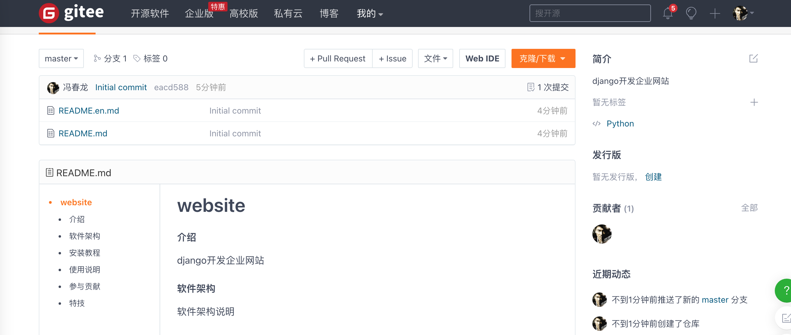
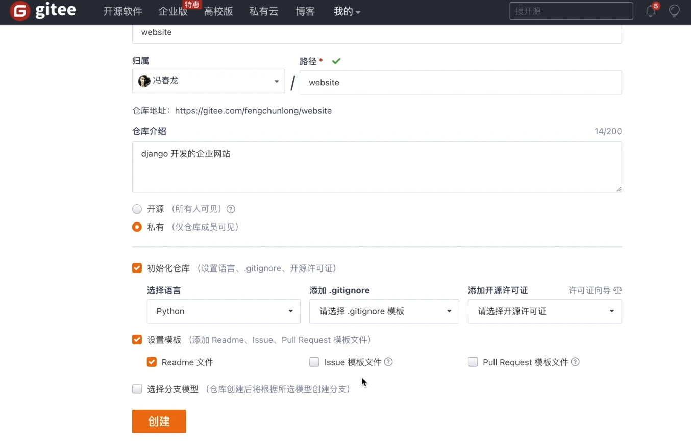
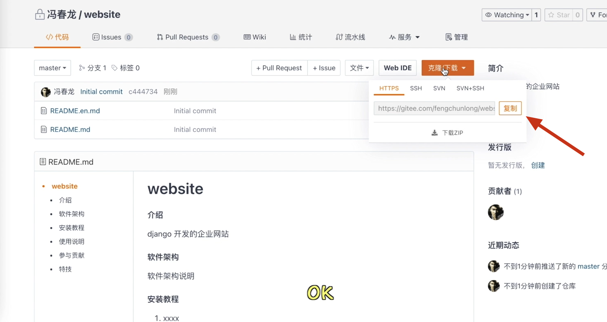
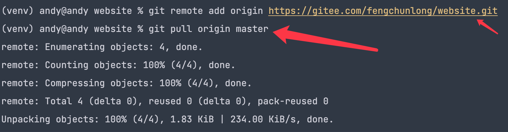
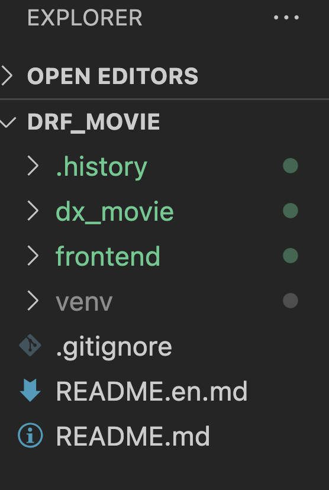
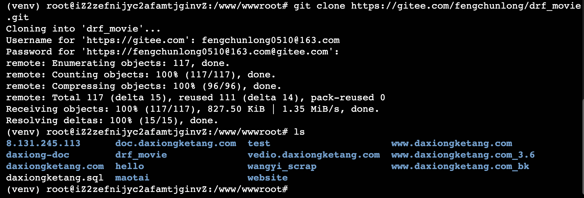

# [项目部署]:上传代码到服务器方式2-git上传代码到服务器

在真正的公司开发过程中,通常我们使用Git，
因为它更适合版本的管理和协作开发，
我们通常会将我们本地代码上传到GitHub，
或者是上传到Gitee，
然后再从这个上面克隆到我们的服务器上。

本节课我们针对的是有Git命令基础的小伙伴，
如果你学过Git相关的命令的话，
可以跟着我一起来进行Git的操作，
如果你还是一个纯小白的话，
就用我们上一节课教大家的FTP的方式上传代码，
也是一样的。

OK,我们看一下如何使用这种Git的方式，
这里我们会将代码上传到Gitee或者是GitHub，
由于GitHub这个网站我们在访问的时候，
很多小伙伴访问这个网站的时候比较慢，
所以我们直接上传到Gitee，
OK,我们看一下如何使用它。

<!-- trancate -->


## 创建仓库

首先我们需要先注册和登录，
登录成功以后我们找到仓库。
然后我新建一个仓库，
仓库名字就叫做website。 





然后点击创建,创建成功


查看项目地址。


## 本地代码上传到gitee

1.找到本地项目目录，执行初始化命令

```shell
git init
```

2.添加远程仓库

```shell
git remote add origin 远程仓库地址
```


3.拉取远程代码

```
git pull origin master
```



拉去完成后，目录中新增如下文件。



4.设置.gitignore

删除.gitignore文件中的dist/ 。

如果有.history, 添加上，这个是vscode工具中的。 

```
.history/
.DS_Store
```


5.添加要上传的文件到缓冲区

上传所有文件：  

```
git add .
```

上传单一文件：

```
git add + 文件名
```


6.上传代码到本地仓库

```
git commit -m "上传项目代码"
```


7.将本地仓库推送到远程仓库

```
git push origin master
```

tips: 

删除远程文件，保留本地文件

当您想要保留本地文件但删除Git远程仓库中的文件时，您可以按照以下步骤进行操作：

1. 首先，使用`git rm --cached`命令删除远程仓库中的文件，但保留本地文件。例如，如果要删除名为`file.txt`的文件，可以运行以下命令：
   ```
   git rm --cached file.txt
   ```

2. 然后，提交您的更改到本地仓库：
   ```
   git commit -m "从远程仓库中删除文件file.txt"
   ```

3. 最后，将您的更改推送到远程仓库：
   ```
   git push origin <branch_name>
   ```
   其中，`<branch_name>`是要推送到的分支名称,这里是master。

通过这些步骤，您可以成功地从Git远程仓库中删除文件，同时保留本地文件。这样，您就可以确保本地文件不受影响，而只删除了远程仓库中的文件。


## 服务器clone 代码


1. 终端clone代码

进入服务器终端，找到项目路径，clone代码。
使用如下命令：

```
git clone 远程仓库地址
```





如果拉取新代码

```
git pull 远程仓库地址
```

会提示输入gitee的用户名和密码，填写完成后，开始下载。
