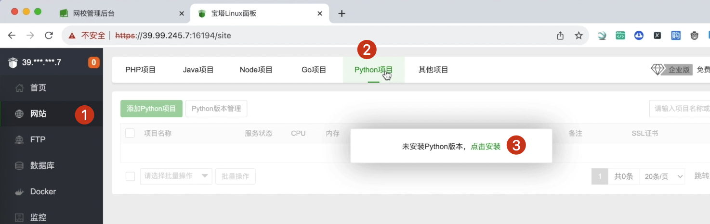
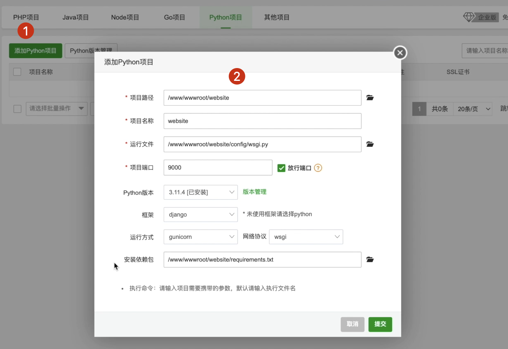

# [项目部署]:创建python项目添加包依赖


现在我们已经将我们的本地程序代码上传到了服务器，
那接下来我们就需要运行它。
运行它我们需要有python版本，并安装项目中使用到所有的包。

## python包生成一个文件

这个项目用到了非常多的包，如果一个一个安装，
这种方式显然比较慢。
那么我们可以将整个项目中用到的所有包放到一个文件夹中，
然后使用一行命令进行统一安装。

下面我们就来实现这个功能。

<!-- trancate -->
我们本地的包都是安装到虚拟环境中的，那么可以使用下面的命令来查看。
```
pip list
```
显示的就是我们这个项目中用到的所有的包，这也是使用虚拟环境的一个好处，这个项目的包不与其他项目混在一起。

接下来，我们使用命令,把它们统一的放到一个文件中:
```
pip freeze > requirements.txt
```
使用一个箭头输出到一个叫做requirements.txt文件中,
这个名字你可以随便起,
根据惯例呢通常我们叫做requirements.txt。

生成完成以后，我们看一下这里就添加了一个requirements.txt文件
它的内容就是刚才咱们看到的各种包以及它对应的版本。我们要把requirements.txt上传到服务器，使用ftp或是使用git方式都可以，上传的位置和本地一样。


## 安装python 

接下来我们就来部署这个python的环境。
点击我们的网站,
然后这里提示我们安装python,
选择一个python版本，点击安装。



这个安装时间有点长，大家需要等待一下。
安装完成以后，
我们可以看到这里可以添加python项目，
咱们点击添加python
然后我们选择项目根路径，
点击找到wwwroot下面有一个website，
勾选上，点击选择，
然后这里项目端口，默认的端口是80，
这里我们因为有好几个网站，
所以咱们给它设置一个端口，
叫做9000。
然后这里勾选上放行端口，
如果你这里不配置的话，
你需要在安全这里进行配置，
把这个9000端口给它打开。

python版本就选安装的版本，
框架是django，
运行方式这里通常我们选择这个gunicorn，
然后网络协议wsgi,
安装依赖它自动填充了,
就是我们刚才上传的requirements.txt。
接下来咱们点击提交，此时我们的项目就已经添加成功了。



