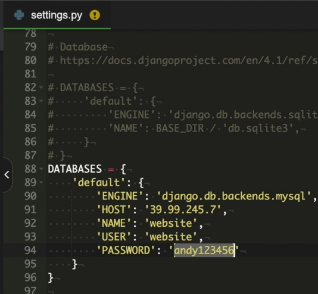

# [项目部署]:创建虚拟环境并启动服务

<!-- trancate -->

## 创建虚拟环境

服务器上的操作和我们在本地操作一样。
先使用pip 安装virtualenv， 命令如下：
```
pip install virtualenv
```

创建一个名为`venv`的虚拟环境，输入命令:

```
virtualenv venv
```

`ls`命令看下目录,现在就新增了一个venv虚拟环境。
然后我们在这里启动它，命令如下：
```
source venv bin activate
```

接下来，安装上面创建的依赖包。使用如下命令:
```
pip install -r requirements.txt
```
它会自动的将所有的文件夹中的包一个一个进行安装,

如果某一个包报错了，我们可以在requirements.txt文件中，
把它里面有一个包删掉，后面再手动单独安装它。

## 配置静态资源


```python title='config/settings.py'

STATIC_URL = 'static/'

STATICFILES_DIRS = [
    os.path.join(BASE_DIR, 'static')
]

# 静态文件收集目录
STATIC_ROOT = Path(BASE_DIR).joinpath('collected_static')
```

:::info[代码解析]

- STATICFILES_DIRS 告诉Django额外的静态文件路径
- STATIC_ROOT 是collectstatic命令收集静态文件的输出目录

两者在静态文件收集的时候互相协作,Django会搜索STATICFILES_DIRS指定的目录,并将文件复制到STATIC_ROOT输出目录中。
:::


## 启动服务

接下来我们来启动服务，运行命令:
```
python manage.py runserver
```
启动这个服务，看一下有什么错误。
然后我们依次来解决这些问题。

首先第一个是这里的localhost数据库的连接问题。
在服务器上，不再使用本地的书库里，所以需要修改一下配置文件，
找到config这里settings.py，修改数据库信息。



接下来我们再启动服务：
```
python manage.py runserver
```
这里提示端口已经被占用,
它默认的是8000端口,
而我们在配置的时候,
咱们设置的是9000端口。
所以我们可以使用这个命令:
```
python manage.py runserver 127.0.0.1:9000
```
此时这个服务就已经启动了,
至少这已经证明,
我们现在程序可以正常运行了。

那么能不能直接访问它呢，
显然是不行的，
这是服务器的内网IP，
相当于你访问的是你本地。
如果换成这个公网IP，它也是无法访问的。

那么如何解决这个问题呢？下节课我们将介绍使用nginx反向代理来实现。
