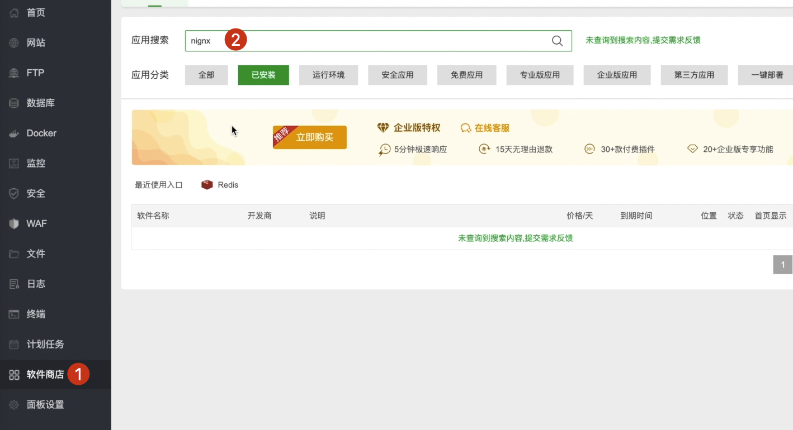
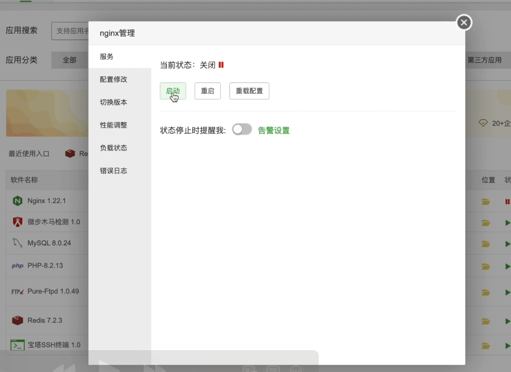
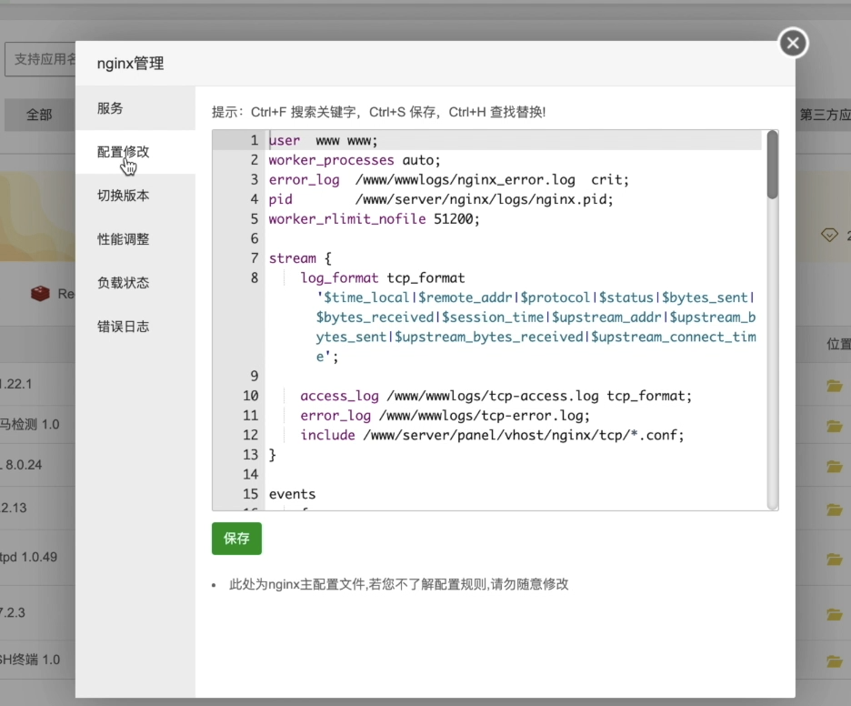
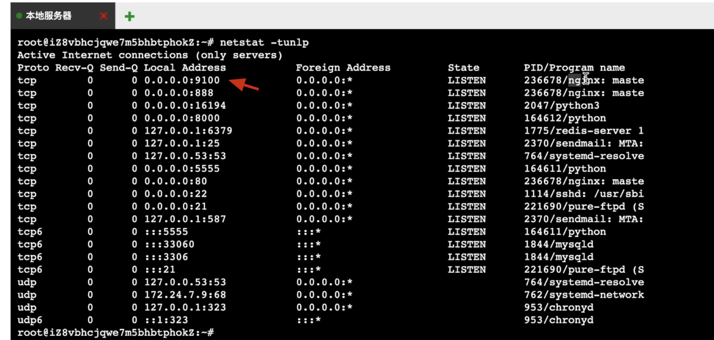

# [项目部署]:nginx基本使用

<!-- trancate -->

为了能够将我们的网站暴露给互联网上的其他的小伙伴访问，
通常我们会使用nginx这个高性能的web服务器，
它主要有两个用途。
第1个是作为http服务器。
比如说我们很多的静态页面，
包括html,css,js这些静态资源文件，
我们都可以使用nginx作为http的web服务器，
用来服务静态或动态的web页面资源给用户，
它的高并发和高可用性是非常适合的。


第2个，我们将其作为反向代理服务器，
使用它可以实现负载均衡,缓存等等，
并且可以将请求转发到我们的后端服务器应用。


好,那接下来我们看一下如何使用它。


首先我们需要确保一下我们的宝塔是否已经安装了nginx。
我们可以在软件这里找到nginx，或者点击这里的已安装，可以看到所有安装的软件。
这里我们安装的nginx是1.21这个版本。



当前它的状态我们没有启动,点击设置,点击启动
。


我们看一下这里有很多的配置信息。


其中，在server这里面引入了这个include，内容如下:
```
include /www/server/panel/vhost/nginx/*.conf;
```
这个include什么意思呢?如果我们的服务比较多,
都放到一个配置文件里会比较繁琐，
所以我们可以把它使用include的方式进行引入，引入多个文件。

路径中的*号就和我们的正则表达式一样，
它可以匹配多个，只要是后缀是.conf的文件,
它都会引入进来。

那么我们就创建一个这样的文件，
让它自动引入。
我们先来实现一个简单的例子。

在'/www/server/panel/vhost/nginx/'路径下，创建一个叫做test.conf的文件，
仿照前面seerver这种形式写,内容如下:
```bash titlie='/www/server/panel/vhost/nginx/test.conf'
server {
    listen 9100; # 端口号
    server_name 39.**.7; # ip地址

    location / {
        root /www/wwwroot/test; # 路径
        index index.html; 
    }
}

```

我们就这么简单的配置一下,
接下来我们去看一下,
这个端口是否被监听了。

我们可以使用命令
```
netstate -tunlp
```  
输出结果如下图:


我们设置的是9100,它被nginx监听了。

:::warning
确保9100端口在宝塔和阿里云服务器都已开启。
:::

接下来，在/www/wwwroot/下创建test文件夹，
然后新建一个index.html文件，随便写一些html代码。
```html titlie='/www/wwwroot/test/index.html'
<h1>这是index首页 <h1>
```

那接下来,
我们就在浏览器中输入网址:  IP:9100。
就会显示出页面内容了。

我们只有一个index.html
那接下来我们上传点其他类型的文件，比如说图片，
在/www/wwwroot/test/目录下新增一张图片：andy.png
那么接下来我们怎么访问它呢？
```
IP:9100/andy.png
```
这样及可以访问图片了。
换一个其他的资源，比如说视频也是一样的原理。

所以说我们现在使用nginx就搭建了一个HTTP服务，
那所有的静态资源，都可以通过后缀名进行访问，
这就是nginx配置的最基础的使用。
