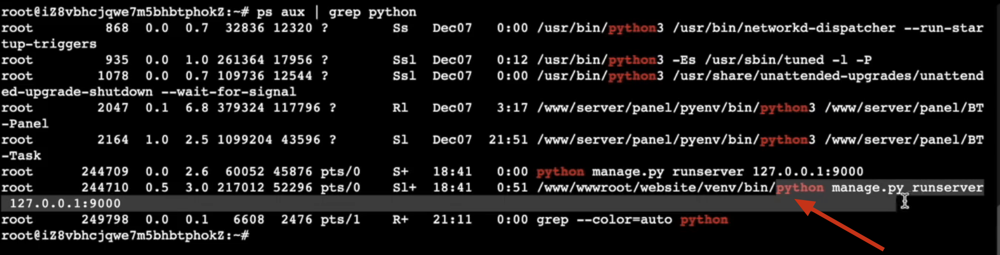

# [项目部署]:配置gunicorn多进程提升性能


虽然现在我们的网站可以访问了,
但是还有个问题。
就是我们启动这个服务的时候，
我们使用Django自带的runserver。
而这个runserver它是一个单进程的，
也就是说同一时间它只能处理一个请求，
那如果有多个请求的时候它就需要排队。


我们也可以使用命令行的方式来验证一下它是不是单进程，
我们输入命令 
```
ps aus | grep python
```
运行结果如下:


小伙伴会发现上图中有很多‘Python’
其中就有这个Panel,也就是面板，
这个面板它也是用Python开发的。
而website bin这个Python下面执行的只有一个，
这里可以看到它是单进程的。

那现在我们的服务器基本上都是多核的，
包括现在我们在阿里云上购买的这个服务器它也是双核的。
为了使用多核来提升这个性能，
所以这里我们不再使用runserver这个服务器，
而是使用gunicorn。

本节课我们就来介绍一下如何使用gunicorn。
<!-- trancate -->

## gunicorn是什么

 gunicorn是一个Python WSGI HTTP服务器,主要用于在生产环境中运行Python web应用程序。

Some key features of gunicorn:

- 高性能 - gunicorn使用了异步模型,可以处理大量并发连接。它的性能可与其他语言的应用服务器相媲美。

- 轻量级 - gunicorn非常容易安装和配置,核心代码库也比较精简。这使得它很适合部署于类似Heroku这样的平台。

- WSGI兼容 - gunicorn完全兼容PEP-3333所定义的WSGI接口,所以可以运行绝大部分Python web应用。

- 可插拔 - gunicorn拥有模块化的设计,核心功能集中在一个紧凑的代码库中,其他功能如访问日志、错误信息以及进程管理都通过插件实现。

- 可靠 - gunicorn经过长时间生产环境考验,可以稳定运行主流Python web框架,如Django、Flask等。

总的来说,gunicorn是一个成熟、高效、易用的Python WSGI服务器,是Python web开发者的首选之一。它的出现大大简化了Python应用在生产环节的部署和运维。

## 安装配置gunicorn

gunicorn是一个python 第三方包，我们可以直接用pip命令来安装:
```bash
pip install gunicorn
```

gunicorn可以设置很多配置信息，通常我们将配置信息写入一个文件中。在website/目录下创建一个gunicorn_conf.py的文件，设置如下gunicorn的配置信息:

```bash title='website/gunicorn_conf.py'
# 项目目录
chdir = '/www/wwwroot/website'

# 指定进程数
workers = 4

# 指定每个进程开启的线程数
threads = 2

#启动用户
user = 'www'

# 启动模式
worker_class = 'sync'

# 绑定的ip与端口
bind = '0.0.0.0:9000'

# 设置进程文件目录（用于停止服务和重启服务，请勿删除）
pidfile = '/www/wwwroot/website/gunicorn.pid'

# 设置访问日志和错误信息日志路径
accesslog = '/www/wwwlogs/python/website/gunicorn_acess.log'
errorlog = '/www/wwwlogs/python/website/gunicorn_error.log'

# 日志级别，这个日志级别指的是错误日志的级别，而访问日志的级别无法设置
# debug:调试级别，记录的信息最多；
# info:普通级别；
# warning:警告消息；
# error:错误消息；
# critical:严重错误消息；
loglevel = 'info' 

# 自定义设置项请写到该处
# 最好以上面相同的格式 <注释 + 换行 + key = value> 进行书写， 
# PS: gunicorn 的配置文件是python扩展形式，即".py"文件，需要注意遵从python语法，
# 如：loglevel的等级是字符串作为配置的，需要用引号包裹起来
```

接下来，我们启动gunicorn, 通过-c参数，加载上面的配置文件，命令如下:
```
gunicorn config.wsgi:application -c gunicorn_conf.py
```   
上面命令中config是website项目的全局配置文件，wsgi是文件名，application是wsgi调用函数获取的应用名称。application是默认的，所以也可以不写,例如:
```
gunicorn config.wsgi -c gunicorn_conf.py
```
执行完毕后，我们验证一下，现在是否启动了多进程。
执行如下命令：
```
ps aus | grep python
```

输出结果如下图所示。


上图显示的是一个主进程，下面有4个work进程，因为我们在配置，设置了4个worker进程。
```bash
# 指定进程数
workers = 4
```
这样我们就是用gunicorn启动了多个worker进程来监听用户请求，提高了我们服务器运行效率。


