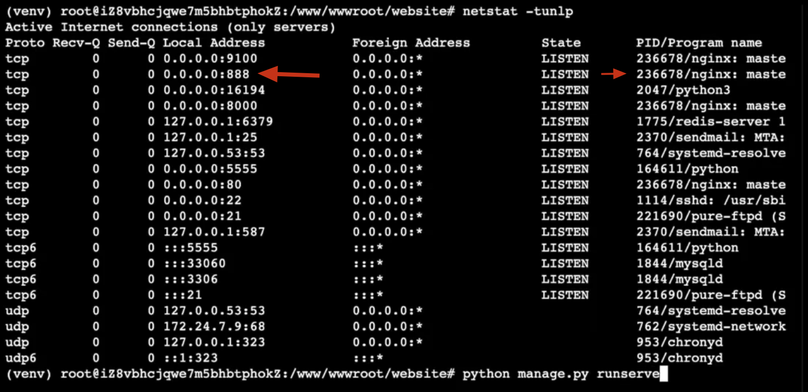
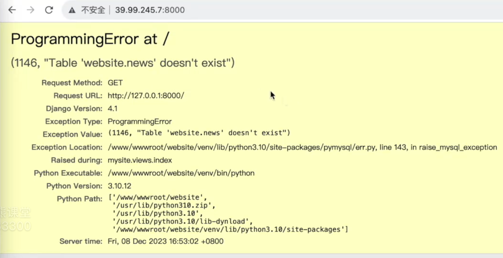
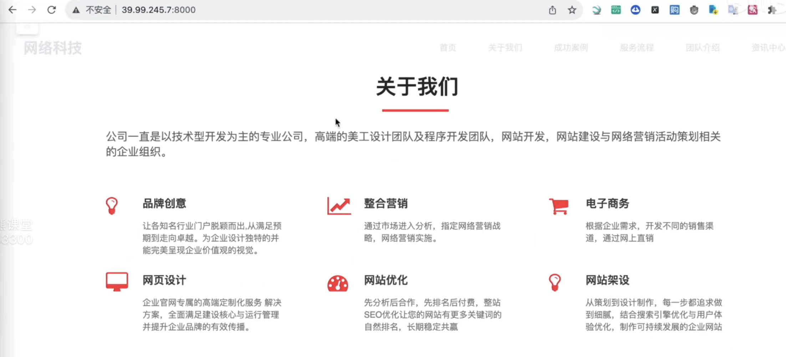
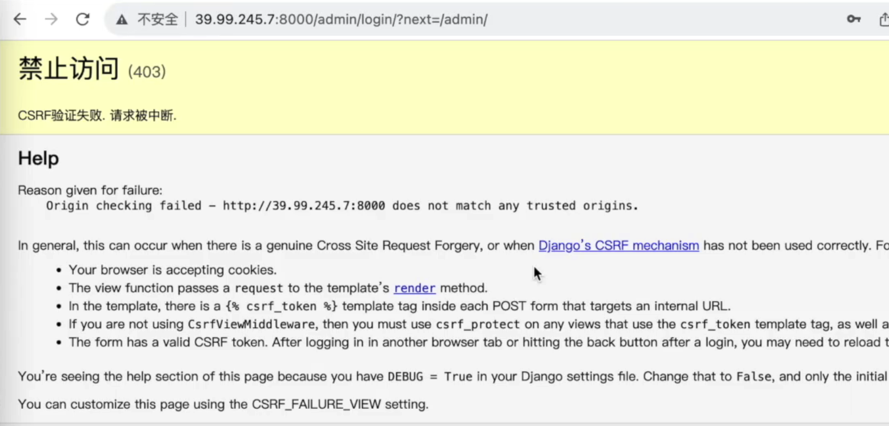
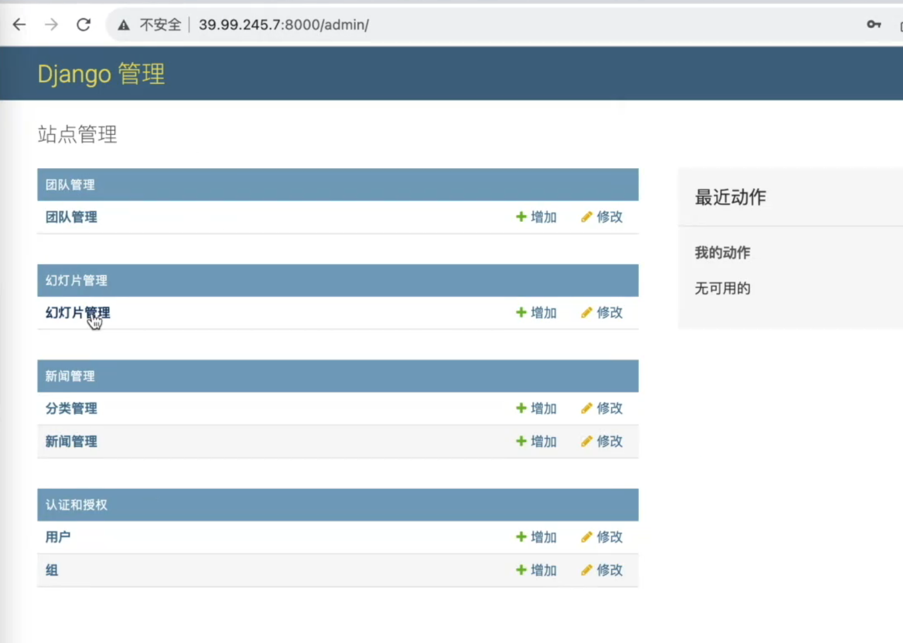

# [项目部署]:企业网站配置nginx

<!-- trancate -->

在www/server/pannel/vhost/nginx新建一个文件，命名website.conf，
配置如下：
```bash
server
{
    listen 8000;
    server_name 39.**.113; # 改成真实的IP地址
    index index.html index.htm default.htm default.html;
    root /www/wwwroot/website;

    location /static {
        alias /www/wwwroot/website/collected_static;
    }
    
    location / {
        # 将请求代理传递给后端服务
        proxy_pass http://127.0.0.1:9000;
        # 设置代理请求的Host头
        proxy_set_header Host 127.0.0.1:$server_port;
        # 设置代理请求的X-Real-IP头为客户端IP
        proxy_set_header X-Real-IP $remote_addr;
        # 设置代理请求的X-Forwarded-For头为客户端IP
        proxy_set_header X-Forwarded-For $proxy_add_x_forwarded_for;
        # 设置代理请求的REMOTE-HOST头为客户端IP
        proxy_set_header REMOTE-HOST $remote_addr;
        # 添加响应头显示缓存状态
        add_header X-Cache $upstream_cache_status;
        # 设置代理请求的X-Host头
        proxy_set_header X-Host $host:$server_port;
        # 设置代理请求的X-Scheme头
        proxy_set_header X-Scheme $scheme;
        # 配置代理连接超时时间
        proxy_connect_timeout 30s;
        # 配置代理远程读取超时时间 
        proxy_read_timeout 86400s;
        # 配置代理向远程发送数据超时时间
        proxy_send_timeout 30s;
        # 使用HTTP/1.1协议向后端服务器发送请求
        proxy_http_version 1.1;
        # 支持websocket
        proxy_set_header Upgrade $http_upgrade;  
        proxy_set_header Connection "upgrade";
    }
    
    # HTTP反向代理相关配置结束 <<<

    # 配置访问日志
    # 将所有客户端访问请求日志写入指定文件
    access_log /www/wwwlogs/website.log;
    
    # 配置错误日志  
    # 将所有错误信息写入指定文件
    error_log /www/wwwlogs/website.error.log;
}

```

配置完成后重新加载nginx, 使用如下命令:
```
nginx -s reload
```
检查8000端口是否被nginx监听，使用如下命令：
```
netstat -tunlp
```
输入结果如下：


接下来启动Django服务，输入命令:
```
python manage.py runserver 127.0.0.1:9000
```
启动后，我们可以在浏览器中访问阿里云服务器提供的外网ip地址: 39.****.7:8000 .

:::tip
小伙伴可能会有这样的疑惑：为什么一会8000端口，一会9000端口。

我们在nginx中配置的是8000端口，也就是说服务器接收到一个请求，访问的是39.****.7:8000，nginx会做一个转发，URL中如果包含'/static'的会转发到一个路径，其余的转发给本地服务的127.0.0.1:9000， 也就是我们的Django服务。
:::

如果访问网址，会提示下面的错误。


这是因为我们的阿里云服务上的MySQL还没有任何数据，所以我们先来执行迁移操作。
先关闭服务，执行下面的命令。
```
python manage.py migrate
```

然后创建超级管员用户,执行下面的命令:
```
python manage.py createsuperuser
```
接下里再次启动服务:
```
python manage.py runserver 127.0.0.1:9000
```
此时就可以正常访问了，如下图所示。


如果添加数据，可以在后台访问网址: 39.****.7:8000/admin。

填写正确的用户名和密码即可登录后台，如果提示下面错误，则需要去settings.py文件中进行配置。


```python title='website/config/settings.py'
DEBUG=False # 上线后，关闭调试功能

ALLOWED_HOSTS = ['*'] # 允许任何人访问

# 新增可以访问的信任源
CSRF_TRUSTED_ORIGINS = ['http://3....7:8000'] 
```

再次启动服务，就可以正常反问后台了，如下图所示。

