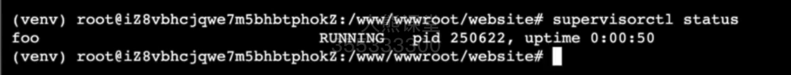
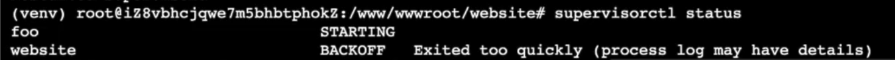
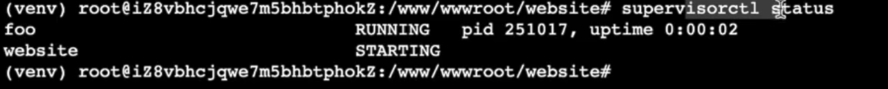

# [项目部署]:配置supervisor监控进程

我们已经使用了gunicorn来启动了服务，
但是当我们把这个面板关闭以后，
我们再来访问网络，
此时呢
这个服务已经关闭了，
所以就会提示一个Server Error 5000。
那这显然不符合我们的需求，
一旦我们把控制面板关闭，
这个程序就不再执行了，
我们的服务也就关闭了，
我们就无法再访问这个网站了。


虽然说使用gunicorn可以在后台设置守护进程，
但是一旦这个服务出现问题了，
比如说阿里云网站自身出现故障，
当它恢复以后，
我们的程序也无法再次恢复，
所以，
我们就需要选择一个更加好用的进程管理工具。
它可以监管进程，
同时可以方便的启动停止重新启动这样进程。
如果进程异常退出了，
那么还能够自动重启。
那最好还能够管理日志，
管理工作队列等等，
本节课我们就来介绍一个这样管理进程的工具，
叫做`Supervisor`。
<!-- trancate -->

## 什么是supervisor


## 安装并生成默认配置
Supervisor也是Python开发的，
所以使用之前我们需要先来下载它。
我们使用pip命令来安装:
```
pip install supervisor
```

安装成功以后,接下来我们看一下怎么使用它。

和gunicorn一样，
它也需要有一个配置文件。
它方便的一点在于，
它可以生成一个默认的配置文件。
我们使用这个命令:
```bash
echo_supervisor_conf > supervisord.conf
```
箭头执行输出位置，就是当前这个目录下，
名字叫做supervisord.conf。

打开supervisord.conf, 我们可以在这里生成的一个默认的是一个通用的配置。
比如说我们可以看到这里和程序相关的[Program],
后面是Program的名称,
可以设置命令,
可以设置进程,
可以设置这些数量等等。

## 配置supervisor
我们演示一个简单的程序。

在supervisord.conf配置文件的底部，添加如下配置:
```bash
[program:foo]
command='/bin/cat'
```
保存后，我们启动supervisor。命令如下:
```
supervisord -c supervisord.conf
```

启动完成后，我们可以同过名称查看启动状态。

```bash
supervisorctl status
```
运行结果如下:


接下里，我们来配置gunicorn。

同样的，在supervisord.conf配置文件底部，添加如下配置信息:
```bash
[program:website]
command=/www/wwwroot/website/venv/bin/gunicorn config.wsgi -c gunicorn_conf.py
directory=/www/wwwroot/website
startsecs=10
autorestart=true
stopasgroup=true
killasgroup=true
startrestries=3
exitcodes=0
stdout_logfile=/www/wwwroot/website/log/gunicorn.out.log
stderr_logfile=/www/wwwroot/website/log/gunicorn.err.log
```

:::info[参数说明]

- command: 要启动进程的命令。这里是启动gunicorn服务。

- directory: 进程的启动目录。

- startsecs: 进程启动后,等待多长时间后再次检查进程是否还在运行,默认是1秒。这里设置为10秒。

- autorestart: 是否在进程退出时自动重启,设置为true表示自动重启。

- stopasgroup/killasgroup: 是否以进程组的方式停止/杀死进程,设置为true表示作为组停止/杀死。

- startretries: 进程异常退出后,最多重启次数,默认是3次。

- exitcodes: 正常退出的代码,设置为0表示只有退出码是0时才算正常退出。

- stdout/stderr_logfile: 标准输出和错误输出重定向的日志文件。

所以这个配置主要实现了:

1. 使用supervisor守护gunicorn进程。

2. gunicorn进程异常退出时,自动重启,最多3次。

3. 捕获gunicorn的输出日志到指定文件。

4. 作为一个组管理gunicorn进程。

这样可以利用supervisor来保证gunicorn进程的持续可靠运行。
:::


保存后，需要重新加载配置文件，执行命令:
```
supervisorctl reload
```
然后再来查看状态:
```
supervisorctl status
```
如果提示如下错误



查看错误日志，打开website/supervisor_err.log文件，提示如下错误


上面是因为之前gunicorn启动了，所以下关闭它，使用命令:
```
pkill gunicorn
```
然后再来执行重新加载，命令如下：
```
supervisorctl reload
```
最后再来查看启动状态, 命令如下:
```
supervisorctl status
```

运行结果如下：


然后我们就可以正常访问网址了，即使关闭了后台，那么服务还是在启动中。此外，它还可以自动重启。

## 总结
下面我们再来回顾一下。
首先我们是安装了supervisor，
然后通过一个命令生成了默认的配置文件supervisor.conf。
在这个配置文件中，
我们设置了program website。
这里需要注意：command参数需要填写上绝对路径，
它在venv/bin下。

此外，这里特别重要的一点是设置了一个输出日志和错误输出日志。
当我们在启动出现问题的时候，
咱们就去查看日志。
然后当我们每次修改这个配置文件的时候，
咱们都需要去重新加载一下。
然后看一下它的状态，
如果有什么问题，
就去错误日志中进行查找并且进行修改。

至此，
我们就使用了Nginx 、GUNICORN 、SUPERVISOR，
把我们的项目部署到了服务器上，
并且让它正常的运行起来。

这个纯Django项目的部署，我们就介绍到这里。


