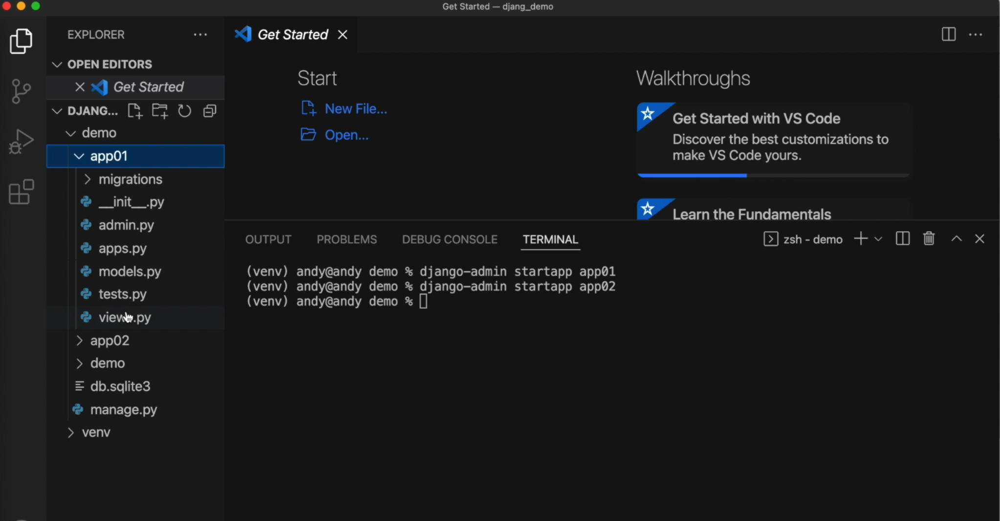
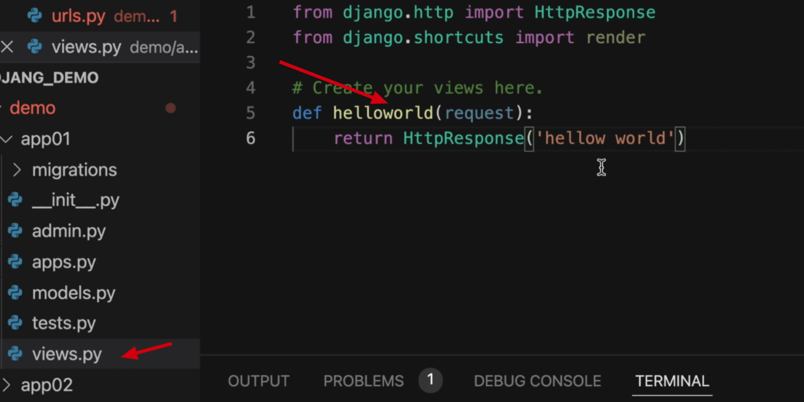
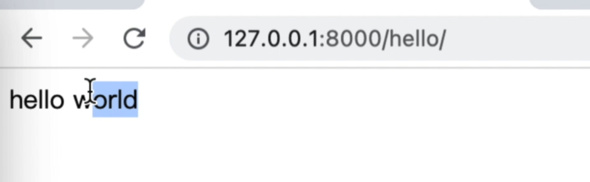

# 创建Django应用

上节课我们使用命令行的方式，创建了一个叫做Django的项目. 
然后我们使用命令：
```bash
python manage.py runserver
```
运行这个项目。

本节课我们来创建应用。

<!-- truncate -->

## 什么是Django应用

那什么是应用呢？
一个应用其实就是实现某些特定功能的一些python文件的组合。 
那在一个项目中可以有多个应用，这些应用之间是相互隔离的，如下图所示。


## 创建应用

好，接下来我们就看一下如何创建一个应用。 
创建应用同样的咱们也可以使用命令行。 
:::tip
还记得前面介绍的`django-admin --help` 命令吗？我们用它来查看下所有命令。应用英文是APP, 所以大概也能猜到 startapp 就是创建应用.
:::

创建一个名为app01的应用，命令如下：
```
django-admin startapp app01
```
创建成功了，然后我们回到右侧看一下,
但我们的demo项目下就多了一个叫做app01的这个应用。
那同理，如果我们使用刚才的命令，再创建一个app02，命令如下：
```
django-admin startapp app02
```
看一下这个时候又新增了一个app02。 
在这个文件夹下面有很多相关的文件， 如下图所示。


它们具体什么功能，咱们后面再来详细介绍。

## 输出第一个程序：hello world

当我们启动项目后，浏览器中访问网站
```
127.0.0.1:8000
```
默认的看到我们的首页。而现在我们需要让它显示hello world。
根据前面介绍的MVT模式，所以我们的大致流程是这样的。
1. 配置url
2. 配到url时，执行对应的视图函数
3. 函数实现输出"hello world"

### 配置url

我们找到这个全局配置urls.py的文件(demo/demo/urls.py)，默认代码如下：
```python title='demo/demo/urls.py'
from django.contrib import admin
from django.urls import path


urlpatterns = [
    path('admin', admin.site.urls),
]
```
根据上面的代码，我们模仿它写一个这个路由呢，就叫做hello。
代码如下：
```python title='demo/demo/urls.py'
from django.contrib import admin
from django.urls import path


urlpatterns = [
    path('hello/', helloworld), # 新增路由
    path('admin', admin.site.urls),
]
```
上面代码中，新增了一条路由，`path('/hello/', helloworld)`, 当用户在浏览器中访问‘/hello/’时，会匹配到它，然后会执行helloworld函数。

### 创建视图函数

接下里我们设置这个helloworld函数，我们想在app01应用下创建它。代码如下：
```python title='demo/demo/urls.py'
from django.contrib import admin
from django.urls import path
from app01.views import helloworld # 新增代码


urlpatterns = [
    path('hello/', helloworld), # 新增路由
    path('admin', admin.site.urls),
]
```
接下来，在app1下面我们找到一个views.py。
在这里面我们来定一个函数，就叫做helloworld。
如下图：

代码如下：

```python title='demo/app01/views.py'

def helloworld(request):
    return HttpResponse('hello world')
```
上面代码中，helloworld函数接受一个参数request, 它是请求对象， 
这是固定的写法，后面咱们再来详细介绍。

此外函数需要返回一个响应HttpResponse，响应内容就是“hello world”。


接下里，我们来测试一下。在浏览器中输入 
```
127.0.0.1:8000/hello/
```
此时，匹配到"/hello"这个路由，它就会执行app01/views.py文件中"helloworld"函数, 
返回一个响应, 响应的内容呢，就是“hello world”。
输出结果如下图所示。



好，本节我们先介绍到这里，小伙伴，我们下节再见。
