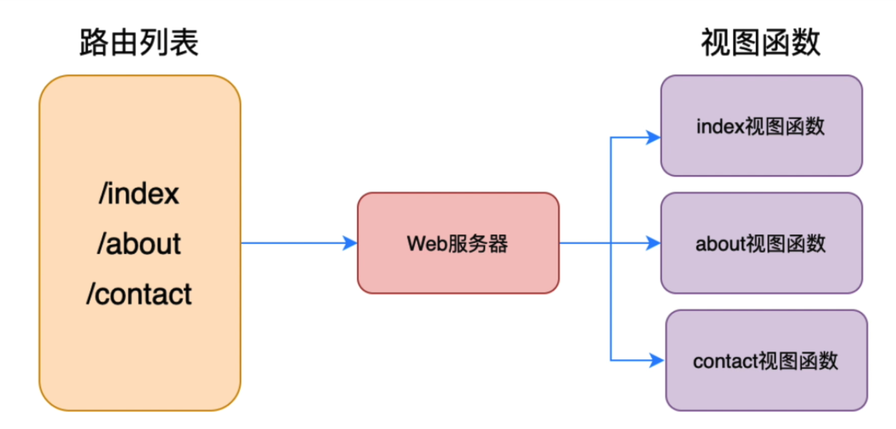
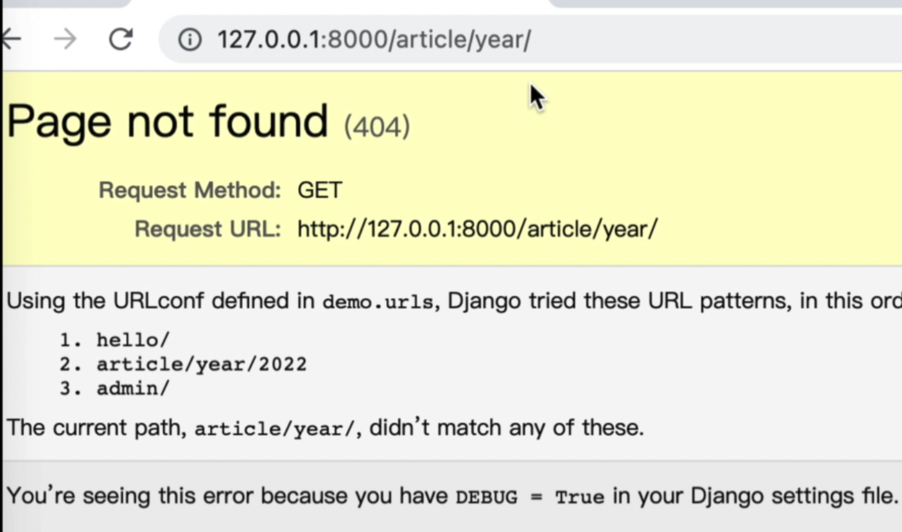
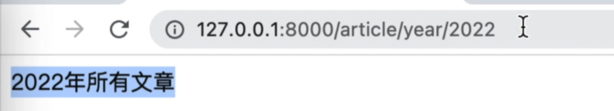
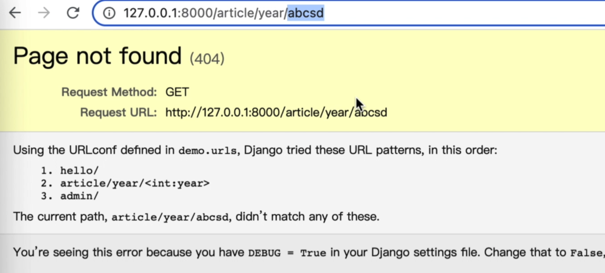
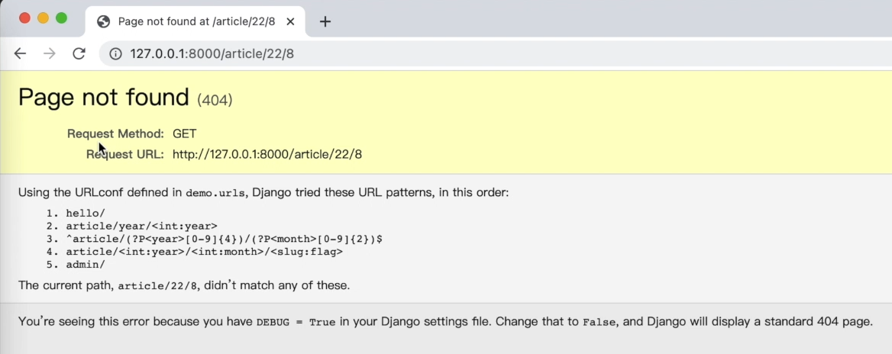
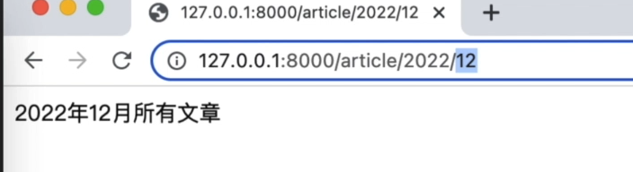

# 3种路由匹配模式

在上一节课中，我们实现了第1个Django程序，输出一个"hello world"。
然后我们反复提到了一个词`路由`。本节我们就来介绍一下什么是路由，以及Django中最常见的3种路由匹配模式。本节我们就来介绍一下Django知识的最常见的三种路由形式:
- 精确字符串格式 
- 路径转换器格式
- 正则表达式格式 

<!-- truncate -->

## 什么是路由



当在我们在这个浏览器中输入网址的时候,
这里的URL它就是web服务的入口，用户通过给浏览器发送来任何的请求，
都是发送到一个指定的URL地址上的, 
然后服务器会将这个响应返回给浏览器，也就是我们这里的hello world，路由就是用来处理URL和函数之间关系的调度器。
它能够确保输入一个URL， 就会调用我们程序中的某一个函数。


## 字符串精确模式
在全局路由配置文件中(django_demo/demo/urls.py), 配置的hello 就是字符串精确模式。
```python
from django.contrib import admin
from django.urls import path
from app01.views import helloworld # 新增代码


urlpatterns = [
    path('hello/', helloworld), # 新增路由
    path('admin', admin.site.urls),
]
```
只有在浏览器中访问“127.0.0.1:8000/hello/”才能精确的匹配到这个路由。如果访问“127.0.0.1:8000/hello/andy”或其他都将无法匹配。

:::tip
很多小伙伴会问，hello后面为什么要加“/”，这是因为添加“/”以后，“127.0.0.1:8000/hello/”可以匹配，“127.0.0.1:8000/hello”也可以匹配。如果不加“/”，只能匹配不加“/”的形式。
:::

再举一个例子，添加一个新的路由，urls.py代码如下：
```python
from django.contrib import admin
from django.urls import path
from app01.views import helloworld 
from app01.views import aritcle_year # 新增代码

urlpatterns = [
    path('hello/', helloworld), 
    path('article/year/2022/', article_year), # 新增路由
    path('admin', admin.site.urls),
]
```

接着在app01/views.py中添加article_year函数，代码如下：
```python

def article_year(request):
    return HttpResponse('2022年所有文章')
 
```
如果浏览器中访问路由:127.0.0.1:8000/article/year, 运行结果如下：


如果浏览器中访问路由:127.0.0.1:8000/article/year/2022,


## 路径转换器模式

接下来我们来介绍第2种：路径转换器模式。

比如说我们这里year后面是2022，就要获取2022年度的所有文章。 
那如果是2021，
就获取所有2021年度的所有文章，
也就是说这个year可以是变化的.

好看一下在路由中如何实现它。

先来修改urls.py路由文件。代码如下：
```python
urlpatterns = [
    path('hello/', helloworld), 
    path('article/year/<int:year>/', article_year), # 这里修改
    path('admin', admin.site.urls),
]
```
仔细观察发现，原来的article路由是：
```python
path('article/year/2022/', article_year), # 新增路由
```
修改后的路由是：
```python
path('article/year/<int:year>/', article_year), # 这里修改
```
也就是将固定的年份，修改为变量的形式`<int:year>`, 其中，int表示整数类型（如果是字符串类型，可以不写，因为默认就是字符串类型），而year就是变量，可以接受任何整数类型数据。

接下来，修改article_year视图函数，让它能接收一个变化的参数。

在app01/views.py中，添加如下代码：
```python
def article_year(requests, year):
    return HttpResponse(f'{year}年所有文章')
```
在浏览器中访问网址: 127.0.0.1:8000/article/year/2022。就显示
```
2022年所有的文章
```
，那如果输入的是2023的话，显示的就是
```
2023年度所有文章 
```
也就是说我们正常的接收到了这个参数， 
然后把这个参数显示到页面里了。 

那如果我随便写一些， 把原来是数字，现在我给它改成字符'abcd',则匹配不到，因为‘abcd’不是urls.py中配置的int类型，结果如下。


除了int类型和str类型，还有其他的几种常见类型，如slug, uuid 和path, 每种类型说明如下：

- str：匹配任何非空字符串，但不含斜杠/，如果你没有专门指定转换器，默认使用该转换器
- int：匹配0和正整数，返回一个int类型
- slug：可理解为注释、后缀、附属等概念，是url拖在最后的一部分解释性字符。该转换器匹配任何ASCII字符以及连接符和下划线，比如building-your-1st-django-site；
- uuid：匹配一个uuid格式的对象。为了防止冲突，规定必须使用破折号，所有字母必须小写，例如075194d3-6885-417e-a8a8-6c931e272f00。返回一个UUID对象；
- path：匹配任何非空字符串，重点是可以包含路径分隔符’/‘。这个转换器可以帮助你匹配整个url而不是一段一段的url字符串。要区分path转换器和path()方法。

上面的例子中，我们只是传递了一个参数year, 此外，我们还可以传递更多参数。例如，
在urls.py中新增2个路由，代码如下：
```python
from django.contrib import admin
from django.urls import path
from app01.views import helloworld 
from app01.views import aritcle_year, article_month, article_flag # 新增代码


urlpatterns = [
    path('hello/', helloworld), 
    path('article/year/<int:year>/', article_year), 
    path('article/year/<int:year>/', article_year), # 新增代码
    path('article/year/<int:year>/<slug:flag>', article_flag), # 新增代码
    path('admin', admin.site.urls),
]
```

接着在视图文件中，创建article_month, 代码如下：
```python
def article_month(request, year, month):
    return HttpResponse(f'{year}年{month}月所有文章')

def article_flag(request, year, month, flag):
    return HttpResponse(f'{year}年{month}月{flag}所有文章')
```
在浏览器中访问网址:127.0.0.1:8000/article/2022/8 , 输出结果如下：
```
2022年8月所有文章
```
在浏览器中访问网址:127.0.0.1:8000/article/2022/8/python, 输出结果如下：
```
2022年8月python所有文章
```

## 正则表达式模式

接下来我们介绍路由匹配的第3种模式,也就是正则表达式模式。

那先来说一下为什么要使用它？
在上面的例子中，当我们在浏览器中输入这个网址，然后匹配月份匹配Python的时候，
它是可以正常匹配到的，但是呢，我们对这里的年份格式和月份格式并没有做一个验证。现在只要是整数就可以。但是很多时候，我们有一些特殊需要，比如说年份我们想要保留4位，月份我们保留2位。
那么这时我们需要对这里的URL中的某些参数进行一些限制。而我们只用简单的int，str还有slug都不能够满足了。
所以，我们就可以使用正则表达式，让它进行匹配。

OK我们看一下如何使用呢？
前面都是
```
from django.urls import path
```
那现在我们要使用正则表达式了，需要导入re_path
```
from django.urls import path, re_path
``` 
接下，对第2个年份和月份的做一个修改，修改后的urls.py代码如下：
```python
from django.contrib import admin
from django.urls import path, re_path # 新增
from app01.views import helloworld 
from app01.views import aritcle_year, article_month, article_flag # 新增代码


urlpatterns = [
    path('hello/', helloworld), 
    path('article/year/<int:year>/', article_year), 
    # path('article/year/<int:year>/', article_year), 
    re_path(r'(?P<year>[0-9]{4})/(?P<month>[0-9]{2})$', views.article_month),
    path('article/year/<int:year>/<slug:flag>', article_flag),
    path('admin', admin.site.urls),
]
```
上面代码中
```python
re_path(r'(?P<year>[0-9]{4})/(?P<month>[0-9]{2})$'
```
第一个r表示不转义，()内是正则表达式语句。?P表示匹配模式，后面`<year>`是匹配变量。

正则基础语法说明：
- `^`：表示开始
- `$`：表示结束
- `[0-9]`:表是从0-9中选择
- `{4}`: 表示长度是4位

好，这样我们就写完了这个正则表达式的匹配，接下来我们来验证一下。

在浏览器中访问网址:127.0.0.1:8000/article/22/8/python, 输出结果如下：


在浏览器中访问网址:127.0.0.1:8000/article/2022/12/python, 输出结果如下：



如果小伙伴想对它进行更多的限制，
那么我们就修改正则表达式的形式，满足你的需求就可以。 

:::tip
当我们在这里定义了多条规则的时候,
那如果 
第1条满足，第2条满足，第3条满足 
它会选择哪一个呢？
其实呢，这就和我们的if语句比较相似。
当它匹配到第1个的时候，
那后面这些都不再匹配了，
只返回第1个的函数结果，
这是正则匹配的一个规则。
那如果所有的都没有匹配到， 
就会出现像我们刚才看到的结果，返回一个not found。
这是Django路由匹配的流程。
:::


至此呢，我们就介绍完了三种路由匹配的形式，
小伙伴们，我们下节再见。
