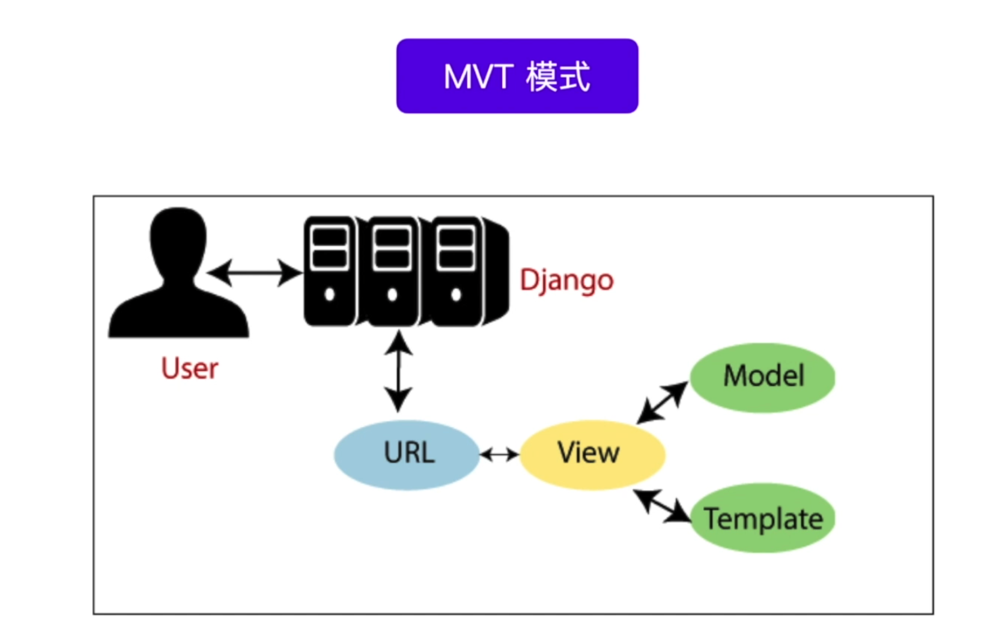

# [视图]:函数视图

前面我们说过，要学好Django，需要抓住MVT这条主线。本节开始我们下来介绍MVT中的V,也就是视图。



一个是视图，我们可以称之为函数或者叫视图类，简称为视图。 
它本质上就是一个简单的Python函数或者是类，
那么它接收的是一个请求对象，
然后，并且返回一个响应对象。


根据视图类型，Django视图又可以分为：FBV（基于函数的视图） 和 CBV（基于类的视图）。


<!-- trancate -->

## FBV(基于函数的视图)
其实前面我们一直在使用的，就是FBV(基于函数的视图)。
那接下来呢，我们再通过一个实例来介绍一下FBV。

在urls.py文件中，创建一个路由，命名current。代码如下：
```python title='demo/demo/urls.py'
urlpatterns = [
    path('<slug:slug>/', views.my_view),
    path('year/<int:year>', views.article_year),
    re_path(r'(?P<year>[0-9]{4})/(?P<month>[0-9]{2})$', views.article_month),
    path('<int:year>/<int:month>/<slug:flag>', views.article_flag),
    path('current', views.get_current_datetime),
]
```
它指向views.get_current_datetime函数。
所以接下来，我们在views.py中来创建这么一个函数，命名get_current_datetime函数。代码如下：
```python title='demo/app01/views.py'
import datetime  # 新增代码

def get_current_datetime(request):
    today = datetime.today() # 获取今天日期
    format_today = today.strftime("%Y-%m-%d")
    html = f"<h1>今天是{format_today}</h1>"
    return HttpResponse(html)
```
运行结果如下：

:::info[运行结果]
today.strftime("%Y-%m-%d"): 将时期时间格式更改为Y-m-d形式。
:::


:::tip[代码解析]
today.strftime("%Y-%m-%d"): 将时期时间格式更改为Y-m-d形式。
:::


## 函数视图实例

### 创建account应用

新建一个应用，命名为account。命令如下：
```bash
django-admin startapp account
```
创建完成后，左侧目录中新增了一个account文件夹，在该文件夹下新建一个urls.py文件。
urls.py中新增路由， 代码如下：

```python title='demo/account/urls.py'
from django.urls import path, re_path
from . import views

urlpatterns = [
    path('login/', views.login),
]
```
上述代码中，匹配‘login’时会执行views.login函数, 而views是从当前引入的。所以，在当前account文件夹下新建一个views.py文件。此时，account应用的目录结构如下：


接下来，在views.py文件中编写如下代码:
```python title='demo/account/view.py'
def login(request):
    html = """
    <form>

    </form>
    """
    return HttpResponse(html)
```

但是html内容很多，如果写在login函数中，显然会十分臃肿。所以可以把html文件单独提取出来，并且需要正常展示HTML页面，而不仅仅是字符串。所以我们修改一下view.py代码。

```python title='demo/account/view.py'
from django.shortcuts import render

def login(request):
    return render(request, 'login.html')
```
上述代码中，引入了render函数，它是用于渲染html页面的，第一个参数request是请求对象，保持默认，第2个参数是要渲染的login.html页面。

那么这个login.html放在哪里呢？或者说后面我们再创建其他html页面时，它们放在哪里呢？
我们可以将其统一管理。在demo根目录下，新建一个templates文件夹，此时目录结构如下：

```
├── demo
│   ├── account
│   ├── app01
│   ├── app02
│   ├── db.sqlite3
│   ├── demo
│   ├── manage.py
│   ├── templates
└── venv

```

然后在templates下面,新建一个login.html文件。代码如下：

```html title='demo/templates/login.html'
<!DOCTYPE html>
<html lang="en">
<head>
  <meta charset="UTF-8">
  <meta name="viewport" content="width=device-width, initial-scale=1.0">
  <title>Document</title>
</head>
<body>
  <form action="" method="post">
    <div>用户名：
      <input type="text" name="username">
    </div>
    <div>密码：
      <input type="password" name="password">
    </div>
    <button>登录</button>
  </form>
</body>
</html>
```

### 配置模板路径
后面我们会将所有的html页面都存放到demo/templates目录下。但是django怎么知道render()函数渲染的html文件就在这个路径下呢？
所以，需要我们在全局配置文件中进行配置。
打开demo/demo/settings.py文件, 找到'TEMPLATES = []', 在这里配置`DIRS`，配置信息如下：
```python title='demo/demo/settings.py'
TEMPLATES = [
    {
        'BACKEND': 'django.template.backends.django.DjangoTemplates',
        'DIRS': ['templates'], # 这里是模板路径
                'APP_DIRS': True,
        'OPTIONS': { 
            ...
        }
```

大功告成，可以在浏览器中输入网址：127.0.0.1:8000/accout/login/,运行结果如下：


### 使用post请求

当我们填写完“用户名”和“密码”，点击“提交”时，它会给我们一个警告，如下图所示。 


这是因为Django框架为了我们保证我们账号安全，
设置了一个Django csrf，
它要求我们提交的时候，
添加上一个这个东西，
 csrf token这样的一个保护， 
所以我们需要在HTML表单中给它加上来，修改login.html代码：
```python title='deme/templates/login.html'
  <form action="" method="post">
     
    <div>用户名：
      <input type="text" name="username">
    </div>
    <div>密码：
      <input type="password" name="password">
    </div>
    <button>登录</button>
  </form>
```

:::tip
 `` 是Django 模板的语法，后面会讲到。
 这里的csrf_token就是在表单中添加了一个hidden属性，提交表单时，会携带这个token,django后台会对它进行验证。
:::

当我们在浏览器中，再次点击“提交”的时候，会发现没有任何反应，这是因为，我们还没有编写业务逻辑。
现在就来完成它。

用户提交后，将login.html中form表单的name属性, 也就是`username`和`password`2个字段提交到指定位置，也就是form表单中的action属性的值。它的值是“”，表示提交到它自身，也就是说再次提交给login函数。

接下来我们来修改login函数。
```python title='demo/account/views.py'
    if request.method == "POST":
        username = request.POST.get('username', '')
        password = request.POST.get('password', '')
        # 业务逻辑判断
        return HttpResponse(f"用户{username}的密码是{password}")

    return render(request, 'login.html')
```

:::info[代码解析]
request.method 默认情况下是get, 这里判断是不是”POST“, 如果是，则使用request.POST.get('username', '')获取对应字段的值，没有的话，设置默认值‘’。然后return 直接返回信息。
否则的话，表示是”GET“请求，会渲染页面。
:::

直接访问网址:127.0.0.1:8000/account/login,这里GET请求，会执行下面的代码
```python
return render(request, 'login.html')
```
运行结果如下:


如果填写`用户名`和`密码`，点击`提交`,则是POST请求，会执行下面的代码
```python
    if request.method == "POST":
        username = request.POST.get('username', '')
        password = request.POST.get('password', '')
        # 业务逻辑判断
        return HttpResponse(f"用户{username}的密码是{password}")
```

运行结果如下：


