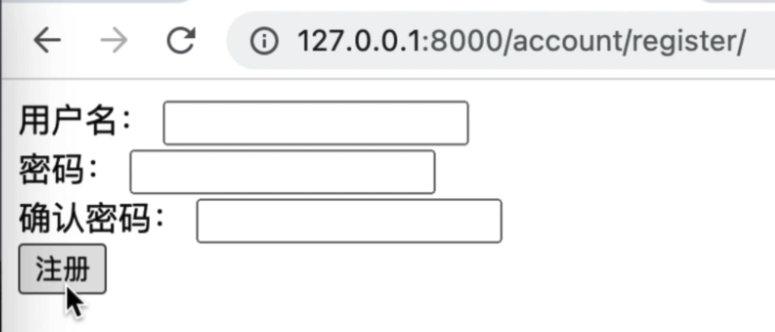
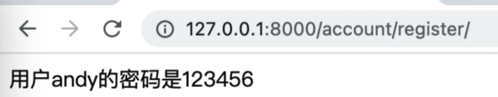

# [视图]:类视图

前面我们介绍完了基于函数的视图, 
基于函数的视图,
它的问题是 
即便它很好的处理简单的案例，
但是除了一些基础的配置项以外呢，
没办法扩展或者自定义它们，
这就限制了它们在实际应用中的用途。 
那为了解决这个问题，
Django引入了一个叫做类视图。

本节课我们就来对比这函数视图来学习这里的类视图

<!-- trancate -->

前面我们讲了一个登录，那接下来咱们就使用类视图来实现和登陆相似的一个注册的功能。 
那既然我们要使用类视图了，所以这里我就不再使用函数了，而要定义一个类。

## 实现GET请求

在account的视图文件中，定义一个类，叫做RegisterView, 类中定义一个get方法，用于实现访问注册页面的工能。views.py文件中新增如下代码：
```python title='/demo/account/views.py'
from django.views import View

class RegisterView(View):
    def get(self, request):
        return render(request, 'register.html')
```
上述代码中，RegisterView继承了Django内置的View视图类。此外，还需要主要，这个get()方法是在类里面，所以第一个参数是self, 正常定义一个类是一样的。

接下来创建路由。在account/urls.py文件中，现在一条路由，代码如下：
```python title='demo/account/urls.py'
from django.urls import path, re_path
from . import views

urlpatterns = [
    path('login/', views.login),
    path('register/', views.RegisterView.as_view()) # 新增代码
]
```
:::info[代码解析]
把/register/这个url路径映射到views模块中的RegisterView类的as_view()方法。

as_view()会返回一个可调用的视图函数,来响应这个路径的请求。

所以这里是使用了基于类的视图(class-based views)来处理/register/的请求,相比函数视图(function views)更加面向对象和可复用。
:::

当在浏览器中输入“127.0.0.1:8000/account/register/” 时，会匹配到"/register"，默认使用get方法，所以会执行RegisterView类下的get方法。
```python
class RegisterView(View):
    def get(self, request):
        return render(request, 'register.html')
```
而上面的get方法会渲染'register.html'文件，所以接下来在templates下创建register.html模板文件。代码如下：

```html title='demo/templates/register.html'
<!DOCTYPE html>
<html lang="en">
<head>
  <meta charset="UTF-8">
  <meta http-equiv="X-UA-Compatible" content="IE=edge">
  <meta name="viewport" content="width=device-width, initial-scale=1.0">
  <title>注册</title>
</head>
<body>
  <form action="" method="post" enctype="multipart/form-data">
    
    <div>用户名：
      <input type="text" name="username">
    </div>
    <div>密码：
      <input type="password" name="password">
    </div>
    <div>确认密码：
      <input type="password" name="password2">
    </div>
    <div>
      <input type="file" name="avatar">
    </div>
    <button>注册</button>
  </form>
</body>
</html>
```

在浏览器中输入网址:127.0.0.1:8000/account/register/ ,运行结果如下所示。




## 实现POST请求
当用户点击“提交”按钮的时候，就会将填写的“用户名”、“密码”和“确认密码”一起提交到form 表单action指定的位置，这里为空，显然是提交到自身。那么接下来，我们应该能猜到，需要在RegisterView类下创建一个post方法，用来接受post请求。代码如下：
```python title='/demo/account/views.py'
    def post(self, request):
        username = request.POST.get('username')
        password = request.POST.get('password')
        password2 = request.POST.get('password2')
        # 业务逻辑判断
        return HttpResponse(f"用户{username}的密码是{password}")
```

在浏览器中输入网址:127.0.0.1:8000/account/register/ , 填写信息后，点击提交，运行结果如下所示。




## 对比函数视图和类视图

 Django中的视图(View)分为函数视图(Function Based Views)和类视图(Class Based Views)两种:

1. 函数视图(Function Based Views)

把视图逻辑封装成一个简单的函数,接受request对象,返回response对象。
优点是简单、快速上手。缺点是如果视图逻辑复杂,代码维护不易。

2. 类视图(Class Based Views) 

把视图逻辑封装成一个class,从View类继承而来。
优点是面向对象,视图模块化,代码复用性高。缺点是相比函数视图学习curves高一些。
Django内置了一些通用类视图,比如TemplateView、ListView等,可以直接使用。
综上,简单视图可以使用函数视图,复杂视图建议使用类视图,两者各有特点,可以combin使用。


