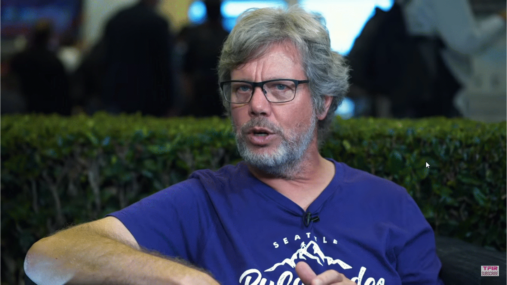
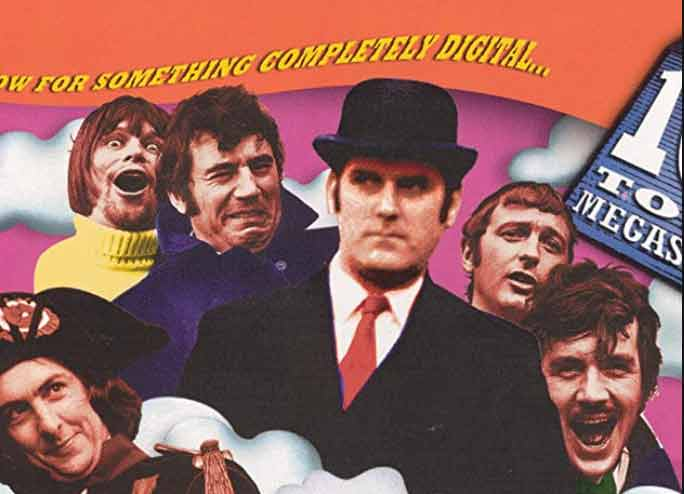
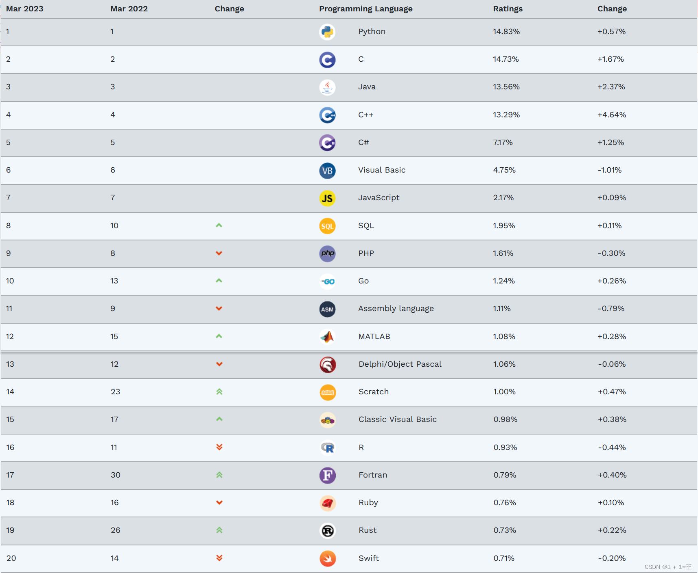
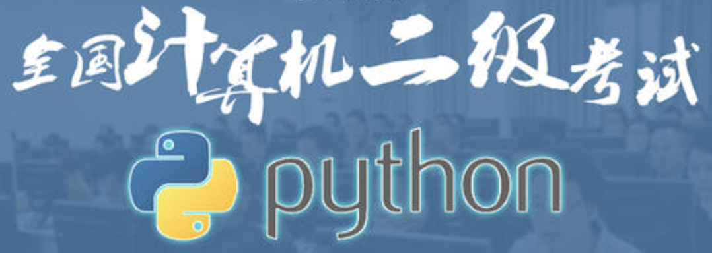

# Python简介

## Python 是什么

Python 是一种易学易用、功能强大的高级程序设计语言，

Python是一种代表简单主义思想的编程语言。阅读一个良好的Python程序就感觉像是在读英语一样，它使你能够专注于解决问题而不是去搞明白语言本身。即使没有编程基础，也能看懂和理解这段程序。就如同你即将看到的一样，Python极其容易上手。

## Python的之父
Python由荷兰数学和计算机科学研究学会的Guido van Rossum 于1990 年代初设计，。guido，中文翻译过来是吉多，中国python程序员亲切的称呼他为龟叔，guido呢在荷兰出生、成长，1982年在阿姆斯特丹大学获得数学和计算机科学硕士学位，2005年12月，guido加入Google公司。2012年12月7日，guido加入Dropbox公司。2018年，因为“创始并发展了Python语言，并长期领导Python社区”，guido被收录进计算机历史博物馆荣誉墙。2020年11月12日， 64岁的Python之父Guido van Rossum在自己的官方宣布：由于退休生活太无聊，自己决定加入Microsoft 的 DevDiv Team。Python 的创始人为荷兰人 Guido van Rossum。1982年，Guido 从阿姆斯特丹大学获得了数学和计算机硕士学位。

 Python 的创始人 Guidovan Rossum

## Python的由来

在80年代，个人电脑的配置较之如今是极低的，程序员不得不努力思考如何最大化利用空间，以写出符合机器口味的程序。而正是因为这一点，Guido需要耗费大量的时间编写 C 程序，让Guido感到苦恼。他认为这样编写程序实在是太过于耗费时间，于是他想到了shell。shell可以像胶水一样，将UNIX下的许多功能连接在一起。许多C语言下上百行的程序，在shell下只用几行就可以完成。然而，shell的本质是调用命令，它并不是一个真正的语言，shell不能全面的调动计算机的功能。于是，guido开始思考，是否能设计一款语言，使它同时具备C与shell的优点，既能够全面调用计算机的功能接口，又可以轻松编写程序。
1989 年圣诞节期间，在阿姆斯特丹，Guido 为了打发圣诞节的无趣，决心开发一个新的程序语言 Python。Guido 将
Python（大蟒蛇）作为该编程语言的名字，是取自英国 20 世纪 70 年代首播的电视喜剧《蒙提.派森的飞行马戏团》（Monty Python’sFlying Circus），因此 Python 语言的 logo 是一条蟒蛇。

## Python 的特色和优点

- 1.简单：易于学习，结构简单，对初学者友好，阅读一个良好的Python程序就感觉像是在读英语一样。
- 2.易理解：Python代码定义的更清晰。

- 3.易维护：Python的成功在于它的源代码是相当容易维护的。

- 4.强大的标准库和第三方库：Python的最大的优势之一是丰富的标准库和第三方库，让 Python程序员能够轻松实现各种复杂的功能。

- 5.可移植：基于其开放源代码的特性，Python已经被移植（也就是使其工作）到许多平台。

- 6.可扩展：如果你需要一段运行很快的关键代码，或者是想要编写一些不愿开放的算法，你可以使用C或C++完成那部分程序，然后从你的Python程序中调用。

- 7.数据库：不管你使用的关系型数据库是oracle，mysql, sqlserver,还是关系型数据库redis,mongoDB，Python提供所有主要的商业数据库的接口。

- 8.可嵌入: 你可以将Python嵌入到C/C++程序，让你的程序的用户获得"脚本化"的能力。

## Python 的发展
Python经历了 30 年的发展，已经成为流行的编程语言之一。TIOBE编程语言排行榜根据互联网上程序员、教程和第三方厂商的数量，并使用搜索引擎统计出编程语言的排名数据，反映了某个编程语言的热门程度。下图为 2023 年 3月份的 TIOBE 编程语言排行榜。Python编程语言已经是TIOBE 编程语言排行榜第一名。并且，这已经是它连续第6年获得年度编程语言，也是有史以来所有编程语言中囊获该奖项最多的一种语言。当然，Python的发展势头似乎也让这样的结果变得理所应当~Python 之所以被大规模采用，主要原因还是要归根于其简单易上手的方便性，以及极大地提高了生产效率。

**2018年9月随着全国计算机等级考试科目中加入“二级Python”，也确立了Python在国内的地位** ，意味着 Python 程序设计已经成为一门必修课程。无论是计算机专业的院系还是非计算机专业的院系，开设Python 程序设计课程，已经成为一种趋势。无论是教育方面，还是实际应用，Python都变得不再陌生！大熊相信Python语言势必会像PS那般普及，成为日常生产力工具。

## Python 的应用领域

- 1.后端开发： Python为Web后端开发提供了大量的模块和框架，例如Flask框架、Danjongo框架。有很多知名的网站后端采用了 Python。
- 2.网络爬虫：又被称为网页蜘蛛、网络机器人，是一种按照一定的规则，自动地抓取网页的程序。网络爬虫把网站的网页下载到在本地，然后对下载的网页进行关键字提取和数据分析。
- 3.数据分析：Python 提供了大量数据分析的模块，常用的numpy，用于数学计算，如矩阵计算、pandas，基于 numpy 数据分析工具，提供了大量能使我们快速便捷地处理数据的函数和方法、matplotlib：用于数据结果的可视化，将数据展现为散点图、折线图、直方图、柱状图、饼图等直观的形式。
- 4.人工智能：Python 提供了相关的库用于快速开发人工智能的应用，例如神经网络算法库，在计算机视觉、语音处理、推荐系统和自然语言处理等场景下有着丰富的应用，用户使用 Python 的 AI库时，不需要深入了人工智能算法的细节，极大的降低了人工智能开发的门槛。
- 5.自动化运维：Python 提供了各种自动化运维工具，能满足绝大部分自动化运维的需求
- 6.自动化测试：Python 提供了众多的自动化测试框架，可以实现单元测试、GUI 程序的自动化测试、Web 自动化测试、性能测试

## Python 开发的著名项目

- 1.阿里云 AI 开放平台-语音识别，还有图像识别、视觉识别等 1
- 2.Youtube - 视频社交网站
- 3.Reddit - 社交分享网站
- 4.Dropbox - 文件分享服务
- 5.豆瓣网 - 图书、唱片、电影等文化产品的资料数据库网站
- 6.知乎 - 一个问答网站
- 7.文明4-一款大型策略战棋类游戏

